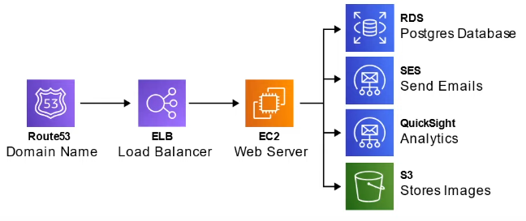
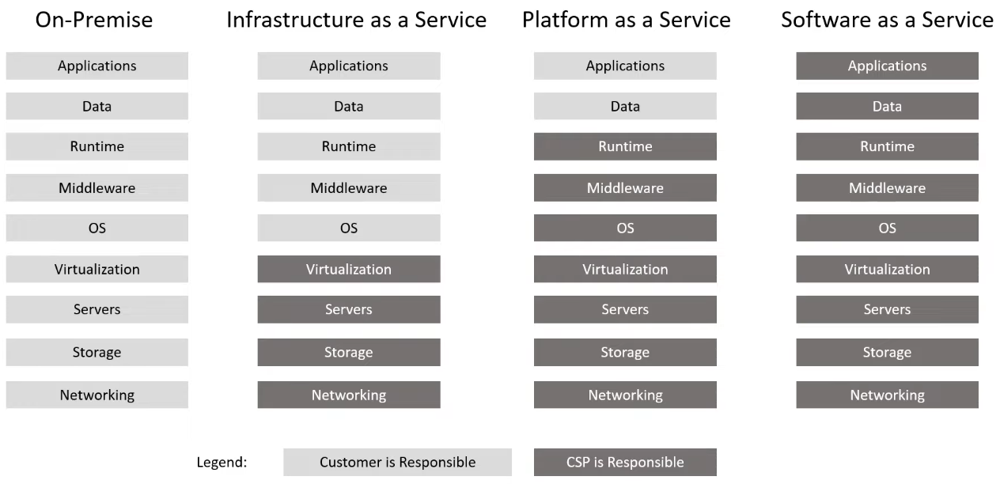
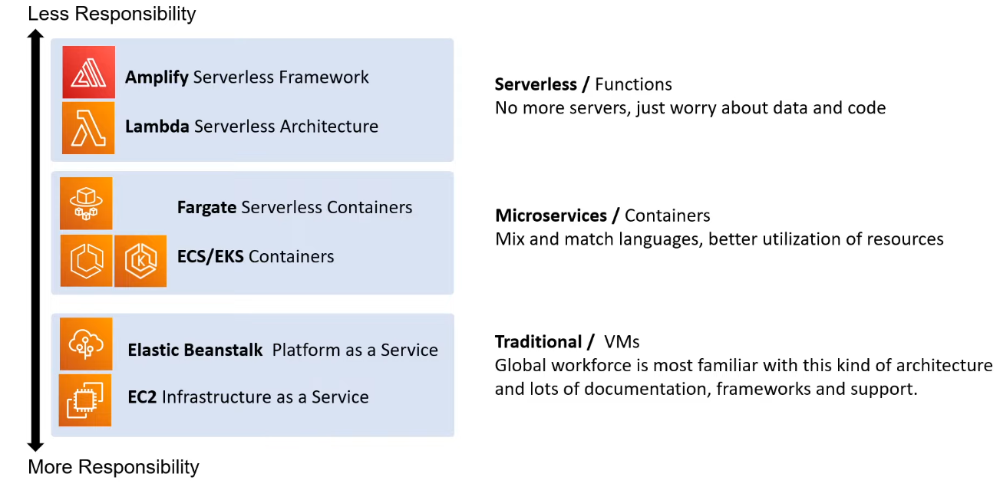
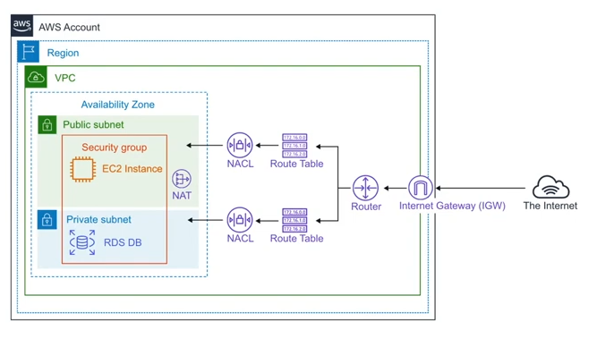

- [AWS Cloud Practitioner](#aws-cloud-practitioner)
- [Cloud Computing](#cloud-computing)
  - [Evolution of Cloud Computing](#evolution-of-cloud-computing)
    - [Amazon Web Services](#amazon-web-services)
    - [What makes it a Cloud Services Provider (CSP)?](#what-makes-it-a-cloud-services-provider-csp)
  - [The Evolution of Computing](#the-evolution-of-computing)
    - [Dedicated (physical server)](#dedicated-physical-server)
    - [VMs](#vms)
    - [Containers](#containers)
    - [Functions](#functions)
  - [Types of Cloud Computing](#types-of-cloud-computing)
  - [Cloud Computing Deployment models](#cloud-computing-deployment-models)
  - [Billing](#billing)
    - [AWS Budget](#aws-budget)
    - [AWS Free Tier](#aws-free-tier)
    - [Biling Alarm](#biling-alarm)
  - [The benefits of Cloud](#the-benefits-of-cloud)
  - [The Six and Seven advantages to Cloud](#the-six-and-seven-advantages-to-cloud)
    - [Official Six advantages to Cloud](#official-six-advantages-to-cloud)
    - [Author's Seven advantages to Cloud](#authors-seven-advantages-to-cloud)
- [AWS Global Infrastructure](#aws-global-infrastructure)
  - [Region](#region)
  - [Region vs Global Services](#region-vs-global-services)
  - [Availability Zone (AZ)](#availability-zone-az)
  - [Fault Tolerance](#fault-tolerance)
  - [Point of Presence (PoP)](#point-of-presence-pop)
    - [Servies that uses PoP](#servies-that-uses-pop)
  - [AWS Direct Connect](#aws-direct-connect)
    - [AWS Direct Connect Locations](#aws-direct-connect-locations)
  - [Local Zones](#local-zones)
  - [Data Residency](#data-residency)
  - [AWS Goverment](#aws-goverment)
  - [GovCloud](#govcloud)
- [Cloud Architecture Tecnologies](#cloud-architecture-tecnologies)
  - [High Availablity](#high-availablity)
  - [High Scalability](#high-scalability)
  - [High Elasticity](#high-elasticity)
  - [High Fault Tolerant](#high-fault-tolerant)
  - [High Durability](#high-durability)
  - [Disaster Recovery](#disaster-recovery)
    - [Options](#options)
- [Management and Development Tools](#management-and-development-tools)
  - [Amazon Resources Name (ARNs)](#amazon-resources-name-arns)
- [Shared Responsability Model](#shared-responsability-model)
  - [AWS Shared Responsability Model](#aws-shared-responsability-model)
    - [Types of Cloud Computing Responsability](#types-of-cloud-computing-responsability)
    - [Shared Responsability Model - Computing](#shared-responsability-model---computing)
    - [Shared Responsability Model - Architecture](#shared-responsability-model---architecture)
- [Computing Services](#computing-services)
  - [VMs, Containers, Serverless](#vms-containers-serverless)
  - [Higher Performance Computing Services](#higher-performance-computing-services)
  - [Edge and Hybrid Computing Services](#edge-and-hybrid-computing-services)
  - [Cost \& Capaciuty Managment Computing Services](#cost--capaciuty-managment-computing-services)
- [Storage](#storage)
  - [Introduction to S3](#introduction-to-s3)
    - [Common uses](#common-uses)
    - [Security features](#security-features)
    - [Other COnfiguration](#other-configuration)
    - [S3 Storage Clases](#s3-storage-clases)
  - [AWS Snow Familiy](#aws-snow-familiy)
  - [Storage Services](#storage-services)
  - [EBS volume](#ebs-volume)
  - [EFS](#efs)
- [Database](#database)
  - [What its a Data Warehouse?](#what-its-a-data-warehouse)
  - [What is a Key / Value store?](#what-is-a-key--value-store)
  - [What is a Document Store?](#what-is-a-document-store)
  - [NoSQL Database Services](#nosql-database-services)
  - [Relational Database Services](#relational-database-services)
  - [Other Database Services](#other-database-services)
- [Networking](#networking)
  - [Availalibty Zone](#availalibty-zone)
  - [Region](#region-1)
  - [VPC](#vpc)
  - [Subnets](#subnets)
  - [NACLS](#nacls)
  - [Security Groups](#security-groups)
  - [Route Tables](#route-tables)
  - [Internet Gateways](#internet-gateways)
  - [Enterprise/Hybrid Networking](#enterprisehybrid-networking)
  - [AWS CloudFront](#aws-cloudfront)
- [EC2](#ec2)
  - [EC2 Instances Families](#ec2-instances-families)
  - [Instance Type](#instance-type)
  - [Dedicated Host vs Dedicate Instances](#dedicated-host-vs-dedicate-instances)
  - [Tenancy](#tenancy)
  - [Configuration EC2 Instance Options](#configuration-ec2-instance-options)
  - [Elastic IP](#elastic-ip)
  - [AMI](#ami)
  - [Launch Template](#launch-template)
  - [Auto Scaling Group (ASG)](#auto-scaling-group-asg)
  - [LB](#lb)
    - [Configuration Options](#configuration-options)
    - [ALB (Application Load Balancer)](#alb-application-load-balancer)
    - [NLB (Network Load Balancer)](#nlb-network-load-balancer)
    - [CLB (Classic Load Balancer)](#clb-classic-load-balancer)
    - [Gateway Load Balancer](#gateway-load-balancer)
- [EC2 Pricing Models](#ec2-pricing-models)
- [Identiy](#identiy)
  - [Zero-trust Model](#zero-trust-model)
    - [Some AWS Services to achive Zero-Trust](#some-aws-services-to-achive-zero-trust)
      - [AWS CloudTrail](#aws-cloudtrail)
      - [Amazon GuardDuty](#amazon-guardduty)
      - [Amazon Detective](#amazon-detective)
      - [Zero-Trust on AWS with Third Parties](#zero-trust-on-aws-with-third-parties)
  - [Directory Service](#directory-service)
  - [Identity Provider (IdP)](#identity-provider-idp)
    - [OpeniD](#openid)
    - [OAuthZ.0](#oauthz0)
    - [SAML](#saml)
  - [Single-Sign On SSO](#single-sign-on-sso)
  - [LDAP](#ldap)
  - [Multi-Factor Authentication](#multi-factor-authentication)
  - [Security Key](#security-key)
  - [Identity and Access Managment (IAM)](#identity-and-access-managment-iam)
    - [Policies](#policies)
      - [Policy Anatomy](#policy-anatomy)
    - [Permission Boundries](#permission-boundries)
    - [Service Control Policies](#service-control-policies)
    - [Policy Conditions](#policy-conditions)
  - [Principal of Least Priviledge (PoLP)](#principal-of-least-priviledge-polp)
    - [Just-Enough-Access (JEA)](#just-enough-access-jea)
    - [Just-In-Time (JIT)](#just-in-time-jit)
  - [AWS Account Root User](#aws-account-root-user)
  - [AWS SSO](#aws-sso)
- [Application Integretion](#application-integretion)

# AWS Cloud Practitioner

My resume for the exampro.co course.

# Cloud Computing

The practice of using a network of remote servers hosted on the Internet to store, manage, and process data, rather than a local server or a personal computer.

| On-Premise | Cloud Providers |
|---|---|
| You own the servers |  Someone else owns the servers |
| You hire the IT people | Someone else hires the IT people |
| You pay or rent the real-estate | Someone else pays or rents the real-estate |
| You take all the risk | You are responsible for your configuring cloud services and code, someone else takes care of the rest. |

## Evolution of Cloud Computing

* **Dedicated Server**
    * One physical machine dedicated to single a business.
    * Runs a single web-app/site.
    * *Very Expensive, High Maintenance, High Security*
* **Virtual Private Server (VPS)**
    * One physical machine dedicated to a single business. The physical machine is virtualized into sub-machines
    * Runs multiple web-apps/sites. 
    * *Better Utilization and Isolation of Resources*
* **Shared Hosting**
    * One physical machine, shared by hundred of businesses.
    * Relies on most tenants under-utilizing their resources. 
    * Very Cheap, Limited functionality, Poor Isolation
* **Cloud Hosting**
    * Multiple physical machines that act as one system.
    * The system is abstracted into multiple cloud services
    * *Flexible, Scalable, Secure, Cost-Effective, High Configurability*

### Amazon Web Services 

Collection of cloud services that can be used together under a single unify API to build a lot differents kinds of workloads.

### What makes it a Cloud Services Provider (CSP)?

* provides multiple Cloud Services e.g. tens to hundreds of services
* those Cloud Services can be chained together to create cloud architectures
* those Cloud Services are accessible via Single Unified APl eg. AWS API
* those Cloud Services utilized metered billing based on usage e.g. per second, per hour
* those Cloud Services have rich monitoring built in eg. AWS CloudTrail
* those Cloud Services have an Infrastructure as a Service (laaS) offering
* Those Cloud Services offers automation via Infrastructure as Code (laC)

A cloud service provider can have hundersds of cloud services that are grouped into various types of services. The four most common types of cloud services (the 4 core) for Infrastructure as a Service (laaS) would be:
* **Compute** Imagine having a virtual computer that can run application, programs and code.
* **Networking** Imagine having virtual network defining internet connections or network isolations between services or outbound to the internet
* **Storage** Imagine having a virtual hard-drive that can store files
* **Databases** Imagine a virtual database for storing reporting data or a database for general purpose web-application

## The Evolution of Computing

### Dedicated (physical server)

* A physical server wholly utilized by a single customer.
* You have to guess your capacity
* You'll overpay for an underutilized server
* You can’t vertical scale, you need a manual migration
* Replacing a server is very difficult
* You are limited by your Host Operating System 
* Multiple apps can result in conflicts in resource sharing
* You have a *guarantee of security, privacy, and full utility of
underlying resources

### VMs

* You can run multiple Virtual Machines on one machine.
* Hypervisor is the software layer that lets you run the VMs
* A physical server shared by multiple customers
* You are to pay for a fraction of the server
* You'll overpay for an underutilized Virtual Machine
* You are limited by your Guest Operating System
* Multiple apps on a single Virtual Machine can result in conflicts in resource sharing
* Easy to export or import images for migration
* Easy to Vertical or Hortizonaalty scale

### Containers

* Virtual Machine running multiple containers
* Docker daemon is the name of the software layer that
lets you run multiple containers.
* You can maximize the utilize of the available capacity which is more cost-effective
* Your containers share the same underlying OS so containers are more efficient than multiple VMs
* Multiple apps can run side by side without being limited to the same OS requirements and will not cause conflicts during resource sharing

### Functions

- Are managed VMs running managed containers.
- Known as Serverless Compute
- You upload a piece of code, choose the amount of memory and duration.
- Only responsible for code and data, nothing else
- Very cost-effective, only pay for the time code is running, VMs only run when there is code to be executed
- Cold Starts is a side-effect of this setup

## Types of Cloud Computing

* **SaaS**: A product that is run and managed by the service provider. Don’t worry about how the service is maintained. It just works and remains available e.g. saleforce, gmail
* **PaaS**: Focus on the deployment an managment of your apps. Dont worry about, provisioning configuraing or understanding the hardware OS.
* **IaaS**: The basic buildings block for cloud IT. Provides access to networking features, computers and data storage space. Dont worry about IT staff, data centers and hardware.

## Cloud Computing Deployment models

* **Public cloud**: Everything (the workload or project) is built on the CSP Also known as: *Cloud-Native or Cloud First.
* **Private Cloud**: Everything built on company’s datacenters. Also known as On-Premise. The cloud could be OpenStack.
* **Hybrid**: Using both on-premis and a CSP.
* **Cross-Cloud**: Using multiple Cloud Providers

| Cloud | Hybrid | On-Premise |
| --- | --- | --- |
Fully utilizing cloud computing | Using both Clopud and On-Premise | Deploying resources on-premises, using virtualization and resource managment tools, is sometimes called "private cloud" | 
Companies that are starting out today, or are small enough to make the leap from a VPS to a CSP. | Organizationes that started with their own datacenter, can't fully move to cloud due to effort of migration or security compliance | Organizations that cannot run on cloud due strict regualtory compliance or the sheer size of their organization |
| Startups, SaaS offering, New projects and companies | Banks, FinTechs, Invesement managment, large professional sergice providers, legacy on-premise| Public sector, super sensitive data, large entreprise with heavy regulation

## Billing

### AWS Budget

AWS Budgets is a service that helps you set custom cost and usage budgets for your AWS resources and monitor your progress towards those budgets. It sends you alerts when you exceed (or are forecasted to exceed) your budgeted amounts, enabling you to take timely corrective actions to optimize your AWS spending.

### AWS Free Tier

AWS Free Tier is a set of AWS services that can be used for free for up to 12 months or with certain usage limits. It includes services such as Amazon EC2, Amazon S3, AWS Lambda, and more. The free tier is designed to help users learn and experiment with AWS services, and also to provide a low-cost option for small-scale production workloads.

### Biling Alarm

1. Go to the CloudWatch 
2. Select "Alarms", and then select the "Create Alarm" button.
3. In the "Create Alarm" wizard, select the "Billing" metric from the "Select metric" page.
4. Select the "Total Estimated Charge" metric, and then select the appropriate statistic and time period.
5. Enter the threshold value that will trigger the alarm, and specify the actions to be taken when the alarm is triggered (e.g., send a notification, AutoScalingGroup (ASG) action, EC2 action).
6. Choose a name and description for the alarm, and then select the "Create Alarm" button to create the billing alarm.

## The benefits of Cloud

* Agility
    * Increase speed and agility
* Pay-as-you go pricing
    * Trade capital expense for variable expense
* Economy of scale
    * Benefit from massive economies of scale
* Global Reach
    * Go global in minutes
* Security
* Reliability
    * Stop spending money on running and maintaining data centers
* High Availability
* Scalability
    *  Benefit from massive economies of scale
* Elasticity

> Author notes: Fault tolerance, disaster recovery

## The Six and Seven advantages to Cloud

### Official Six advantages to Cloud

* You can pay on-demand/as-you-go meaning there is no upfront-cost and you pay for only what you comsume or pay by the hour, minutes or seconds. 
Instead of paying for upfront costs of data centers and servers
* You shareing the cost with other customers to get unbeatable savings.
Hundreds of thousands of customers utilizing a fraction of a server
* Scale up or down to meet the current need. Launch and destroy services whenver.
Insted of paying for idl or underutilized servers.
* Launch resources withing a few clicks in minutes.
Insted of waiting days or weeks of your IT to implement the solution on-premise
* Focus on your own customers, developiong and configuring your applications.
Insted of operations suck as of racking, stacking and powering servers.
* Deploy your app in multiple regions around the world with a few clicks.
Provide lower latency and a better experience for your customers at minimal cost.

### Author's Seven advantages to Cloud

* **Cost-effective** You pay for what you consume no up-front cost. On-demand pricing or Pay-as- you-go (PAYG) with thousands of customers sharing the cost of the resources
* **Global** Launch workloads anywhere in the world. Just choose a region.
* **Secure**  Cloud provider takes care of physical security. Cloud services can be secure by default or you have the ability to configure access down
to a granular level.
* **Reliable**  Data backup, disaster recovery, data replication, and fault tolerance
* **Scalable** Increase or decrease resources and services based on demand
* **Elastic** Automate scaling during spikes and drop in demand
* **Current**  The underlying hardware and managed software is patched, upgraded and replaced by the cloud provider without interruption to you.

# AWS Global Infrastructure

What is the AWS Global Infrastructure?

The AWS Global Infrastructure is globally distributed hardware and datacenters that are physically networked together to act as one large resource for the end customer.

The AWS Global Infraestructure is made up of the following resources:
- 25 Launched Region
- 81 Availability Zones (AZ)
- 108 Direct connections Locations
- 275+ Points of Presence
- 14 Local Zone
- 17 Wavelength Zones

## Region

Regions are geographically distinct locations constiting of one or more availability zones.

Every regions is physically isolated from and independen of every other region in term of location, power, water supply.

* Each region generally has three AZ, in general.
    - Some new region are limited to two
* New services almost always become available first in US-EAST
* Not all AWS Services are available in all regions
* All your billing information appers in US-EAST-1
* The cost of AWS services vary per region

When you choose a region there are four factors you need to consider:
1. What Regulatory Compliance does this region meet?
2. What is the cost of AWS services in this region?
3. What AWS services are available in this region?
4. What is the distance or latency to my end-users?

## Region vs Global Services

* **Regional Services**: AWS scopes their AWS Managment console on a selected Region. This will determing an AWS service will be launched an what will be seen within an AWS Service's console.
You Generally dont explicity set the region for a services at the time of creation.
* **Global Services**: Some AWS Services operate across multiple regions and the region will be fixed to “Global” e.g. Amazon S3, CloudFront, Route53, IAM
    For these global services at the time of creation:
    *   There is no concept of region. eg. IAM User
    *   Asingle region must be explicitly chosen eg. S3 Bucket
    *   Agroup of regions are chosen eg. CloudFront Distribution

## Availability Zone (AZ)

An AZ is physical location made up of one or more datacenter.
A datacenter is secured building that contains hunderds of thousends of computers.
A region will *generally contain 3 Availability Zones
Datacenters withing a region will be isolated from each other. But the will be close enough to provide low-latancy (< 10 ms).
Its common practice to run workloads in at least 3 AZs to ensure services remain available in case one or two datacenters fail.
AZs are represented by a Region Code, followed by a letter identifier eg. us-east-1a

A Subnet is associated with an Availability Zone.
You never choose the AZ when launching resources. You choose the Subnet which is associated to the AZ.

## Fault Tolerance

* **Fault domain** is a section of a network that is vulnerable to damage if a critical device or system fails. The purpose of a fault domain is that if a failure occurs it will not cascade outside that domain, limiting the damage possible.

The scope of a fault domain could be:
- specific servers in a rack
- an entier rack in a datancenter
- an entier room in a datancenter
- the entier data center build

> A fault level is a collection of fault domains

Each Region is desing to be completly isolated from the other Amazon Regions.
> This achives the gratessts possible fault tolerance and stability.
Each AZ is isolated, but the AZ in a Region are connected through low latency-links.
Each AZ is desgined as an independent failure zone

## Point of Presence (PoP)

Points of Presence (PoP) is an intermediate location between an AWS Region and the end user, and this location could be a datacenter or collection of hardware.
For AWS a Point of Presence is a data center owned by AWS or a trusted partner that is utilized by AWS Services related for content delivery or expediated upload.

PoP resources are:
- Edge Locations
- Regional Edge Caches

Edge Locations are datacenters that hold cached (copy) on the most popular files (eg. web pages,images and videos) so that the delivery of distance to the end users are reduce

Regional Edge Locations are datacenters that hold much larger caches of less-popular files to reduce a full round trip and also to reduce the cost of transfer fees.

### Servies that uses PoP

* **CloudFront**
    * You point your website to CloudFront so that it will route requests to nearest Edge Location cache
    * allows you to choose an origin (such as a web-server or storage) that will be source of cached
    * caches the contents of what origin would returned to various Edge Locations around the world

* **Amazon S3 Transfer Accelerator** Allows you to generate a special URL that can be used by end users to upload files to a nearby Edge Location. Once a file is uploaded to an Edge Location, it can move much faster within the AWS Network to reach S3.

**AWS Global Accelerator** Find's the optimal path from the end user to your web-servers. Global Accelerator are deployed within Edge Locations so you send user traffic to an Edge Location instead of directly to your web-application.

## AWS Direct Connect

AWS Direct Connect is a private/dedicated connection between your datacenter, office, co-location and AWS.

Has two very-fast network options
1. Lower Bandwidth 50MBps-500MBps
2. Higher Bandwidth 1GBps or 10GBps

Helps reduce network costs and increase bandwidth throughput. (great for high traffic networks)

Provides a more consistent network experience than a typical internet-based connection. (reliable and secure)

### AWS Direct Connect Locations

Direct Connect Locations are trusted partnered datacenters that you can establish a dedicated high speed, low-latency connection from your on-premise to AWS.

You would use the AWS Direct Connect service to order and establish a connection.

## Local Zones

Local Zones are datacenters located very close to a densely populated area to provide single-digit millisecond low latency performance (eg. 7ms) for that area.

Only specific AWS Services have been made available:
* EC2 Instance Types (T3, C5, R5, R5d, 3en, G4)
* EBS (iol and gp2)
* Amazon FSx
* Application Load Balancer
* Amazon VPC

## Data Residency

**What is Data Residency?**

The physical or geographic location of where an organization or cloud resources reside.

**What is Compliance Boundaries?**

A regulatory compliance (legal requirement) by a government or organization that describes where data and cloud resources are allowed to reside.

**What is Data Sovereignty?**

Data Sovereignty is the jurisdictional control or legal authority that can be asserted over data because it's physical location is within jurisdictional boundaries.

## AWS Goverment

AWS can be utilized by public sector or organizations developing
cloud workloads for the public sector. 
AWS achieves this by meeting regulatory compliance programs along with specific governance and security controls. 
AWS has special regions for US regulation called GovCloud

## GovCloud

Federal Risk and Authorization Management Program (FedRAMP) a US government-wide program that provides a standardized approach to security assessment, authorization, and continuous monitoring for cloud products and services.

What is GovCloud?
A Cloud Service Provider (CSP) generally will offer an isolated region to run FedRAMP workloads.

# Cloud Architecture Tecnologies

**What is a Solutions Architect?**
A role in a technical organization that architects a technical solution using multiple systems via researching, documentation, experimentation.

**What is a Cloud Architect?**
A solutions architect that is focused solely on architecting technical solutions using cloud services.

A cloud architect need to understand the following terms and factor them into their designed architecture based on the business requirements.

* Availability - Your ability to ensure a service remains available eg. Highly Available (HA)
* Scalability — Your ability to grow rapidly or unimpeded
* Elasticity — Your ability to shrink and grow to meet the demand
* Fault Tolerance — Your ability to prevent a failure
* Disaster Recovery - Your ability to recover from a failure eg. Highly Durable (DR)

A Solutions Architect needs to always consider the following business factors:
* (Security) How secure is this solution?
* (Cost) How much is this going to cost?

## High Availablity

Your ability for your service to remain available by ensuring there is
*no single point of failure and/or ensure a certain level of performance.

**How to achive it?**
Running your workload across multiple Availability Zones ensures that it 1 or 2 AZs become unavailable your service / applications remains available.

> Elastic Load Balancer

## High Scalability

Your ability to increase your capacity base on the incising demand of traffic, memory and computing power.

**Veritcal Scaling**: Upgrade to a bigger server
**Horizontal Scaling**: Add more servers of the same size

## High Elasticity

Your abilitty to automatically increse or decreas your capacity base on the current traffic, memory, and computing power.

> AutoScaling Group

## High Fault Tolerant

Your ability for your service to ensure there is no single point of failure. Preventing the change of failure.

Fail-overs is when you have a plan to shift trafficto a redundant system in case the primary system fails

A common example is having a copy (secondary) of your database where all ongoing changes are synced. The secondary system is not in-use until a fail over occurs and it becomes the primary database.

> RDS Multi-AZ

## High Durability

Your ability to recover from a disaster and to prevent the loss of data
Solutions that recover from a disaster is known as Disaster Recovery (DR)

* Do you have a backup?
* How fast can you restore that backup?
* Does your backup still work?
* How do you ensure current live data is not corrupt?

> CloudEndure Disaster Recovery continuously replicates your machines into a low-cost staging area in your target AWS account and preferred Region enabling fast and reliable recovery in case of IT data center failures.

## Disaster Recovery

**Recovery Point Objective (RPO)** is the maximum acceptable amount of time since the last data recovery point. This objective determines what is considered an acceptable loss of data between the last recovery point and the interruption of service and is defined by the organization. 

**Recovery Time Objective (RTO)** is the maximum acceptable delay between the interruption of service and restoration of service. This objective determines what is considered an acceptable time window when service is unavailable and is defined by the organization.

### Options

**Backup & Resore**: You backup your data and restore in to new infrastructure. RPO/ROT Hours
* Lower priority use cases
* Restore data after event
* Deploy resources after event
* Cost $

**Pilot Light**: Data is replicated to another region with the minimal services running. RPO/ROT 10 minutes
* Less stringent RTO & RPO
* Core Services
* Start & and scale resources after event
*  Cost $$

**Warm Standby**: Scale down copy of your infrastructure running rady to scale up. RPO/ROT minutes
* Business Critical Services
* Scale resouirces after event
* Cost $$$

**Multi-site Active-active**: Scale up copy of your infraestructure in another region. RPO/ROT Real-time
* Zero downtime
* Nero zero loss
* Mission Critical Service
* Cost $$$$

# Management and Development Tools 

## Amazon Resources Name (ARNs)
Amazon Resource Names (ARNSs) uniquely identify AWS resources.
ARNSs are required to specify a resource unambiguously across all of AWS

Are has the following format variation
* arn:partition:service:region:account-id:resource-id
* arn:partition:service:region:account-id:resource-type/resource-id
* arn:partition:service:region:account-id:resource-type:resource-id

* Partition:
    * aws - AWS Region
    * aws-cn - China Region
    * aws-us-gov - AWS GovCloud (US) Regions

* Service: Identifies the service
* Region: Which AWS region the resource is
* AccountID
* ResouirceID: Could be a number name or path:
    * user/Pepe
    * instance/i-5234234341

Resource ARNs can include a path, and this could also include wildcard character, namely an asterisk

# Shared Responsability Model

The Shared Responsibility model is a cloud security framework that defines the securityu obligation of the customer versa the CSP e.g. AWS

Customers are responsible for Security **in** the Cloud. 
AWS is responsible for Security **of** the Cloud

## AWS Shared Responsability Model

| Customer | AWS |
|---|---|
|Configuration of Managed Services or Third-Party Software - Platforms  - Applications  - IAM | Hardware / Global Infrastructure  - Regions  - Availability Zones  - Edge Locations  - Physical Security |
|Configuration of Virtual Infraestructure and Systems - OS  - Network  - Firewall | Software  - Compute  - Storage  - Database  - Networking 
|Security Configuration of Data - Client-Side Data Encryption  - Server-Side Encryption  - Networking Traffic Protection  - Customer Data ||

### Types of Cloud Computing Responsability

### Shared Responsability Model - Computing

### Shared Responsability Model - Architecture

# Computing Services

EC2 allows you to launch Virtual Machines (VM)

A Virtual Machine (VM) is an emulation of a physical computer using software. 
Server Virtualization allows you to easily create, copy, resizr or migrate your server. 
Multiple VMs can run on the same physical server so you can share the cost with other customers.

EC2 is highly configurable server where you can choos AMI that affects options such as:
* The amount of CPUs
* The amount of Memory (RAM)
* The amount of Network Bandwidth
* The Operation System (OS) eg. Windows 10, Ubuntu, Amazon Linux 2
* Attach multiple virtual hard-drives for storage eg. Elastic Block Store (EBS)

An Amazon Machine Image (AMI) is a predefined configuration for a Virtual Machine.

EC2 is consider the backbone of AWS because the majority of AWS services are using EC2 as their underlying servers. e.g. S3, RDS, DynamoDB, Lambdas

## VMs, Containers, Serverless

**Virtual Machines** — an emulation of a physical computer using software
* Amazon LightSail is the managed virtual server service. it is the "frendly" version of EC2 Virtual Machines

**Containers** — virtualizing an Operation System (OS) to run multiple workloads on a single OS instance. Containers are generally used in micro-service architecture (when you divide your application into smaller applications that talk to each other)
* **ECS** is a container orchestration service that support Docker containers. Launches a cluster of server's on EC2 instances with Docker installed.
* **ECR** is a repository for container images. In order to launch a container you need an image.
* **ECS Fargate** is serverlesss orchestration container service. it is the same as ECS expect you pay-on-demand per running containers. AW manages the underlying server, so you don't have to scale or upgrade the EC2 server.
* **EKS** is a fully managed Kubernetes service. Kubernetes is an open-source orchestration software that was created by Google and is generally the standard for managing microservices.

**Serverless**: when the underlying servers are managed by AWS. You don’t worry or configure servers.
* **AWS Lambda** is a serverless functions service. You can run code without provisioning or managing servers.
You upload small pieces of code, choose much memory and how long function is allowed to run before
timing out. You a charged based on the runtime of the serverless function rounded to the nearest 100ms.

## Higher Performance Computing Services

The Nitro System A combination of dedicated harware and lighweight hypervisor enabling faster innovation and enhanced security. All new EC2 instance types use the Nitro System.
* Nitro Cards — specialized cards for VPC, EBS and Instance Storage and controller card
* Nitro Security Chips — Integrated into motherboard. Protects hardware resources.
* Nitro Hypervisor — lightweight hypervisor Memory and CPU allocation Bare Metal-like performance

Bare Metal Instance You can launch EC2 instance that have no hypervisor so you can run workloads directly on the hardware for maximum performance and control. The M5 and R5 EC2 instances run are bare metal.

* **Amazon Bottlerocket** is a Linux-based open-source operation system that is purpose-built by AWS for running
containers on Virtual Machines or bare metal hosts

**What is High Performance Computing (HPC)?**
A cluster of hundreds of thousands of servers with fast connections between each of them with the purpose of boosting computing capacity.
When you need a supercomputer to perform computational problems too large to run on a standard computers or would take to long.

* **AWS ParallelCluster** is an AWS-supported open source cluster managment tool that makes east for you to deploy and manage High Perofmrance Computing (HPC) clusters on AWS.

## Edge and Hybrid Computing Services

**What is Edge Computing?** When you push your computing workloads outside of your networks to run close to the destination location.
eg. Pushing computing to run on phones, 1oT Devices, or external servers not within your cloud network.

**What is Hybrid Computing?** When you’re able to run workloads on both your on-premise datacenter and AWS Virtual Private Cloud (VPC)

* **AWS Outposts** is physical rack or servers that you can put in your data center. AWS Outposts allows you to use AWS API and Services such as EC2 right in your datacenter.

* **AWS Wavelength** allows you to build and launch your applications in a telecom datacenter. By doing this your applications with have ultra-low latency since they will be pushed over a the 5G network and be closest as possible to the end user.

* **VMWare Cloud on AWS** allows you to manage on-premise virtual machines using VMWare as EC2 instances.
The data-center must being using VMWare for Virtualization.

* **AWS Local Zones** are edge datacenters located outside of an AWS region so you can use AWS closer to end destination.
When you need faster computing, storage and databases in populated areas that are outside of an AWS Region

## Cost & Capaciuty Managment Computing Services

Cost Management: How do we save money?
Capacity Management: How do we meet the demand of traffic and usages though adding or upgrading servers?

* **EC2 Spot Instances, Reserved Instanced and Savings Plan**
Ways to save on computing, by paying up in full or partially, by committing to a yearly contracts or by being
flexible about availability and interruption to computing service.

* **AWS Batch** plans, schedules, and executes your batch computing workloads across the full range of AWS
compute services, can utilize Spot Instance to save money.

* **AWS Compute Optimizer Groups (ASGs)** automatically adds or remove EC2 servers to meet the current demand of traffic. Will save you money and meet capacity since you only run the amount of servers you need.

* **Elastic Load Balancer** distributes traffic to multiple instance, can re-route traffic from unhealthy instance to healthy instances.
can route traffic to EC2 instances running in different Availability Zones.

* **AWS Elastic Beanstalk (EB)** is for easily deploying web-applications without developers having to
worry about setting up and understanding the underlying AWS Services. Similar to Heroku.

# Storage

**Elastic Block Storage (EBS) - Block**
* Data is split intop evently split blocks.
* Directly accessed by the OS
* Supports only a single write volume.
> When you need a virtual hard drive attached to a VM

**Elastic File Storage (EFS) - File**
* File is storaged with data and metadata
* Multiple connections via network share
* Supports multiple reads, writing locks the file
> When you need a file-share where multiple users or VMs need to access the same drive

**Simple Storage Service (S3) - Object**
* Object is storaged with data, metadata and Unique ID
* Scale with limited no file limit or storage limit
* Supports multiple reads and wirte (no locks)
> When you just want to upload files, and not have to worry about underlying infraestructure. Not inteded for high IOPs

## Introduction to S3

Amazon S3 is a serverless service that provides highly scalable, durable, and available object storage in the cloud.

S3 Objects are objects containing you data, may consist of
* Key: name of the object
* Value the data itself made up of a sequence of bytes
* Version ID when versioning is enabled, the version of the object
* Metadata: additional information attached to the object

S3 Bucket is an universal namespace so bucket name must be uniques and they hold objects and folders that holds objects.

> You can storage an individual object from 0 Bytes to 5 Terabytes in size.

### Common uses
* Backup and archiving
* Data Lakes, so store data in its native format, without needing to transform or preprocess it to later consumption by tools to query, transofmr and analyze
* Content Distributions
* Application Hosting

### Security features
* S3 provides a range of access control options to help secure data. Bucket policies, access control lists (ACLs), and user policies are all available to control who can access data stored in S3 and what they can do with it.
    * Bucket policies control access to the entire bucket.
    * ACLs are more granular and can be applied at the object level to control access to individual objects within a bucket
    * User policies can be used to control access to S3 resources for specific IAM users or groups
* S3 provides options for encrypting data at rest and in transit (SSL/TLS). 
    * Server-side encryption is available using Amazon S3-managed keys (SSE-S3), AWS Key Management Service (KMS) managed keys (SSE-KMS), or customer-provided keys (SSE-C). 
* S3 also provides the ability to enable versioning on buckets to help protect against accidental deletion or modification of data.
* Logging and monitoring are also critical components of S3 security. S3 provides options for logging and monitoring data access, including access logs that capture information about requests made to a bucket.
    * S3 Integrates with AWS CloudTrail

### Other COnfiguration

Life Cycle
Replication
Inventory configuration

### S3 Storage Clases
AWS offers a range of S3 storage classes that trade Retrieval Time, Accessibility and Durability for Cheaper Storage

* **S3 Standard (default)** Fast! 99.99% Availability, 11 9’s Durability. Replicated across at least three AZs
* **S3 Intelligent Tiering** Uses ML to analyze object usage and determine the appropriate storage class. Data is moved to the most cost-effective access tier, without any performance impact or added overhead.
* **S3 Standard-IA (Infrequent Access)** Still Fast! Cheaper if you access files less than once a month.
Additional retrieval fee is applied. 50% less than Standard (reduced availability)
* **S3 One-Zone-IA** Still Fast! Objects only exist in one AZ. Availability (is 99.5%). but cheaper than Standard IA by 20% less
(Reduce durability) Data could get destroyed. A retrieval fee is applied.
* **S3 Glacier**
For long-term cold storage. Retrieval of data can take minutes to hours but the off is very cheap storage
* **S3 Glacier Deep Archive**
The lowest cost storage class. Data retrieval time is 12 hours.

## AWS Snow Familiy 

AWS Snow Family are storage and compute devices used to physically move data in or out the cloud when moving data over the internet or private connection it to slow,difficult or costly.

* Snowcone
    * 8 TB HDD
    * 14 TB SDD
* Snowball Edge
    * 39~80 TB
* Snowmobile
    * 100 PB of Storage

## Storage Services

* **Simple Storage Service (S3)** is a serverless object storage service. You can upload very large files and an unlimited amount
of files. You pay for what you store. You don’t worry about the underlying file-system, or upgrading the disk size.
* **S3 Glacier** is a cold storage service It design as a low cost storage solution for archiving and long-term backup. It uses previous generation HDD drives to get that low cost. Its highly secure and durable.
* **Elastic Block Store (EBS)** is a persistent block storage service. It is a virtual hard drive in the cloud you attach to EC2 instances. You can choose different kinds of hard drives: SSD, IOPS SSD, Throughput HHD, Cold HHD
* **Elastic File Storage (EFS)** is a cloud-native NFS file system service. File storage you can mount to multiple EC2 instances at the same time. When you need to share files between multiple servers.
* **Storage Gateway** is a hybrid cloud storage service that extende your on-premise storage to cloud
    * file Gateway extender your local storage to AWS S3
    * Volume Gateway caches your local drivers to S3 so you have countinous backup of local files in the cloud
    * Tape Gateway stores files onto virtual tapes for backing up your files on a ver cost effective long termin storage
* **AWS Snow Familiy** are storage devices use to phsically migrate large mount of data ot he cloud
* **AWS Backup** a fully managed backup service that makes it east to centralize and automate backup of data cross multiple AWS services eg. EC2, EBS, RDS, DynamoDB, EFS, Storage Gateway.
* **CludEndure Disaster Recovery** continuosusly replicates your machines into a low-cost staging are in your target AWS accouynt and preferred region enavbling fast  a relibble recovery in case of IT data cebnters failures.
* **Amazon FSx** is a feature rick and highly-performant file system. that can be used for Windows (SMB) or Linux (Lustre)

     
## EBS volume

* Encryption
* General Purpose
* Provisioned IOPS
* Cold HDD
* Troughput Optimized HDD
* Magnetic

## EFS 

* Deployed into a VPC
* Availability and Durability: It's Region or One Zoned
* Life Cycle managment.
* Performance mode: General Purpose or Max I/O
* Troughput mode: Bursting or provisiong
* Encryption

# Database

A database is a data-store thata stores semi-structured and strucurted data.
A Database is more complex data stores because it requioeres using formal desgin and modeling techniques

Database can be generally categorized as either:
* Relational dabases
    * Structured datab thata strongly represents tabular data (tables, rows and columns)
* Non-relational dabases
    * Semi-structured that may or may not distantly resemble tabular data.

    Databases have a rick set of functionality:
    * specialized languaje to  query
    * specialized modeling strategies to optimze retrival for different use cases
    * more fine tune control over the tranformation of the data into usefule data structures or reportes.

## What its a Data Warehouse?
A relational datastore designed for analytic worklads, which is generally column-oriented data-store.

Data warehouses generally performa agregattion wihch is grouping data, and are optimized around columns since the need to quickly aggerate column data. The are designed to return very fast even tough they have vast amounts of data and are infrequently accessed meaning they aren't inteded for  real-time reporting. A data warehouse needs to consume data from a relational database on a regular basis

## What is a Key / Value store?

A key-value database is a type of non-relational database (NoSQL) that uses a simple key-value method to store data. Key values stores are dumb and fast. They generally lack features like: relationships, indexes, aggregation.A key/value stores a unqieuekey alongside a value and will interpret this data resembling a dictionary. They can resemble tabular data, it doesn't have to have the consistent columns per row and due to their simple desing they can scale well beyond  a relational database.

## What is a Document Store?

A document store is a NoSQL database that stores documents as its primary structure. A document could be an XML but more commonly is JSON or JSON-Like. They are a subclass of Key/Value stores.

## NoSQL Database Services

DynamoDB is a servers NoSQL key/value and document database. it is designe to scale to billions of records with guaranteed consistent data return in at least second.

DocumentDB is a NoSQL document database t hat is "MongoDB Compatbile".

Amazon Keyspaces is a fully managed Apache Cassandra database. Casasanda is a Key/Value database similar yo dDynamoDB in that is columnar store database but has some additional functionality.

## Relational Database Services

* **Relational Database Services (RDS)** is a relational database services that supports multiple SQL engines. e.g. MySQL, MariaDB, Postgres, Orcale, MS SQL Server.
* **Aurora** is a fully managed database of MySQL and Postgres
* **Aurora Servers** in the serverless on-demand version of Aurora
* **RDS on VMware** allows you to deploy RDS supported engines to an on-premise data-center that must be using VMware for server virtualization.

## Other Database Services

* **Redshift** is a petabyte-size data-werehouse. It's use for Online Analytical processing. 
* **ElastiCache** is managed database of the in-memory and caching like Redis or Memcached.
* **Neptune** is a managed graph database. Data is represented as interconnected nodes.
* **Amazon Timestreams** is a fully managed time series database.
* **Amazon Quantum Ledge Database** is a fully managed ledge database that provides transparante, inmmutable and cryptographically variable transaction logs.
* **Database Migration Services (DMS)** is a database migration services. You can migrate from:
    * on-premise database to AWS
    * from two database in differents or same AWS accounts using diffrent SQL engines
    * from an SQL to NoSQL database

# Networking

## [Availalibty Zone](#availability-zone-az)

An AZ is physical location made up of one or more datacenter.
A datacenter is secured building that contains hunderds of thousends of computers.

## [Region](#region)

Regions are geographically distinct locations constiting of one or more availability zones.

## VPC

It's a virtual network dedicated to your AWS account, that its logically isolated from other virtual networks in the AWS Cloud and provides complete control over the virtual networking enviroment (IP range, subnets, route tables and gateways) from where you launch AWS Resources such as AWS EC2 Instances.

## Subnets

A range of IP addreses within a VPC that can be used to create isolated smaller network segments. Each subnet is associated with a specific AZ within a particular region and it can contain resouces like EC2.

## NACLS

Network ACL is apply to the subnet level, filters entering and exiting traffic of the subnet. Works as a stateless firewall checks for an allow rule for both connections (ingress & egress) and are processed in order.

## Security Groups

A security group apply at the network interface level of the instances in any subnet. Works as a stateful firewall which allows the return traffic automatically because it only supports allow rules implying  there is an implicit deny rule to everything but what is allow.

## Route Tables

A set of rules thata termine how traffic is directed between subnets withtin a VPC or between VPC and the internet. Contains a list of routes, each of hich specifices a destination CIDR block and a target, such as an internet gateway, a NAT gateway, VPC Peering Connection).

## Internet Gateways

A horizontally scalable, highly available virtual router that allows communication betweein instances ina VPC and the internet. Servces as target for one or more route ina VPC route table, enabling instances in the VPC to communication with the internet. 

By default instances ina VPC cannot communicate with the internet unless they are assigned a public IP addres or a NAT device is used. The internet gateway 4enables instance in the VPC to communicate with the internet without reuqieireg a NAT device or VPN connection.
 
## Enterprise/Hybrid Networking

* AWS Virtual Private Networking (VPN) a source connection between on-premise, remote office, mobile employees
* [Direct Connect](#aws-direct-connect) dedicated gigabit connection from on-premise datacenter to AWS
* PrivateLinks (VPC INterface Endpoints) keeps traffice within the AWS network and not traverse the internet to keep traffic is secure.

## AWS CloudFront

CloudFront is a content delivery network services that speeds up the deliver of static and dynamic web content by caching content at edge locations which are geographically distributed datacenters located closer to the end-user. Also offers features like TLS encrption, custom domain names, origin access identiy, geographic restrictions, etc and integrations with other services like S3, EC2 and Lambda to deliver dynamic content and execute custom logic on request.

# EC2

Elastic Compute Cloud (EC2) is a highly configurable virtual server that launches virtual machines called instances.

One of the key benefits of using EC2 is its scalability, enables users to easily scale their computing resources up or down to meet changing demand. EC2's pay-as-you-go pricing model also makes it cost-effective, as they only pay for the resources they use. Alos, offers a high level of flexibility, reliability, and security, with various instance types, operating systems, software options, multiple availability zones, and various security features.

What do I would need to choose?
* OS
* Instance Type
* Storage
* Configure Instance
    * Security Groups, Key Pairs, UserData, IAM Roles, Placements Groups

## EC2 Instances Families

Instances Families are different combinations of CPU, Memory, Storage and Netowkring Capacity. Allows you to choose the approppiate combination of capacity to meet your applictions uniques requierements. Differents instances families are different because of the varying hartware used to give them their unque properties. Commonly instances families are called *instance types* but an instance type is a combination of size and family.

| Usage | Name | Description |
|---|---|---|
| General Purpose | A1, T2, T3, T3a, T4g, M4, M5, M5a, M6zn, M6g, M6i Mac | Balance of compute, memory and networking resource. e.g. web servers and code repositories. |
| Compute Optimzed | C5, C4, Cba C5n C6g C6gn | Ideal for compute bound applications that benefit from high performance procesor e.g. scientific modeling, dedicatied gaming servers and ad server engines |
| Memory Optimized | R4 R5 R5a R5b R5n  X1 X1e High Memory z1d | Fast performance for workloads that process large data sets in memory e.g. in memory caches, in-memory database, real time big data analytics |
| Accelerated Optimized | P2 P3 P4 G3 G4ad G4dn F1 Inf1 VT1 | Hardware accelerators or co-processors e.g. machine learning computation finance, seismic analysis, speech recognition |
| Storage Optimized | I3 I3en D21 D3 D3en H1 | High sequential read and write access to very large data sets on local storage e.g. NoSQL, in memory or transactional database, data warehousing |

## Instance Type

An instance type is a particulare sintance size and instance familly

## Dedicated Host vs Dedicate Instances

Dedicated Hosts are single-tenant EC2 instances designed to let you Bring-Your-Own-License (BYOL) based on machine characteristics.

| Categories | Dedicated Instance | Dedicated Host |
| --- | --- | --- |
| Isolation | Instance Isolation | Physical Server Isolation |
| Billing | Per instance billing (+$2 per region fee) | Per host billing |
| Visibility of Physical characteristics | No Visibilities | Sockets, core host ID | 
| Affinity between a host and instance | No Afiinity | consistencity deploy to the same instance to the same physical server 
| Targeted instance placement | No control | Additional control over instances placment on phstyical server |
| Automatic instasnce placment | Yes | Yes | 
| Add capacity using an allocation request | No | Yes |

## Tenancy

* Shared Share a physical host with other instance
* Dedicated Host your servers lives here and you have control of the physical attributes
* Dedicated instances your servers always 

## Configuration EC2 Instance Options
* AMI pre-configured virtual machine image 
* [Instance Type](#instance-type)
* Number of instance
* Spot instances
* Networking (VCP)
    * Subnet
    * Auto-assign Public IP
* Placment Group, allows you to put servers close together
* Capacity Reservation
* Domain Join Directory
* IAM role
* Shutdown behavior
* Termination Protection
* Monitoring
* Tendency
* File System (EFS)
* User data: metadata that can be used to pass startup scripts or other configuration data to an instance during launch
* Storage (EBS)
* [Security Groups](#security-groups)
* Key pair

## Elastic IP

An Elastic IP public IPv4 address associated with an account that can be assigned to and reassigned from any instance in the account's VPC.

## AMI

An AMI is a pre-configured virtual machine image. It contains all the information necessary to launch an instance, including the operating system, application server, and applications.

## Launch Template

Its a resources that contains the configuration to launch instances including AMI, instance type, network settings, security groups among others options that can be used to launch instances individually or as part of an Amazon EC2 Auto Scaling Group

## Auto Scaling Group (ASG)

Its a services that automatically adjust the number of EC2 instasnces ina group according to user-define policies base on criteria such as CPU usage, network traffic, etc. To ensure that the desire number of instances ir running and to maintin application availability and performance.

Some limitations: 
* Unable to use custom metrics or events
* Inability to stop instances
* Some times may take several minutes 
* It can have a significant impact on cost

## LB

Services that  automatically distributes incoming network traffic across multiple EC2 instances to improve application availability, fault tolerance, and scalability.

It can be configured to work with different protocols, such as HTTP, HTTPS, TCP, and SSL.

### Configuration Options

* **Scheme** choose whether to make it an internal load balancer or an internet-facing load balancer.
* **VPC and Subnets**
* **Listeners** define how the load balancer should route traffic to target groups based on the protocol and port used to receive incoming requests.
* **Target Groups** define the EC2 instances, IP addresses, Lambda functions, ALB, that the load balancer should forward traffic to, and can be configured with different health check settings and routing rules.
* **Rules** define how traffic should be routed to different target groups based on the content of the incoming request, such as the URL path or query parameters.
* **Security Groups** define the inbound and outbound traffic rules for the load balancer itself, such as allowing traffic from specific IP addresses or ports.
* **Certificates (ALB)** define the SSL/TLS certificates to use for securing traffic between the client and the load balancer, and between the load balancer and the target groups.
* **Access Logs (ALB)** enable logging of access requests to an S3 bucket, and configure the fields and format of the log entries.

### ALB (Application Load Balancer)

Used to distribute traffic to multiple targets at the application layer (Layer 7), allowing advanced routing based on content, host, path, and query parameters.

### NLB (Network Load Balancer)

Used to distribute traffic to multiple targets at the transport layer (Layer 4), allowing high throughput, low latency, and support for TCP, UDP, and TLS.

### CLB (Classic Load Balancer)

The legacy load balancer type, used to distribute traffic to multiple targets at either the application or transport layer,

### Gateway Load Balancer

# EC2 Pricing Models 

I will do it later

# Identiy 

## Zero-trust Model

"Trust no one, verify everything"

Its a security approach that assumes that all users, devices, and networks, even those inside an organization's perimeter, should be treated as potentially hostile and untrusted, and requires authentication and authorization for every access attempt, based on factors such as user identity, device health, network location, and behavior analysis, among others. 

### Some AWS Services to achive Zero-Trust

Technically implment a Zero Trust Model but doesn't have a ready-to-use intelligent identity controls.

#### AWS CloudTrail

Service that provides visibility into user activity and resource changes across an AWS account by capturing a log of API calls made within the account.

#### Amazon GuardDuty

Threat detection service that continuously monitors AWS accounts and workloads for malicious activity and unauthorized behavior. GuardDuty analyzes events and logs from various sources, such as VPC Flow Logs, DNS logs, CloudTrail logs, and network traffic metadata, using machine learning algorithms and threat intelligence feeds, to detect and alert on potential security threats

#### Amazon Detective

Amazon Detective is a security service that helps customers investigate security incidents and conduct forensic analysis of AWS workloads and resources. 

Provides a graph-based approach to security investigations, allowing customers to quickly identify the root cause of security incidents, understand the scope and impact of an attack

#### Zero-Trust on AWS with Third Parties

* Azure Active Directory
* Google BeyondCorp
* JumpCloud

By using AWS SSO with third-party directories, organizations can ensure that users only have access to the resources they need to do their jobs, and can enforce granular access policies based on attributes such as user roles, groups, and locations. This helps to minimize the risk of unauthorized access to sensitive data and resources, and also simplifies the management of access permissions.

## Directory Service

A directory service maps the names of network resources to their network addresses.

A directory service is shared information infrastructure for locating,
managing, administering and organizing resources:

* Volumes
* Folders
* Files
* Printers
* Users
* Groups
* Devices
* Telephone numbers
* other objects

## Identity Provider (IdP)

Identity Provider (IdP) a system entity that creates, maintains, and manages identity information for
principals and also provides authentication services to applications within a federation or distributed network.

Federated identity is a method of linking a user's identity across multiple separate identity management systems

### OpeniD

Open standard and decentralized authentication protocol. Eg be able to login into a different social
media platform using a Google or Facebook account

OpenlD is about providing who are you

### OAuthZ.0

Industry-standard protocol for authorization OAuth doesn’t share password data but instead uses
authorization tokens to prove an identity between consumers and service providers.

Oauth is about granting access to functionality

### SAML

Security Assertion Markup Language is an open standard for exchanging authentication and authorization
between an identity provider and a service provider.

An important use case for SAML is Single-Sign-On via web browser.

## Single-Sign On SSO

Single sign-on (SSO) is an authentication scheme that allows a user to log in with a single ID and password to different systems and software. 

SSO allows IT departments to administrator a single identity that can access many machines and cloud services.

## LDAP

Lightweight Directory Access Protocol (LDAP) is an open, vendor-neutral, industry standard application protocol for accessing and maintaining distributed directory information services over an Internet Protocol (IP) network.

## Multi-Factor Authentication

A security control where after you fill in your username/email and password you have to use a second device such as a phone to confirm that its you logging in.

## Security Key

A secondary device used as second step in authentication process to gain access to a device, workstation or application.

## Identity and Access Managment (IAM)

It's a service that manage access to AWS resources in a secure and granular way, with features such as user, group and role management, access control policies, multi-factor authentication, identity federation, and audit logs and it's most commonly used to assigne  access to specific AWS services and resources without the need to share long-term credentials.

### Policies

Policies are JSON documents that define the permissions and restrictions that determine what actions are allowed or denied on AWS resources for specific users, groups, or roles.

IAM policies can be used to enforce the principle of least privilege, by granting only the minimum necessary permissions for a user or role to perform their tasks

#### [Policy Anatomy](./aws-security-specialist.md/#iam-policy-details)

Follow the link for more information.

### Permission Boundries

Feature that allow customers to restrict the maximum permissions that a user or role can be granted, even if their policies or group memberships allow more extensive permission.

They work by defining a boundary policy that specifies the maximum permissions allowed for a user or role, and then associating it with the corresponding IAM identity.

### Service Control Policies

AWS IAM policies that enable customers to set permission guardrails for their AWS accounts or organizational units, restricting access to specific services and actions for users and roles.

### Policy Conditions

Feature that allows customers to specify additional factors that must be met before an actions is allowed or denided on a resource. Like time of day, the sources IP address, MFA status, request source.

## Principal of Least Priviledge (PoLP)

Security concept of providing a user, role, or application the least amount of permissions to perform a operation or action.

### Just-Enough-Access (JEA)
Permitting only the exact actions for the identity to perform a task.

### Just-In-Time (JIT)
Permitting the smallest length of duration an identity can use permissions.

ConsoleMe is an open-source Netflix project to self-serve short-lived IAM policies so an end user can access AWS resources while enforcing JEA and JIT

## AWS Account Root User

AWS Account Root User is a special user who is created at the time of AWS account creation:
* The Root User account uses an Email and Password to login
* Aregular user has to provide the Account ID / Alias, Username and Password
* The Root User account can not be deleted
* The Root User account has full permissions to the account and its permissions *cannot be limited.
* You cannot use IAM policies to explicitly deny the root user access to resources.
* You can only use an AWS Organizations service control policy (SCP) to limit the permissions of the root user
* There can only be one Root user per AWS account
* The root user is instead for very specific and specialized tasks that are infrequently or rarely performed
* An AWS Root Account should not be used for daily or common tasks
* Its strongly recommended to never use Root User Access Keys
* Its strongly recommended to turn on MFA for the Root User

Administrative Tasks that only the root user can perform:
* Change your account settings.
    * Includes the account name, email address, root user password, and root user access keys.
    * Other account settings, such as contact information, payment currency preference, and Regions, do not
require root user credentials.
* Restore IAM user permissions.
    * If the only IAM administrator accidentally revokes their own permissions, you can sign in as the root
user to edit policies and restore those permissions.
* Activate IAM access to the Billing and Cost Management console.
* View certain tax invoices
* Close your AWS account.
* Change or Cancel AWS Support plan
* Register as a seller in the Reserved Instance Marketplace.
* Enable MFA Delete on an S3 Bucket.
« Edit or delete an Amazon S3 bucket policy that includes an invalid VPC ID or VPC endpoint ID.
* Sign up for GovCloud.

## AWS SSO 

AWS SSO is a service that provides a more efficient and secure way for users to access multiple AWS accounts and applications and simplifying the process of managing user access across these accounts and applications.

It integrates with various AWS services and third-party applications allowing users to access these services without having to sign in separatly from each other.

# Application Integretion

