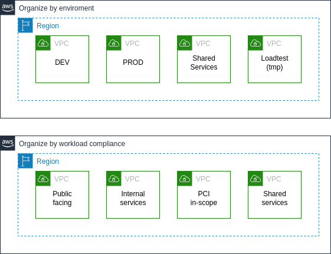

# AWS Security Specialty
- [AWS Security Specialty](#aws-security-specialty)
- [Incident Reponse](#incident-reponse)
  - [Main Points](#main-points)
    - [Case of Compromised Instance](#case-of-compromised-instance)
    - [Case of Exposed access keys](#case-of-exposed-access-keys)
  - [Incident Reponse Plan](#incident-reponse-plan)
    - [Preparation](#preparation)
    - [Detection and Analysis](#detection-and-analysis)
    - [Contaiment Eradication \& Recovery](#contaiment-eradication--recovery)
      - [Steps](#steps)
    - [Post-Incident Activity](#post-incident-activity)
  - [Case Study: Compromised EC2 Instance](#case-study-compromised-ec2-instance)
    - [identify compromised resources](#identify-compromised-resources)
    - [identify Blast Radios](#identify-blast-radios)
      - [mitigate the Event](#mitigate-the-event)
      - [recovery safely](#recovery-safely)
  - [Question Breakdown](#question-breakdown)
- [Logging and Monitoring](#logging-and-monitoring)
  - [Securit Monitoring](#securit-monitoring)
    - [Infraestructure Monitoring Services](#infraestructure-monitoring-services)
    - [Application Monitoring Service](#application-monitoring-service)
    - [Accounts Monitoring Services](#accounts-monitoring-services)
  - [Troubleshooting tools](#troubleshooting-tools)
    - [Tools](#tools)
    - [Root causes](#root-causes)
  - [Case Study: Broken Monitoring](#case-study-broken-monitoring)
    - [trace why notification have not received](#trace-why-notification-have-not-received)
    - [implement missing monitoring](#implement-missing-monitoring)
    - [ensure compliance](#ensure-compliance)
  - [Question Breakdown](#question-breakdown-1)
  - [Logging Solutions](#logging-solutions)
    - [Access logs](#access-logs)
    - [Execution logs](#execution-logs)
    - [Security Log](#security-log)
  - [Log processing](#log-processing)
  - [Case Study: Automated Log Management](#case-study-automated-log-management)
    - [transfer logs from CloudWatch Logs to S3](#transfer-logs-from-cloudwatch-logs-to-s3)
    - [implement automated log expiration across all log groups](#implement-automated-log-expiration-across-all-log-groups)
  - [Question Breakdown](#question-breakdown-2)
- [Infrastructure Security](#infrastructure-security)
  - [Edge Security, ingress points](#edge-security-ingress-points)
    - [VPC Security](#vpc-security)
  - [VPC Egress](#vpc-egress)
  - [Multiple VPC Strategies](#multiple-vpc-strategies)
    - [Same regions](#same-regions)
    - [Different regions](#different-regions)
    - [Different account](#different-account)
  - [Connect multiple VPC - Transit Gateway](#connect-multiple-vpc---transit-gateway)
  - [Consideration](#consideration)
  - [Case Study: Multi-Scope Infraestructure Design](#case-study-multi-scope-infraestructure-design)
    - [design an application/network infrastructure for HIPAA compliant workloads](#design-an-applicationnetwork-infrastructure-for-hipaa-compliant-workloads)
    - [design a devops infrastructure for shared use](#design-a-devops-infrastructure-for-shared-use)
  - [Question Breakdown](#question-breakdown-3)
- [Network Troubleshooting Scenarios](#network-troubleshooting-scenarios)
  - [Scenario 1: Traffic rejected between A and B](#scenario-1-traffic-rejected-between-a-and-b)
  - [Scenario 1: Posible Causes](#scenario-1-posible-causes)
    - [Route Tables misconfiguration](#route-tables-misconfiguration)
    - [NACLs misconfiguration](#nacls-misconfiguration)
    - [Security Group misconfiguration](#security-group-misconfiguration)
  - [Scenario 2: User cannot modify network resource](#scenario-2-user-cannot-modify-network-resource)
  - [Scenario 2: Posible Causes](#scenario-2-posible-causes)
    - [Change of a VPC through API endpoint](#change-of-a-vpc-through-api-endpoint)
- [Host-Based Security](#host-based-security)
  - [Case Study: The Golden AMI Pipeline](#case-study-the-golden-ami-pipeline)
    - [set up the pipeline infrastructure](#set-up-the-pipeline-infrastructure)
    - [share the approved AMIs with organization](#share-the-approved-amis-with-organization)
    - [deploy updated AMIs into existing stacks](#deploy-updated-amis-into-existing-stacks)
  - [Question Breakdown](#question-breakdown-4)
- [IAM](#iam)
  - [Permissions and Roles](#permissions-and-roles)
    - [AWS Credentials](#aws-credentials)
      - [Benefits of Signed request](#benefits-of-signed-request)
      - [How To Access AWS - Indirect](#how-to-access-aws---indirect)
  - [IAM Policy Details](#iam-policy-details)
  - [IAM Policy Conditions - Resources based access control](#iam-policy-conditions---resources-based-access-control)
  - [Policiy Evaluation Logic](#policiy-evaluation-logic)
  - [Assuming an IAM role](#assuming-an-iam-role)

# Incident Reponse

The incident response cycle is a structured process organizations follow to respond to security incidents, and continuously improve their incident management process. 

## Main Points

1. Given an AWS abuse notice, evaluate the suspected compromise instance or expose access Keys
2. Verify that the incident response plan includes relevant AWS services
3. Evaluate the configuration of automated alerting and execute possible remediation of security-related incidents and emerging issues

### Case of Compromised Instance

- Amazon GuardDuty is a threat detection service that continuously monitors your AWS accounts and workloads for malicious activity and delivers detailed security findings for visibility and remediation.
- VPC Flow Logs is a feature that enables you to capture information about the IP traffic going to and from network interfaces in your VPC. Flow log data can be published to the following locations: Amazon CloudWatch Logs, Amazon S3. After you create a flow log, you can retrieve and view the flow log records in the log group, bucket, or delivery stream that you configured.
- Isolate instances from network using security group
- Launch a replacement from AMI

### Case of Exposed access keys

- Access Advisor report to determine which services were accessed using that key and at what time.
- GuardDuty
- CloudTrail Logs
- Disable Keys, create new keys

## Incident Reponse Plan

### Preparation

Invariably, there will come a time where a risk will materialize, and a cyber incident will occur. Preparation is where the foundations of any future response process lie. In this phase, you should adopt a risk-based approach to cybersecurity, by taking the time to understand your organization’s technological and business environment, identify and track threats and document risks to your organization. Once you define your risk and identify your critical assents, you'll need an actionable plan that empowers your teams to response indicendets.

- Limit the blast radious
    - Deploy Accounts using AWS Organization
    - Using multiple VPC to restrict access
    - Self documented infraestructure (AWS Config, AWS CloudFormation, AWS SSM)
- Procedures and Run Playbooks
    - Store this files in diffrente accounts with high avaialability with soft copies in offline storage
- Normal Behavior Baseline
    - Amazon CloudWatch
    - Amazon GuardDuty
- Clean image for DRP
    - Create clean EC2 AMI 
    - EBS Snapshots
    - Backup stored in S3
    - Save configuration files in S3
- Risk assessment
    - Amazon Inspector, EC2 perspective
    - Amazon GuardDuty
    - Amazon Macie, S3 perspective
- Network security
    - VPC NACL
    - Security Groups
    - VPC Flow Logs
    - AWS WAF
- Store Relevant Event Information
    - Amazon CloudWatch Logs
    - Configuration stream (Snapshot of config)
    - Amazon CloudWatch Events
    - Access logs stored in S3
    - CloudTrail Logs

### Detection and Analysis

The detection phase uses technical or administrative security controls to detect malicious activity in the environment.

- Recognizing sings of an intrusion attempt
    - Amazon CloudWatch
    - Amazon CloudTrail (audit log)
    - Amazon GuardDuty
    - VPC Flow Logs
- Incident Analysis
    - Visualize performance baseline with CloudWatch dashboards, SSM Insights dashboards
    - Understand normal behavior with GuardDuty dashboard
    - Implement log retention policies, CloudWatch log expiration, S3 life cycle policies and glacier vault lock policy
    - Corralate events between logs and metrics with Amazon OpenSearch & Kibana and CloudWatch logs insights
- Incident Notification
    - Amazon SNS
    - Amazon SES
    - AWS Trusted Advisor
- Use all help Available
    - Open a support case
    - Search the AWS Forums
    - Great justification for premium support

### Contaiment Eradication & Recovery

Detection flows into containment, eradication, and recovery, with the implication that each may be repeated multiple times during a given incident. This is intended to acknowledge the reality that, as the response process unfolds, new issues will likely be detected and addressed.

#### Steps

- Containment strategy
    - Security Group rules
    - Revoke IAM sessions
    - WAF ACL rules
    - IAM policies
    - Access key rotation
    - KMS CMK rotation
- Evidence gathering and handling
    - CloudTrail log
    - CloudWatch log
    - VPC Flow Logs
    - IAM Access Advisor
- Identify the attacking Entity 
    - DNS Lookup
    - GuardDuty Finding
- EC2 Instance termination
- Disable compromised keys
- Separate compromised data for analysis
- Recovery
    - Know your RTO (recovery time objective) and RPO (recovery point objective)
    - Ability to recognize resources that needed to be repair and those that need replacement
    - Automate task to help a faster recovery
- Clean Up
    - Remove temporary resources
    - KMS key audit
    - Full IAM audit
    - Review further fidings

### Post-Incident Activity

When recovery has been completed across the organization, it can be tempting to simply put the incident behind you. However, doing so will be detrimental to your organization’s growth, as well as your preparedness to tackle similar incidents in the future. Understanding the cause of the incident, reviewing how your program can be improved, and implementing the improvements constitute an essential feedback loop. This feedback loop should be formalized in your incident response plan.

You'll need:

- Evidence retation
    - S3
    - Glacier
    - AMI of compromised instances
    - Snapshots of compromised volumes
- Proposals for improvment
    - Least privilage
        - Access control
        - Network permissions
    - Monitoring
        - Better dashboards
        - Active response

## Case Study: Compromised EC2 Instance

Scenario: One of your EC2 instances has been compromised by an unknown actor
How can you:

1.  identify compromised resources
2.  identify blast radius
3.  mitigate the event
4.  recover safely

### identify compromised resources

Option 1: AWS abuse notice via email

> No context, few data points = Sub-optimal

Option 2: Identify through existing instrumentation using services CloudWatch, VPC Flow logs, EC2 OS Firewall

> Allow us to gather data points on the security performance and by doing this we start to correlate our viewed behavior with actions that are been taken potentially by an outside source and that allow us to make informed decisions on how to move ahead.

### identify Blast Radios

Use AWS ecosystem to determine inventory relationships and which resources are associated with the compromised instance. AWS Config continually assesses, audits, and evaluates the configurations and relationships of your resources like to which subnet is associated, NACL, security group or volumes has attached. By learning all this information can actually change the scoop of our suspected compromised.

#### mitigate the Event

Given this configuration (fig 1.) we create a different SG and detachment the previous one to add a new one completely isolated from the network in place for analysis (fig 2).

#### recovery safely

Assuming that we've created our backups we can then launch another resource from it with the correct application security group. Also we need to retain our data and one way to do it is to persist all logs and data points in durable storage for post mortem analysis. Once we have the data it's important to analyse it to make recommendations and we can do it with some of this applications: 

- RedShift queries, feature RedShift: We can use it to create query S3 data like if it was part of PostgreSQL database.
- Athena: Analyze data or build application from an Amazon Simple Storage Service (S3)
- Glub Job: Execution of Code
- QuickSight dashboard

## Question Breakdown

Your security team has been informed that one of your IAM username/password pairs
has been published to social media and has been used several times by unauthorized
sources. How can the security team stop the unauthorized access, and determine what
actions were taken with the compromised account, with minimal impact on existing
account resources?

- [ ] Immediately change the IAM user password, ask the user what actions they normally take, then compare with current AWS inventory

> Stops the usage of the IAM account, but does not really address action taken with the compromised credentials

- [ ] Delete the IAM user account, remove all resources created by the user, and analyze CloudTrail logs for unauthorized actions

> Stops the usage of the IAM account, analyzes unauthorized usage, but impacts exisiting resources

- [ ] Immediately change the IAM user password, and remove all resources created by the user

> Stops the usage of the IAM account, but impacts existing resources

- [x] Immediately change the IAM user password, and analyze CloudTrail logs for unauthorized actions

# Logging and Monitoring

## Securit Monitoring

### Infraestructure Monitoring Services

- VPC Flow Logs
- Amazon GuardDuty
- Athernas queries
- AWS Config configuration stream, apply logic to that stream to determine if a change matches a rule. It watches security group changes, new instances launch, changes or additions in route tables.
- Amazon inspector 

### Application Monitoring Service

- CloudWatch logs
- CloudTrail, Cognito user authentication, step functions logs, deployments via AWS CodeDeploy
- S3, ALB Access Logs, CloudFront access logs, Redshift audit logs.

### Accounts Monitoring Services

- CloudWatch Events: Activity can be publish and create rule to match specific events and take action accordingly. GuardDuty, CloudTrail Events, AWS Organization events, can push events to this service.
- AWS Config: Include a predefined rules to get advantage of once enabled for accounts monitoring. [List of AWS Config Managed Rules](https://docs.aws.amazon.com/config/latest/developerguide/managed-rules-by-aws-config.html)

## Troubleshooting tools

### Tools

- Amazon Inspector findings
- CloudWatch alarms and metrics
- CloudTrail Logs
- CloudWatch Logs Insights

### Root causes

- Unclear requirements for security monitoring
- Poorly implemented CloudWatch Alarms
- Gaps in OS update procedures and compliance checking

## Case Study: Broken Monitoring

Scenario: Recent security event never generated notifications.
How can you:

1.  trace why notification have not received
2.  implement missing monitoring
3.  ensure compliance going forward

Given this pipeline

### trace why notification have not received

Possible Root Causes

- CloudTrail has been disabled
- CloudWatch alarm deleted or modified
- SNS topic or subscription deleted
- Email distribution subscription deleted or changed or blocked, individual email goes to ex-employee inbox.

### implement missing monitoring

- Enable CloudTrail
- Document all alarms and re-create
- Recreate topic or subscription
- Re-create distribution list

### ensure compliance

- Config Rule + Lambda function to ensure CloudTrail is enable
- Schedule lambda function that evaluates alarms and recreates as needed
- Prevent topic or subscription deletes via Organization SCP

## Question Breakdown

An application running in EC2 has a requirement for independent, periodic security checks against the application code. These checks can send notifications upon warning, but for critical alerts they must shut down the application on the instance. How can your security team perform these checks without injecting code into the application, while meeting the notification and active response requirement?

- [ ] Install the AWS Inspector agent on the instance, and schedule regular audit jobs. Send the findings to an SNS topic with a Lambda function subscribed that parses the findings and responds appropriately.
> AWS Inspector cannot audit your custom application code, but sending findings to Lambda is a good option
- [x] Deploy a second application on the EC2 instance with the security audit code. Send security audit results to CloudWatch Events, and create a rule to send warning events to SNS, and critical events to SSM Run Command to stop the application
- [ ] Install CloudWatch Logs agent on the instance, streaming all application logs. Create a CloudWatch Logs metric filter with alarms for notifications and a Lambda function to stop the application
> This does not act as an independent audit, relying on application logs
- [ ] Install the AWS Inspector agent on the instance, and schedule regular audit jobs. Send the findings to Cloud Watch Events, and create a rule to send warning events to SNS, and critical events to SSM Run Command to stop the application
> Inspector cannot audit custom code. Te passive/active response mechanism is appropriate.

## Logging Solutions

### Access logs

*API Gateway*: CloudWatch Logs, using IAM Role
*CloudFront*: S3 Bucket
*ELB*: S3 Bucket*
*S3*: S3 Bucket*

> * Best effort delivery, AWS does not grantee that every single log entry would actually make it into the S3 Bucket

### Execution logs

*API Gateway*: CloudWatch Logs, using IAM Role
*Lambda Functions*: CloudWatch Logs, using IAM Role
*Custom EC2*: S3 Bucket o CloudWatch Logs, using IAM Role

### Security Log

*Inspector*: With the possibility to use notification to SNS using an IAM Role
*GuardDuty*: You can send your findings to CloudWatch Events using IAM Role and take actions.
*CloudTrail*: CloudWatch Logs, using an IAM Role. By default uses S3 Bucket
*VPC Flow Logs*: CloudWatch Logs, using an IAM Role

## Log processing

- Amazon Kinesis Data Stream
- Amazon Kinesis Firehose (you can place them into S3, Redshift, Amazon ES, 3rd party applications)
- Amazon Athenas
- Amazon Redshift
- AWS Glue
- Amazon Elastic MapReduce
- Amazon Elasticsearch and Kibana
- Amazon CloudWatch logs Insights
- AWS Lambda (enables you to perform custom analytics from already easy to integrate services)

## Case Study: Automated Log Management

Scenario: New monitoring requirements to persist all logs in S3 and expire all entries in
CloudWatch log groups after 365 days

How can you:

1.  transfer logs from CloudWatch Logs to S3?
2.  implement automated log expiration across all log groups?

### transfer logs from CloudWatch Logs to S3

Using Kinesis Firehose placing the logs entry into the S3 Bucket. It require permissions and configuration into the following steps:

1.  Create IAM Role with trust policy allowing use by Kinesis Firehose
2.  Associate another IAM Role with permissions policy allowing write access to S3 bucket.
3.  Create Firehose delivery stream using IAM Role and ARN from previous steps and S3 bucket ARN
4.  Create IAM Role with trust policy allowing use by CloudWatch Logs
5.  Associate IAM Role with permissions policy allowing access to Kinesis Firehose
6.  Create a subscription filter using IAM role ARN created in previous step and delivery stream ARN *(requires CLI)*

### implement automated log expiration across all log groups

Creating IAM role with trust policy allowing to assume by Lambda function. The permissions policy will allow us to modify the configuration of a CloudWatch Group after this we create our lambda function that set the expiration days on CloudWatch Logs groups passed as parameter. After that we need to create a CloudWatch Event Rule that matches new CloudWatch Logs group creation and add the lambda function as target for this rule.

## Question Breakdown

You've been asked to stream application logs from CloudWatch Logs to Splunk.
There is an existing subscription filter on the log group, set up for Kinesis Firehose to S3. What is the most appropriate way to ingest the logs in near real-time for Splunk analysis?

- [ ] Create a Lambda function subscribed to the CloudWatch log group that streams entries to the Splunk endpoint
> CloudWatch log groups only support one subscription filter at a time
- [ ] Create a Splunk connector to the S3 bucket destination for the Kinesis Firehose
> S3 ingestion will not be near real-time, because Firehoes uses a buffer and batch mechanism
- [x] Enable Source record transformation on the Kinesis Firehose. Create a Lambda function using the Splunk blueprints which decompresses the log entries and pushes to Splunk
- [ ] Write a shell script that uses the AWS CLl to export logs from the CloudWatch log group and ingest into Splunk
> May be functional but not reliable or near real-time

# Infrastructure Security 

## Edge Security, ingress points

- CloudFront
- S3
- API Gateway
- ELB
- AWS Service API endpoints
- VPC Ingress

### VPC Security

**Subnets** can be used to isolate workloads, you can apply NACL and route tables and it gives you finer granularity cidr-related security features and you have the option to monitor using VPC Flow Log feature.

**Network ACL** stateless firewall with order rule sets for both inbound and outbound traffic that is going to be apply at the subnet level. You can use them to enforce compliance for application tier traffic and rejection inbound traffic to database from non-application sources and prevent compromised instances from exploring the network.

**Route Table** can be use to enable internet accessibility, limit outbound access to a specific cidr range -- even /32 and allow least privilege access to on-premises networks down to a single IP or enable traffic flow to authorized endpoints.

**Security Groups** is a stateful firewall. It also allows for inbound and outbound rules and since its stateful only requires to create rules in one direction. Its easier to apply least privilege because by default traffic is block so you can whitelist the appropriate external sources for access. You can create inbound rules to allow traffic only from specific upstream sources (like ALB). It can be apply to other features like lambda functions and endpoints.

## VPC Egress

**Internet Gateway** enables internet access with no blacklist capability so you may want to use more specific route tables entries to limit outbound access.

**Virtual Private Gateway** is used by both VPN and Direct Connect it can be used to route traffic to and between multiple customer networks (VPN CloudHub) and it has no native features for blacklisting traffic.

**VPC Peering Connection** this give you the ability to connect two VPCs and treat them as part of the same network. Requires route table entries, use specific cidr for least privilege. Restrict traffic with security groups and NACL.

**Gateway Endpoint** only used for access to DynamoDB and S3. VPC + DynamoDB or S3 must be present in the same region.Keep traffic private by avoiding public AWS network and allows you to apply resource-level permissions on all requests.

**Interface endpoint** access service API, API Gateway and Marketplace products keeps traffic private by avoiding public AWS network and does not require public IP addresses.

**NAT Gateway** actually exist inside of the VPC rather than attached to the VPC. Managed services that its deploy on a availability zone scope that only allows outbound access to the internet. They cannot be associated with security groups but with NACL that is part of the subnet they are launched into. Apply specific route table entries for least privilege.

**DIY** use fro inline IDS/IPS and DLP. This give you full control over the resource. With this approach can act as router, proxy or security appliance and by disable the source destination checking on the network interface it too becomes a target of round tables entries so you can enforce your traffic directly through this DIY endpoint.

## Multiple VPC Strategies

AWS customers often rely on hundreds of accounts and virtual private clouds (VPCs) to segment their workloads and expand their footprint.This level of scale often creates challenges around resource sharing, inter-VPC connectivity, and on-premises facilities to VPC connectivity.

### Same regions

### Different regions

### Different account

## Connect multiple VPC - Transit Gateway

You can deploy a transit gateway to create assosiations with other vpcs and manage the interconectivity between this vpcs attaching to the transit gateway itself and route tables. This gives your even more flexibility like VPC Peering connections.

## Consideration

The biggest arguments against using multiple accounts on AWS include the complexity of managing and maintaining global visibility of resources, it may require a greater amount of time and effort to establish security policies and control access to resources, which can increase the possibility of bugs and security vulnerabilities. It can also be more difficult to audit and track activities and resource usage across multiple accounts, which can make it difficult to make informed decisions about cost optimization and efficiency.

- More Security Groups
- More NACL
- More route tables (use Transit Gateway)
- More routes
- More egress points
- Higher operation overhead

## Case Study: Multi-Scope Infraestructure Design

Scenario: Design a secure infraestructure with multiple networks for hosting and operations

How can you:

1.  design an application/network infrastructure for HIPAA compliant workloads
2.  design a devops infrastructure for shared use
3.  utilize AWS services to eliminate traffic between the two networks

### design an application/network infrastructure for HIPAA compliant workloads

|  | Internet Accesibility  | Route Tables | NACLs | Services/Apps | SG Config |
|---|---|---|---|---|---|
| Subnet A | Direct access | 0.0.0.0/0 route to IGW | Reject outobund to VPC-only subnets | Managed services in public subnets with ALB with WAF | Inbound 443 / Outbound 8080 to app |
| Subnet B | Indirect internet access | 0.0.0.0/0 routed to NAT GW | Reject all non-application traffic in/out | Resources for application hosting (ECS/Fargate) | Inbound 8080 from LB / Outbound 3306 to DB |
| Subnet C | No internet access | No route for 0.0.0.0/0 | Accept inbound to DB from app only | Data presisted using synchronous replication (RDS/Aurora) | Inbound 3306 / No outbound |

### design a devops infrastructure for shared use

VPC deployed into multiple AZ with public and private subnets and EC2 instances running the CI in a private subnet. We are some workloads we are going to need configure to allow our devops pipeline to work specific for access to the CI and for our CI have access to our source code.

Force all traffice to VPN. This will allow our CI have access to our private data center network that has our source code. Also allow access to our CI through CLI or web browser from our internal company network. Then use a NAT Gateway for outbound acces to AWS API endpoints allowing push container image to ECR, create task definitions in ECS and deploying new services, and finally create new listle new rules to ABL to pint traffic to new ECS service.

## Question Breakdown

Your R&D team is designing a new application which will consist of multiple tiers as follows:

- Customer-facing: Web front end accessible by browser (ports 80/443)
- REST API: Application front end available to client apps and partners (port 443)
- Application: Business logic implementation (port 8080)
- Database: Relational data (port 3306)

Both the customer-facing and REST API tiers need access to the application tier, and only the application tier needs access to the database. Each tier is launched into dedicated subnets.

Which combination of security group and NACL rules would be part of a least-privilege network security configuration? (pick four)

- [x] NACL: deny ALL outbound from Customer-facing to Database subnets
- [ ] SG: allow ALL tcp inbound from REST API SG to Application SG
> Any time you're allowing ALL inbound, you should look for ways to restrict to a range or single port
- [x] SG: allow inbound 3306 from Application subnets to DB subnets
- [x] NACL: deny ALL inbound from REST API to Database
- [x] SG: remove default outbound rule from all SG
- [ ] NACL: allow ALL tcp inbound and outbound to Customer-facing subnets
> This is the default configuration. If the web tier only allows 80/443, it would be good to restrict this NACL to match

# Network Troubleshooting Scenarios

## Scenario 1: Traffic rejected between A and B

Possible locations of A and B
* Located in the same VPC
* Located in different VPCs
* Located in a private data center

## Scenario 1: Posible Causes
* Route table entries (with correct target)
* NACL rules (inbound/outbound)
* Security group rules (inbound/outbound)
* Physical data center firewall
* Host-based firewall
* VPCDIY firewall

### Route Tables misconfiguration

### NACLs misconfiguration

### Security Group misconfiguration

## Scenario 2: User cannot modify network resource

Example network resources
* Route table
* Security Group
* Network Access Control List
* Virtual Private Gateway
* Other VPCresources

## Scenario 2: Posible Causes

* User permissions
    * IAM Policy
* Account permissions
    * AWS Organizations SCP
* Other APl issues
    * Request sent with time drift > 5 min

### Change of a VPC through API endpoint
- Change acpture by AWS Config rule
- Change acpture by CloudWatch Events rule
- Change acpture by CloudFormation Drift Detection

> Any of these could be used to trigger a lambda function to revert the change

# Host-Based Security

- Use AMI from trusted sources
- Launch into a secured VPC
- Implement additional security
    - OS Firewall
    - Disable unneeded services
    - Remove insecure packages
    - AWS Monitoring
    - Third-party monitoring
    - Restrict user access
    - Immutable OS

*Automating OS Security* with Amazon Inspector installing an agent and create a SNS topic to send the findings as notification and configure an assesment template, the schedule run and execute it.

For example after getting a notification posted to SNS by the inspector you can trigger a Lambda function that parses that findings and then invokes SSM run command to install a patch on the instance.

*Security via Immutable OS* an be more secure than a mutable one. An immutable OS is one that cannot be changed after it is deployed. Any changes to the OS must be made by deploying a new version of the OS, which replaces the old one. This ensures that the OS is always in a known and trusted state.

Using an Auto Scaling Group (ASG) can also improve security by ensuring that instances are replaced if they become compromised or are no longer needed. When using an ASG with an immutable OS, new instances are created by deploying a new version of the OS. The new instance is then registered with the ASG and added to the load balancer. The old instance is terminated. This ensures that all instances are running the same version of the OS and have the same security posture.

> Others tools to work with an Inmmutable OS: Elastic Beanstalk, ECS on Fargate, Lambda, 

## Case Study: The Golden AMI Pipeline

Scenario: Design an automation pipeline tor
creation of golden AMIs

How can you:
1. set up the pipeline infrastructure
2. share the approved AMlIs with organization
3. deploy updated AMIs into existing stacks

### set up the pipeline infrastructure
Launche EC2 instance from trusted sources and then use a user data script to perform basic validation (i.g. binary checksum, permissions, existing packages required). After that you can execute patch installas and library updates via SSM Run Command. This task also involves all the OS hardenings strategies discused before. After that you can stop we can create a new Golden AMI from this instances which it can be done via Lambda and CloudWatch Events. From this point we can install inspector agent and perform assesment via SSM Run Command so all of the findings are posted to SNS topic and sent to approver.

### share the approved AMIs with organization

The new Golden AMI generates a CloudWatch Event which will trigger a Lambda function to share the AMI with all other accounts in AWS Organizations. Since CloudWatch Event can have multiple targets you can also use this to forwards event to other accounts event buses.

### deploy updated AMIs into existing stacks

The others acccount would have an inbound AMI update event captured by CloudWatch Events rule that CW Event can trigger a Lambda function that target deploys updates according to infrastructre.

## Question Breakdown

A company has recently completed a number of iImprovements to their network security. Some of the modifications included removing the Internet Gateway and implementing Gateway VPC endpoints for S3 access from inside the VPC. An application that was previously functional is now unable to access S3. Which of the following troubleshooting steps would NOT identify the root cause?

- [ ] Analyze the Network ACL rules associated with the application subnets
> NACLS rule must be permissive in both direction for the traffic flow
- [ ] Analyze the route table associated with the application subnets
> The VPC endpoint requires a route table entry for functionality
- [ ] Analyze the bucket policy associated with the S3 bucket
> The S3 bucket must allow access for functionality
- [x] Analyze the application security group inbound rules
- [ ] Analyze the application security group outbound rules
> Security group outbound rules must be permissive enoguh to allow the application to reach S3

# IAM

## Permissions and Roles

### AWS Credentials

- Authentication
    - Proof of identity
    - User/Password
    - Keys
    - MFA
    - Federation

- Authorization
    - Permissions for actions
    - User-based access control
    - Resource-based access control
    - Implicit deny

#### Benefits of Signed request

1. Authentitcation - proven identiy
2. Avoid tampering (MitM)
3. Avoid replays (wireshark/tcpdump)
 
#### How To Access AWS - Indirect

By assuming an IAM role via STS, you can temporarily grant permissions to a trusted entity, such as an EC2 instance, a Lambda function, or a user in a different account. This allows the trusted entity to access resources and services that it would not normally have access to.

QuickSight users need to have an AWS account and sign in to QuickSight using their email address as their username.

In Cognito, users can sign in using their email address as their username or they can use a social identity provider such as Google or Facebook to authenticate. 

AWS Directory Services is a managed service that allows you to connect your AWS resources with an on-premises Microsoft Active Directory (AD) or to deploy a fully-managed AD in the AWS Cloud. This allows you to use your existing AD identities to access AWS resources, as well as manage user access and authentication for your AWS resources from a single location.

## IAM Policy Details

| Field | What is it? |
| ----- | ----------- |
| Version | Policy language version and should be static |
| Id | Optional identifier for the policy, only required by some services | 
| Statement | The basic building blocks of an IAM policy and allow you to specify which actions are allowed or denied on which resources for a specific IAM user, group, or role. The following elements are define inside of it.
| Sid | Optional identifier for the statement, only required by some elements. Not directly exposed in the IAM API |
| Effect | Determines whether the polciy results in an explicit allow or explicit deny |
| Principal | The entity that is allowed or denied access to the resource. They can be an IAM Role. Specific assumed-role user. AWS Service and everyone  |

## IAM Policy Conditions - Resources based access control

| Field | What is it? |
| ----- | ----------- |
| notPrincipal | Same concept as pricinapl but for exception. Avoid using with Allow Statements. Use with Deny to implement least privilege policies. |
| Actions | Specific task or actions that can be allowed or denied. |
| notAction | Same concept as Action, used for exceptions, easier than defining a long list. UIse with Allow statements for allowing all except specific action. Use with Denay statements for shorter least-privilege policies |
| Resource | Object that are covered by the statement. Always specific using ARN |
| notResource | Same concept as resources, use for exception easier than defining a long list. Can grant or deny access in an unintentional manner. |
| Condition | Specify condition for when a policiy is in effect. Conditions key names are case insensitive. Some conditions are service specific. |
| String conditions |  - Exact match  - Partial match  - Negated match  |
| Numeric conditions |  - Exact match  - Negated match  - Inequality match  |
| Date conditions |  - Exact date/time  - Negated date/time  - Before data/time  - After date/time  |
| Boolean condition |  - Evaluate statement as true or false  - Another way to evaluate strings  - One way to force SSL transport  | 
| Binary condition | Test key values in binary format, compare value to base-64 encoded binary value in policy |
| IP Address Condition | Compare against IPv4, CIDR format required |
| ARN Condition |  - Case sensitive match of any or all elements of ARN  - Negate match of ARN  - Not supported by all resources    |
| IfExist Condition | Add as postfix to other conditions, check if the key exists as part of another check |
| NullCheck | Check if the key exists as a standalone check | 

## Policiy Evaluation Logic

By default, all requests are denied. This is called an implicit deny. The AWS enforcement code evaluates all policies within the account that apply to the request. These include AWS Organizations SCPs, resource-based policies, identity-based policies, IAM permissions boundaries, and session policies. In all those policies, the enforcement code looks for a Deny statement that applies to the request. This is called an explicit deny. If the enforcement code finds even one explicit deny that applies, the code returns a final decision of Deny. If there is no explicit deny, the enforcement code evaluation continues.

Then the enforcement code evaluates AWS Organizations service control policies (SCPs) that apply to the request. SCPs apply to principals of the account where the SCPs are attached. If the enforcement code does not find any applicable Allow statements in the SCPs, the request is explicitly denied, even if the denial is implicit. The enforcement code returns a final decision of Deny. If there is no SCP, or if the SCP allows the requested action, the enforcement code evaluation continues.

Within the same account, resource-based policies impact policy evaluation differently depending on the type of principal accessing the resource, and the principal that is allowed in the resource-based policy. Depending on the type of principal, an Allow in a resource-based policy can result in a final decision of Allow, even if an implicit deny in an identity-based policy, permissions boundary, or session policy is present.

For most resources, you only need an explicit allow for the principal in either an identity-based policy or a resource-based policy to grant access. IAM role trust policies and KMS key policies are exceptions to this logic, because they must explicitly allow access for principals.

Resource-based policy logic differs from other policy types if the specified principal is an IAM user, an IAM role, or a session principal. Session principals include IAM role sessions or an IAM federated user session. If a resource-based policy grants permission directly to the IAM user or the session principal that is making the request, then an implicit deny in an identity-based policy, a permissions boundary, or a session policy does not impact the final decision.

The code then checks the identity-based policies for the principal. For an IAM user, these include user policies and policies from groups to which the user belongs. If there are no identity-based policies or no statements in identity-based policies that allow the requested action, then the request is implicitly denied and the code returns a final decision of Deny. If any statement in any applicable identity-based policies allows the requested action, the code continues.

The code then checks whether the IAM entity that is used by the principal has a permissions boundary. If the policy that is used to set the permissions boundary does not allow the requested action, then the request is implicitly denied. The code returns a final decision of Deny. If there is no permissions boundary, or if the permissions boundary allows the requested action, the code continues.

The code then checks whether the principal is a session principal. Session principals include an IAM role session or an IAM federated user session. If the principal is not a session principal, the enforcement code returns a final decision of Allow.

For session principals, the code checks whether a session policy was passed in the request. You can pass a session policy while using the AWS CLI or AWS API to get temporary credentials for a role or an IAM federated user.

- If a session policy is present and does not allow the requested action, then the request is implicitly denied. The code returns a final decision of Deny.

- If there is no session policy, the code checks whether the principal is a role session. If the principal is a role session, then the request is Allowed. Otherwise, the request is implicitly denied and the code returns a final decision of Deny.

- If a session policy is present and allows the requested action, then the enforcement code returns a final decision of Allow.

If the AWS enforcement code encounters an error at any point during the evaluation, then it generates an exception and closes.

## Assuming an IAM role

