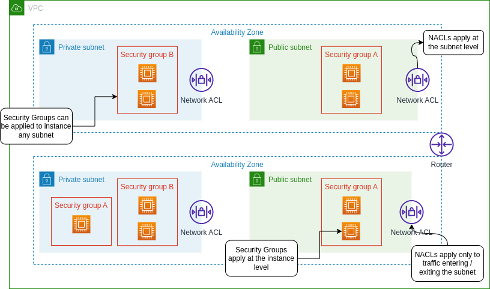
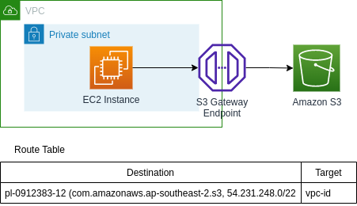

# AWS VPC

## CIDR

## VPC

Es una red virtual dedicada a una cuenta de AWS que esta logicamente aislada de otras redes virtuales en la nube de AWS y provee un control completo sobre el ambiente de la red en si (Rangos IP, subnet, tablas de enrutamiento y puertas de enlace) desde la cual se pueden lanzar recursos de AWS como instancias de EC2.

En la creacion es requerido especificar un rango de IPv4's de la VPC en la forma de bloques de CIDR (10.10.0.0/16). Una VPC abarca todas las AZ de la región, pero cuando crea una subred, especifica el bloque de CIDR de IPv4 para la subred, que es un subconjunto del bloque de CIDR de la VPC. Cada subred debe residir completamente dentro de una zona de disponibilidad y no puede abarcar otras zonas.

### Amazon VPC Components

| Amazon VPC Component | What it is |
| --- | --- |
| Virtual Private Network (VPC) | Una red virtual lógicamente aislada en la nube de AWS |
| Subnet | Un segmento del rango de direcciones IP de una VPC donde puede colocar grupos de recursos aislados |
| Internet Gateway | El lado de Amazon VPC de una conexión a Internet pública |
| Router | Los enrutadores interconectan subredes y dirigen el tráfico entre puertas de enlace de Internet, puertas de enlace privadas virtuales, puertas de enlace NAT y subredes |
| Peering Connection | Conexion directa entre dos VPCs |
| VPC Endpoints | Conexiones privadas a servicios públicos de AWS |
| NAT Instances | Habilita el acceso a Internet para instancias EC2 en subredes privadas administradas por usted |
| NAT Gateway | Habilita el acceso a Internet para instancias EC2 en subredes privadas administradas por AWS |
| Virtual Private Gateway | El lado de Amazon VPC de una conexión de red privada virtual |
| Customer Gateway | Lado del cliente de una conexión VPN |
| AWS Direct Connect | Conexión de red privada de alta velocidad y alto ancho de banda del cliente a AWS |
| Security Group | Cortafuegos a nivel de instancia |
| Network ACL | Cortafuegos a nivel de subred |

### CIDR Rules and guidelines

El tamaño del bloque CIDR puede estar entre /16 y /28 y no debe superponerse con ningún bloque CIDR existente dentro de la VPC asociada. Su tamaño no puede aumentar o disminuir el de un bloque CIDR existente. Las primeras 4 y la última dirección IP no están disponibles para su uso.

- Asegúrese de tener suficientes redes y host.
- Los bloques CIDR más grandes suelen ser mejores para una mayor flexibilidad.
- Las subredes más pequeñas están bien para la mayoría de los casos de uso.
- Considere implementar niveles de aplicación por subred
- Divida sus recursos HA en subredes en diferentes AZ
- La interconexión de VPC requiere bloques CIDR que no se superpongan
     - Esto es en todas las VPC en todas las regiones/cuentas que desea conectar

Se recomienda que especifique un bloque CIDR de los rangos de direcciones IPv4 privadas como se especifica en RFC 1918

| RFC 1918 range | Example CIDR block |
| --- | --- |
| 10.0.0.0 - 10.255.255.255 (10/8 prefix) | 10.0.0.0/16 |
| 172.16.0.0 - 172.31.255.255 (172.16/12 prefix) | 172.31.0.0/16 |
| 192.168.0.0 - 192.168.255.255 (192.168/16 prefix) | 192.168.0.0/20 |

### VPC CIDR Blocks and Subnets

> Subnet generator https://network00.com/NetworkTools/IPv4SubnetCreator

## Security Groups and Network ACL

Se aplica un grupo de seguridad en la etiqueta de la interfaz de red de las instancias en cualquier subred. Funciona como un cortafuegos con estado que permite el tráfico de retorno automáticamente porque solo admite reglas de permiso, lo que implica que existe una regla de denegación implícita para todo menos para lo que está permitido.

La ACL de red se aplica al nivel de subred, filtra el tráfico de entrada y salida de la subred. Funciona como un cortafuegos stateless que busca una regla de permiso para ambas conexiones (entrada y salida) y se procesa en orden.

## VPC Peering

- El emparejamiento de VPC permite el enrutamiento mediante una dirección IPv4 privada.
- Las VPC pueden estar en diferentes cuentas y diferentes regiones, pero los bloques CIDR no se pueden superponer
- No admite emparejamiento transitivo, se requiere malla completa

## VPC Endpoints

## VPC Gateway Endpoint

|     | Interface Endpoint | Gateway Endpoint |
| --- | --- | --- |
| What | Elastic Network Interface with a Private IP | A gateway that is a target for specific route |
| How | Uses DNS Entries to redirect traffic | Uses prefix list in the route table to redirect |
| Which services | API Gateway, CloudFormation, CloudWatch, etc. | Amazon S3, DynamoDB |
| Security | Security Groups | VPC Endpoint Policies |

## AWS Client VPN

## AWS Site-to-Side VPN

## AWS VPN CloudHub

## AWS Transit Gateway

Conecta sus nubes privadas virtuales (VPC) de Amazon y las redes locales a través de un concentrador central. Esta conexión simplifica su red y pone fin a las complejas relaciones de interconexión. Transit Gateway actúa como un enrutador en la nube altamente escalable: cada nueva conexión se realiza solo una vez.

VPC Flow Logs

Captura información sobre el tráfico de IP que va hacia y desde las interfaces de red en una VPC. Estos datos se almacenan mediante Amazon CloudWatch Log o S3 y se pueden crear en los siguientes niveles:

- VPC
- Subnet
- Network interface (ENI attached to a EC2 instance)
