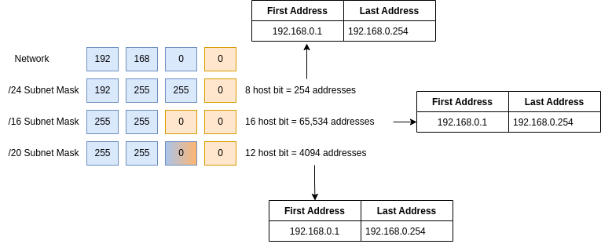
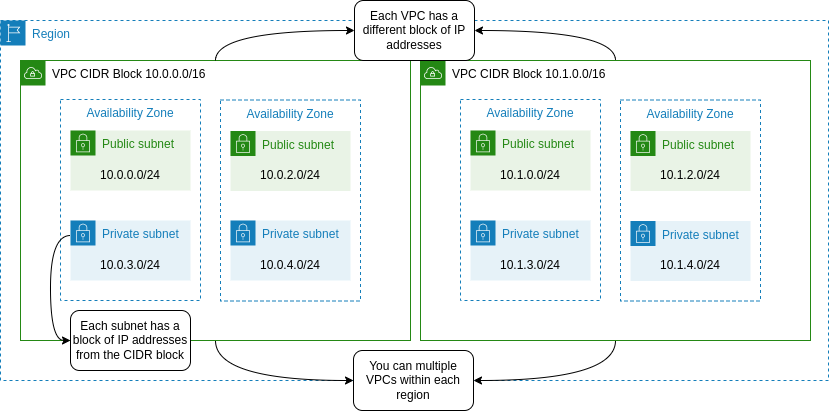
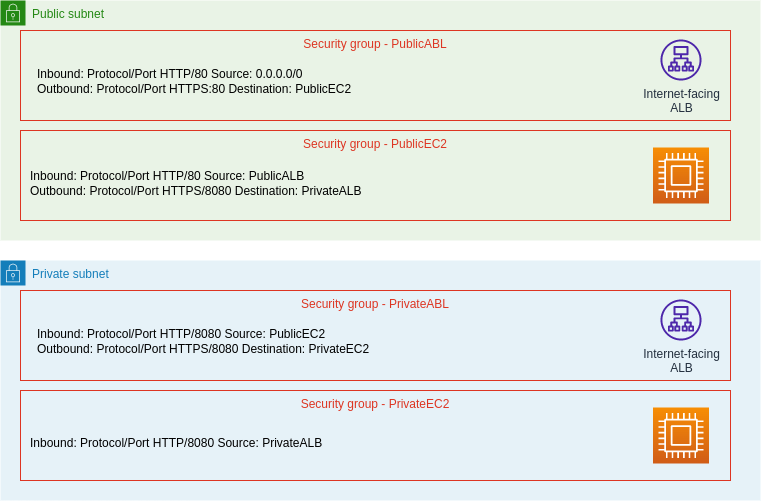
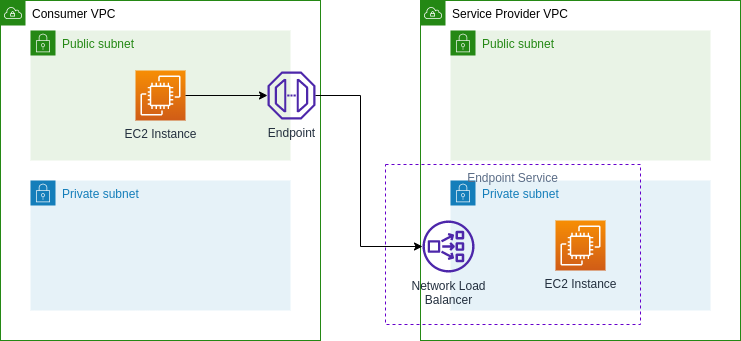
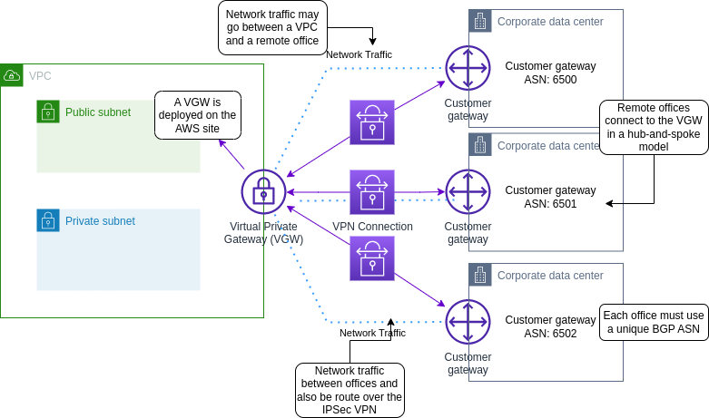
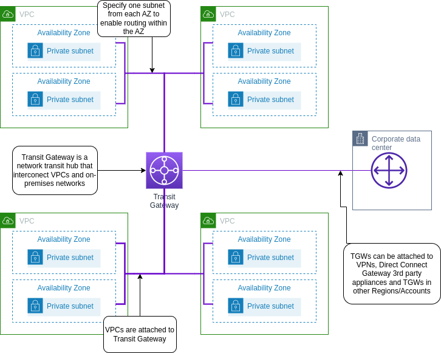

# AWS VPC

## CIDR

## VPC

It's a virtual network dedicated to your AWS account, that its logically isolated from other virtual networks in the AWS Cloud and provides complete control over the virtual networking enviroment (IP range, subnets, route tables and gateways) from where you launch AWS Resources such as AWS EC2 Instances.

At creation its required to specify a range of IPv4 addresses fro the VPC in the form of a CIDR (e.g. 10.10.0.0/16). The VPC spans all the AZ in the region but when you create a subnet, you specify the IPv4 CIDR block for the subnet, which is a subset of the VPC CIDR block. Each subnet must reside entirely within one Availability Zone and cannot span zones.

### Amazon VPC Components

| Amazon VPC Component | What it is |
| --- | --- |
| Virtual Private Network (VPC) | A logically isolated virtual network in the AWS cloud |
| Subnet | A segment of a VPC's IP address range where you can place groups of isolated resources |
| Internet Gateway | The Amazon VPC side of a connection to the public internet |
| Router | Routers interconnect subnets and direct traffic between Internet gateways, virtual private gateways, NAT gateways and subnets |
| Peering Connection | Direct connection between two VPCs |
| VPC Endpoints | Private connections to public AWS services |
| NAT Instances | Enables internet access for EC2 instances in private subnets managed by you |
| NAT Gateway | Enables internet access for EC2 instances in private subnets managed by AWS |
| Virtual Private Gateway | The Amazon VPC side of a Virtual Private Network connection |
| Customer Gateway | Customer side of a VPN connection |
| AWS Direct Connect | High speed, high bandwidth, private network connection from customer to AWS |
| Security Group | Instance-level firewall |
| Network ACL | Subnet-level firewall |

### CIDR Rules and guidelines

CIDR block size can be between /16 and /28 and must not  overlap with any existing CIDR block within the associated VPC. Its size cannot be increase or decrease of an existing CIDR block. The first 4 and the last IP address are not available for use.

- Ensure you have enough networks and host.
- Bigger CIDR blocks are typically better for more flexibility.
- Smaller subnets are OK for most use cases.
- Consider deploying application tiers per subnet
- Split your HA resources across subnets in different AZ's
- VPC peering requires non-overlapping CIDR blocks
    - This is across all VPC's in all regions / accounts you want to connect

It's recommend that you specify a CIDR block from the private IPv4 address ranges as specified RFC 1918

| RFC 1918 range | Example CIDR block |
| --- | --- |
| 10.0.0.0 - 10.255.255.255 (10/8 prefix) | 10.0.0.0/16 |
| 172.16.0.0 - 172.31.255.255 (172.16/12 prefix) | 172.31.0.0/16 |
| 192.168.0.0 - 192.168.255.255 (192.168/16 prefix) | 192.168.0.0/20 |

### VPC CIDR Blocks and Subnets

> Subnet generator https://network00.com/NetworkTools/IPv4SubnetCreator

## Security Groups and Network ACL

A security group apply at the network interface label of the instances in any subnet. Works as a stateful firewall which allows the return traffic automatically because it only supports allow rules implying  there is an implicit deny rule to everything but what is allow.

Network ACL is apply to the subnet level, filters entering and exiting traffic of the subnet. Works as a stateless firewall checks for an allow rule for both connections (ingress & egress) and are processed in order.

## VPC Peering

- VPC Peering enables routing using private IPv4 address.
- VPC's can be in different accounts and different regions but CIDR Blocks cannot overlap
- Does not support transitive peering, full mesh required

## VPC Endpoints

## VPC Gateway Endpoint

|     | Interface Endpoint | Gateway Endpoint |
| --- | --- | --- |
| What | Elastic Network Interface with a Private IP | A gateway that is a target for specific route |
| How | Uses DNS Entries to redirect traffic | Uses prefix list in the route table to redirect |
| Which services | API Gateway, CloudFormation, CloudWatch, etc. | Amazon S3, DynamoDB |
| Security | Security Groups | VPC Endpoint Policies |

## AWS Client VPN

## AWS Site-to-Side VPN

## AWS VPN CloudHub

## AWS Transit Gateway

Connects your Amazon Virtual Private Clouds (VPCs) and on-premises networks through a central hub. This connection simplifies your network and puts an end to complex peering relationships. Transit Gateway acts as a highly scalable cloud router—each new connection is made only once.

## VPC Flow Logs

Captures information about the IP traffic going to and from network interfaces in a VPC. This data is stored using amazon CloudWatch Log or S3 and can be created at the following levels:

- VPC
- Subnet
- Network interface (ENI attached to a EC2 instance)
