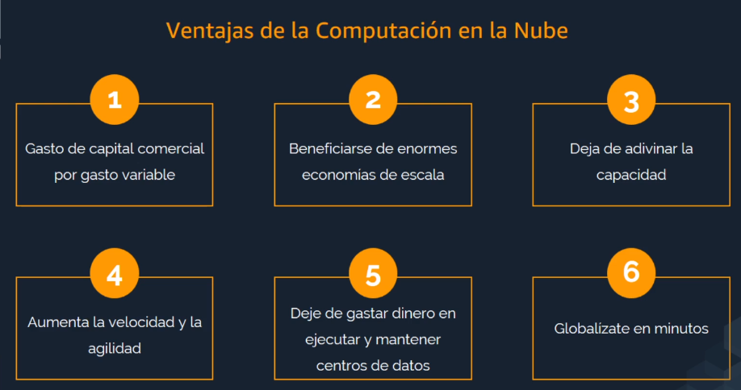
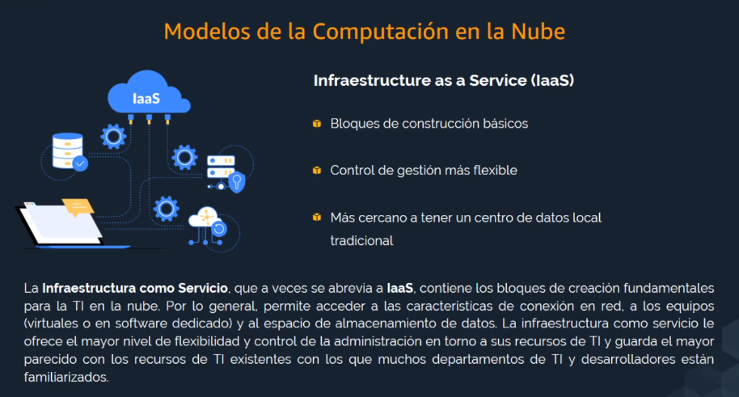
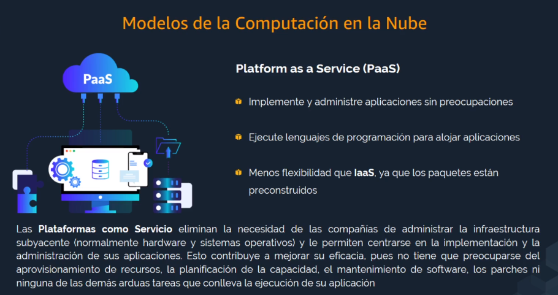
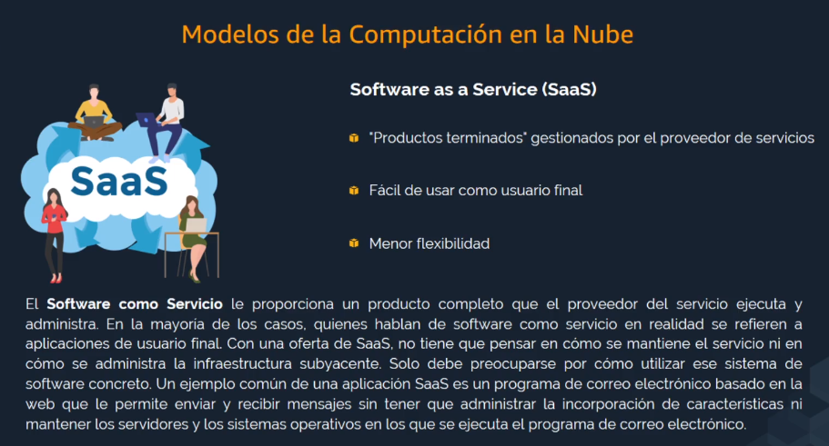
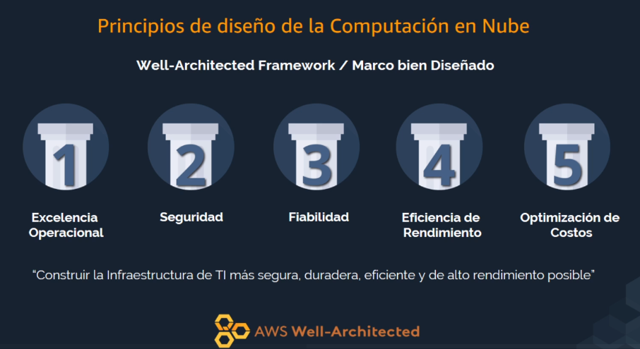
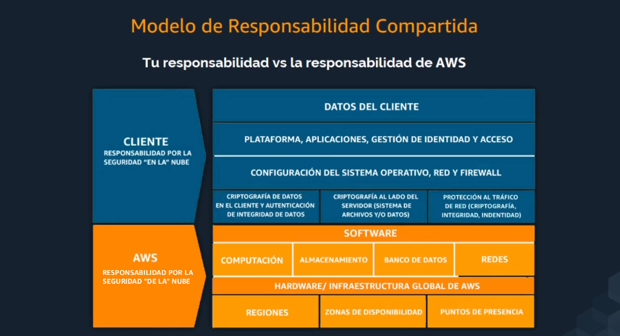
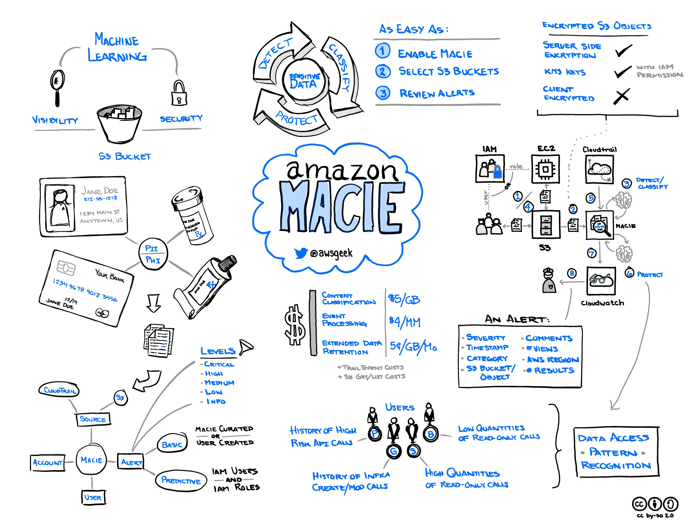

# AWS Certified Cloud Pratitioner
## Cloud Concepts
### Conceptos basicos
Nube == "internet, red de dispositivos interconectados"

Cloud Computing = "Acceso on-demand de recursos informaticos cuando, proceso de adquisicion y facturacion mas faciles y flexibles"

### Ventajas de la nube

### Modelo de computacion en la nube: Iaas

### Modelo de computacion en la nube: Paas

### Modelo de computacion en la nube: Saas

### Tipos de implementacion
* On-cloud
* On-premise
* Hybrid
### Principios de diseño en la nube

1. Operational excellence
    * Documentacion
    * Redefinicion de procedimientos operativos
    * Antifcipacion a fallas
    * Proceso de actualizacion
    * Aprendizaje de las fallas

2. Security
    * Mejores practicas de automatizacion
    * Total proteccion de datos
    * Trazabilidad
    * Administracion de Acceso
    * Aplicacion de seguridad en todos los niveles

3. Reliability
    * Eficiente disaster recovery
    * Redundancia
    * Duplicacion de recursos
    * Escalamiento horizontal para aumento de disponibilidad

4. Performance Efficiency
    * Experimientacion con nuevas tecnologias
    * Portabilidad

5. Optimizacion de costos
    * `Pay-as-you-go`
    * Reserva con anticipacion
    * Adopcion de modelo de consumo

### AWS
Proporciona servicios de infraestructura como servicio

## Security & compliance
### Modelo de responsabilida compartida
* AWS de la nube, osea la infraestructura
    * Seguridad fisica de los centros de datos
    * Seguridad de hardware, software, redes que ejecuta los servicios de computacion en la nube
* El usuario en la nube en distintos niveles de funciones, segun el servicio que se utilice
    * Proteccion de datos del cliente y el cifrado de datos
    * Gestion de identidad y acceso
    * Aplicacion de parches a `OS` de las `VM`
    * Configuracion de `FW`

### Pilar de seguridad del Well-Architected Framework
* Gestion de identidad y acceso
    * Gestion activamente el acceso de todo los usuarios
    * Base de identidad solida del usuario
    * [Principio de privilegio minimo](#principio-de-privilegio-minimo)
* Deteccion
    * Tracing
    * Monitoring
    * Audit
* Respuesta al incidente
    * Intervenir, investigar y ocuparse de todos los eventos
    * Una vez solucionado evolucion en funcion a lo ocurrido
    * Mejora continua
* Proteccion de datos
    * A lo largo de todo el ciclo 
* Proteccion de infraestructura
    * Proteccion de la infraestructura en todas las capas
    * A nivel `VM`: `subnet`, `LoadBalancer`, `OS`
    * Automatizacion de las mejores practicas de seguridad

### Principio de privilegio minimo

Cada rol tiene un conjunto de permisos de acceso necesarios para completar su trabajo de manera efectiva, y la persona en el rol no debe tener mas ni menos que el nivel optiumo de acceso.
* Utilizacion de gestion de acceso [`IAM`](#iam) (Identity and Access Managment)
* Se empieza por los minimos permisos y se otorgan a medida que sean necesario
* Determinacion de roles y politicas acordes a las funciones de cada usuario y servico

### IAM

Desde el `IAM` se realiza la administracion de acceso de servicios y recursos a usuarios u otros servicios de AWS. Debe tenerse en cuenta que los permisos son globales y se recomienda seguir el [Principio de Privilegio minimo](#principio-de-privilegio-minimo). Esto proprociona una seguridad mejorada, integracion con usuarios federados, un control granual de los acceso, integracion entre varios servicios de AWS, aprovisionamiento de credenciales temporales y gestion de credenciales de seguridad flexible

#### Administracion de Usuarios

  * Asignacion de credenciales de seguridad
  * Conjunto de permisos
  * Acceso a la consola administrativa
  * Acceso programatico a datos / recuros
  * Acceso programatico de aplicaciones que accedan a los recursos en lugar de inetraccion humana

#### Roles `IAM`

Los roles son un conjunto de permisos agrupados en un rol. Un usuario asume un rol determinado para obtener crendecioles y/o acceso para la utilizacion de recursos de manera temporal y puede proporcionar incluso acceso a un usuario de otra cuenta de AWS

#### Usuario federados

Integracion con soluciones de gestion de identidiad con `SAML 2.0`

### Amazon Macie

Es un servicio de privacidad y seguridad de datos totalmente administrado que utiliza el apredizaje automatico y la correspondencia de patrones para descubrir y proteger datos confidenciales en AWS.
DEtecta el trafico de salida de los directorios y montorea las anomalias para generar alertas al detectar accesos no autorizados o fugas de datos inadvertidas. Proporciona un inventario de los buckets de AWS S3, inlcuida uina lista de los buckets no cifrados, los de acceso publico y los buckets compartidos con las cuentas de AWS fuera de las definidas en AWS Organizations. Luego, Marcie aplica las tecnicas de apredizaje automatico y dcorrespondencia de patrones en los buckets que seleccione para identificar y recibir alertas sobre los datos confidenciales.
Permite customizacion de tipo de datos a analizar.

### AWS Shield

Proteccion contra DDoS.

Ademas el advance ofrece proteccion financiera contra picos de cargo relacionado con DDoS para EC2, LoadBalancer, CloudFront y Route 53.

### Otros
* AWS Artifact: Portal gratuito de autoservicio para el acceso de informes y acuerdos de conformidad y seguridad
* AWS WAF, Web Application Firewall: Servicio de firewall para aplicaciones. Mejora la visilidad del trafico, proporciona proteccion. Facil de implementar y mantener
* Amazon Inspector: Servicio automatico de evaluacion de seguridad que ayuda a mejorar el nivel de seguridad y conformidad de las aplicaciones implementadas en AWS. Se instala en el agente, fuinciona a traves de una API y se entrega como servicio de manera que sea mas sencillo de integrarlo en el CI/CD para desentralizar las evaluaciones de vulnerabilidad. 
* Trusted Advisor: Servicio que guia el aprovisionamiento de recursos para seguir las mejores particas de AWS. Escanea la infraestructura y y proporciona recomendaciones de acciones para dichas practicas, basado en cinco categrias: Cost Optimization, Performance, Security, Fault Tolerance, Service Limits.
* Amazon GuardDuty: Proteccion de datos, workloads y cuentas de AWS con deteccion de amenazas inteligente y monitoreo constante.