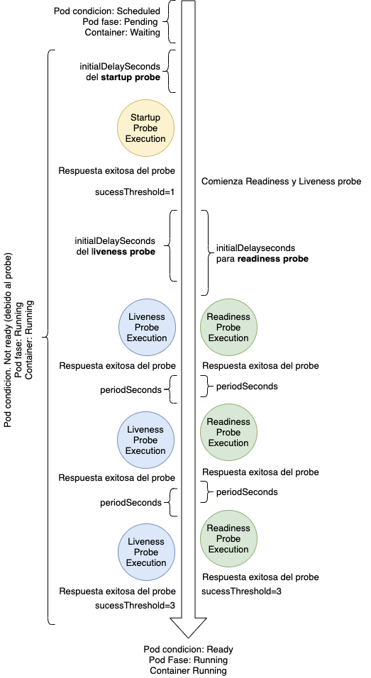

# Kuberenetes Probes: Startup, Liveness & Readiness

Los probes juegan una esencial parte en la ecuación de la alta disponibilidad de las aplicaciones o microservicios, como tambien la mala configuración de estos puede afectarla de manera adversa. Es de vital importancia la configuración apropiada y testing de diferentes escenarios para encontrar los valores óptimos de configuración. Los probes solamente determinan la *health* de la aplicación basado en la respuesta del probe, pero no estan al tanto de la dinamica de nuestra aplicacion o microservicio. Si por alguna razón la probe responde con delay mas alla del `periodSeconds` y `failureThreshold` va a ser determinada como *unhealthy* y el reinicio del pod va a ser disparado.

## Pods y Container Status

Los pods tienen *fases* y *condiciones*, *containers* tienen estados. Las propiedades de los estados pueden cambiar segun el resultado de los probes que se realicen.



## Fases de pods
El objeto status de cada pod contiene un campo llamado *phase*. Este campo le dice a Kubernetes en que parte del ciclo de ejecución un pod se encuentra.

+ *Pending*: Aceptado por el cluster, containers no han sido iniciado todavia
+ *Running*: Por lo menos un contenedor se encuentra en estado *running*, *starting* o *restarting*
+ *Completed*: Todos los containers finalizaron con *status code non-zero*, y el pod no volvera a iniciarse
+ *Failed*: Todos los containers terminaron y al menos uno de estos finalizo con un *status code non-zero*, indicado una clase de error
+ *Unknown*: El estado del pod no puede determinarse

## Condiciones del pod
Las fases dan información acerca del estado en que el pod se encuentra

+ *PodSchedule*: Un nodo ha sido seleccionado exitosamente donde ejecutar el pod y la programación finalizo
+ *ContainersReady*: Todos los contenedores estan listo
+ *Initialized*: Init containers han sido iniciados
+ *Ready*: El pod puede atender solicitudes por lo que se empieza a dar servicio y se incluye dentro de los balanceadores de carga

Las condiciones pueden verse a traves del comando:

```
$ kubectl describe pods <nombre_pod>
...
Conditions:
  Type              Status
  Initialized       True
  Ready             True
  ContainersReady   True
  PodScheduled      True
```

## Estados del container
Existen tres simples estados:

+ *Waiting*: Los procesos necesarios estan ejecutandose para un inicio exitoso
+ *Running*: El container esta ejeutandose
+ *Terminated*: El contenedor inicio la ejecución y termino con éxito o fracaso


Podemos ver las concicones del pod y los estados del contenedor desde el objeto Pod realizando el comando:
```
$ kubectl get pods <nombre_pod> -o yaml | 
 
status:
  conditions:
  - lastProbeTime: null
    lastTransitionTime: "2021-03-11T15:13:57Z"
    status: "True"
    type: Initialized
  - lastProbeTime: null
    lastTransitionTime: "2021-03-11T15:14:01Z"
    status: "True"
    type: Ready
  - lastProbeTime: null
    lastTransitionTime: "2021-03-11T15:14:01Z"
    status: "True"
    type: ContainersReady
  - lastProbeTime: null
    lastTransitionTime: "2021-03-11T15:13:57Z"
    status: "True"
    type: PodScheduled
  containerStatuses:
  - containerID: cri-o://5b7ca3fcca69995772586e67bcaa9d6b416c56903a334dde82afcb1cbd4ffb51
    image: quay.io/agustinlare/apizarro:latest
    imageID: quay.io/agustinlare/apizarro@sha256:d6abd04cf32bc91bdfe853db48a7bbbbe85d4a0b6ac46ae513227068a05b1b2b
    lastState: {}
    name: flask
    ready: true
    restartCount: 0
    started: true
    state:
      running:
        startedAt: "2021-03-11T15:14:00Z"
  hostIP: 10.70.49.116
  phase: Running
  podIP: 10.128.7.104
  podIPs:
  - ip: 10.128.7.104
  qosClass: Burstable
  startTime: "2021-03-11T15:13:57Z"
```

## Probe's en OCP
Existen tres controladores disponibles que pueden cubrir casi cualquier escenario

## *Excec*
Ejecuta un comando dentro del container, esto tambien es un *gateway feature* ya que puede ejecutar cualquier tipo de ejecutable. Esto podría ser un script que ejecuta varias solicitudes de curl para determinar el estado o un ejecutable que se conecta a una dependencia externa pero uno debe asegurarse de que con esta ejecución no quede un proceso *zombie* ya que para que el probe sea exitoso la ejecución debe devolver un *exit code 0*.

## *HTTP GET*
Envia un HTTP GET request a un path definido. Para un probe exitoso el HTTP endpoint debe resultar en una respuesta entre 200 y 399.

## *TCP socket check*
Se conecta a un puerto definido para verificar si se encuentra abierto, generalmente se usa para puntos finales que no hablan HTTP.

## *Parametros comunes*
Los probes tienen campos configurables comunes:

+ `initialDelaySeconds`: Segundos luegos de que el container inicio y previos a que empiece el probe
+ `periodSeconds`: Frecuencia de el pod
+ `successThreshold`: Cuantos resultados exitosos debe recibir para transicionar desde el estado 'failure' a 'healthy'
+ `failureThreshold`: Cuantos resultados fallidos debe recibir para transicionar desde el estado 'healthy' a 'failure'

A modo de ejemplo:
```
  initialDelaySeconds: 1
  periodSeconds: 5
  timeoutSeconds: 1
  successThreshold: 1
  failureThreshold: 1
```

Como puede apreciarse, puede aplicarse una configuración muy detallada pero para la exitosa ejecución debemos analizar los requerimientos y dependencias de nuestras aplicaciones o microservicio.

## Startup probe
A partir de la version 4.X fue introducida la `startup probe`, esta es muy util para aplicaciones que tengan un slow-start para evitar que sean reiniciadas por el `Kubelet`. Si tu aplicación requiere tiempo para estar listo, leer archivos, parsear configuración, verificar el estado de una base de datos, etc, debería utilizarse `Startup Probes`. Este sistema deshabilita el `liveness` y `readiness` para que no intervengan con la inicialización de la aplicación. Es mucho mejor que incrementar el `initialDelaySeconds` del `readiness` o `liveness probe`. 

Si el probe falla o se excede el umbral, se reinicia el container para que la operación pueda comenzar de nuevo. Debe ajustar el `initialDelaySeconds` y `periodSeconds` en consecuencia para asegurarse de que el proceso tenga tiempo suficiente para completarse. De lo contrario puede encontrar su pod en un ciclo de reinicios indefinidamente.

## Readiness probe
Si se quiere controlar el trafico enviado hacia el pod, debe utilizarse readiness probes. Este modifica la condición del pod a "Ready", lo cual permitira que este de servicio y sea agregado a los *balanceadores de carga*. Tambien si el proceso tiene la posibilidad de quitarse asi mismo de servicio para procesar una gran cantidad de información, nuevamente debería utilizarse `readiness probes`, asi cuando la aplicacion le infiera al `kubelet` cuando necesite salir del *balanceador de carga* y dejar de recibir trafico.

## Liveness probe
Si el container no falla por si mismo cuando se encuentra un error inesperado, entonces la utilización de liveness probe es imperiosa. De esta manera kubelet podra identificar el si el pod necesita reiniciar el container. Si usted puede controlar estos errores forzando la salida (exit) de la ejecución no necesita necesariamente liveness probe, sin embargo es recomendado tenerlo ya que pueden ocurrir bugs de los cuales no conozca.
