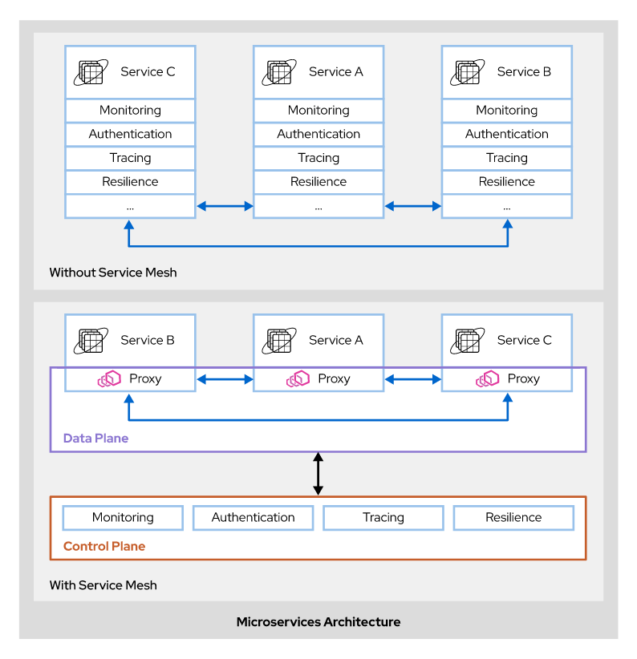
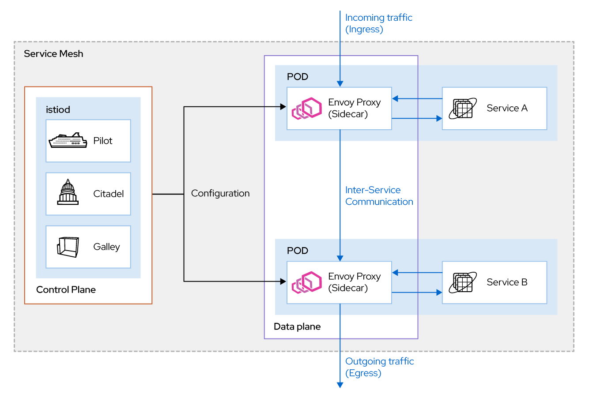
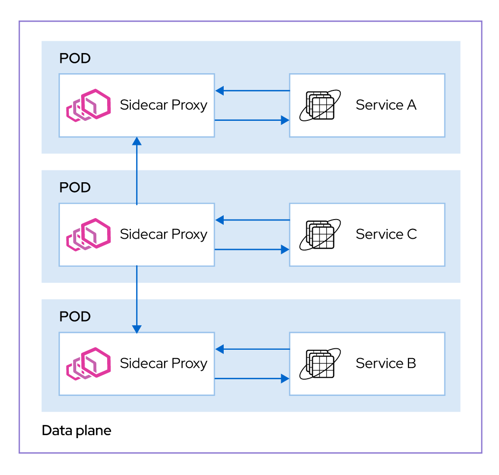

Chapter 1. Introduccion a Red Hat OpenShift Service Mesh

# Introduction

**Service mesh** es una tecnologia diseñada para abordar problemas de arquitecturas en microservicios. Crea un punto centralizado para controlar muchas caracteristicas de algunos o todos los microservicios.

Opera al nivel de comunicacion de red. Es decir que los componentes del mesh capturan o interceptan el trafico hacia y desde microservicios, ya sea modificando solicitudes, redirigiendolas o creando nuevas solicitudes a otros servicios.

**Openshift Service Mesh** incorpora y extiende varios projectos open source y los orquestra para proveer una experiencia mejorada al desarrollador:

**Istio** es el componente central de la arquitectura mesh para Kubernetes. Istio crea un control plane que centraliza las capacidades del mesh y un plano de datos que crea la estructura del mesh.
The data plane controls communications between services by injecting sidecar containers that capture traffic between microservices.

**Maistra** es un projecto open-source basado en Istio que adapta las caracteristicas a los casos extremos de OpenShift Container Platform. Tambien extiende caracteristicas de Istio como multitentnacy, injercio explicita del sidecar y el uso de `routes` de Openshift en vez de Kubernetes ingress.

**Jaeger** es un servidor de trazabilidad de código abierto que centraliza y muestra los seguimientos asociados con una sola solicitud. Un seguimiento contiene información sobre todos los servicios a los que llegó una solicitud. Maistra es responsable de enviar los rastros a Jaeger y Jaeger es responsable de mostrar los rastros. Los microservicios dentro del mesh son responsables de generar los encabezados de solicitud necesarios para que otros componentes generen y agreguen seguimientos.

**ElasticSearch** es un motor de búsqueda y análisis open-source, distribuido y basado en JSON. Jaeger usa ElasticSearch para almacenar e indexar los datos de seguimiento. Opcional.

**Kiali** proporciona observabilidad de los servicios dentro del mesh. Descubre microservicios en el mesh y sus interacciones y los representa visualmente. También captura información sobre la comunicación y los servicios, como los protocolos utilizados, las versiones del servicio y las estadísticas de fallas.

**Prometheus** lo utiliza para almacenar información de telemetría de los servicios. Kiali depende de Prometheus para obtener métricas, estado de salud y topología del mesh.

**Grafana** se puede utilizar para analizar métricas de malla de servicios. Grafana proporciona a los administradores del mesh un análisis avanzado de consultas y métricas.

# Dificultades en microservicios
A pesar de presentar muchos beneficios, los microservicios crean varios desafíos arquitectónicos que los administradores y desarrolladores deben comprender para construir una aplicación de microservicios robusta y resistente.

Algunos de estos desafíos están relacionados con el desarrollo de los propios microservicios.

**Development challenges**
Uno de los primeros problemas con los que se encuentran los desarrolladores es el descubrimiento de servicios. Debido a que los servicios a menudo cambian su dirección IP, cada servicio debe ser fácilmente detectable y referido por un nombre estático. Otro problema que encuentran los desarrolladores es el desarrollo de la elasticidad, o la capacidad de escalar hacia arriba o hacia abajo en respuesta a la demanda. Para respaldar la elasticidad y aprovechar uno de los beneficios más importantes de una arquitectura de microservicio, los desarrolladores deben diseñar un sistema que sea escalable y tener una solución de orquestación que responda adecuadamente a la demanda.

**Security challenges**
Dado que las arquitecturas de microservicios implican un alto grado de comunicación, la autenticación se convierte en una característica fundamental. Los microservicios deben validar que las solicitudes estén autorizadas y rechazar las solicitudes no autorizadas.

**Operation challenges**
En las arquitecturas de microservicio, un microservicio o elemento defectuoso puede provocar el error en cascada, causando un gran impacto en la aplicación. Los microservicios deben ser resistentes a fallas de pares o dependencias para evitar fallas en el servicio y rupturas del acuerdo de nivel de servicio (SLA).

A medida que las aplicaciones crecen, la supervisión se vuelve difícil. A diferencia de una arquitectura monolítica, los microservicios están distribuidos por naturaleza, lo que puede dificultar la consolidación de la información.

Los desarrolladores y administradores requieren características operativas, como:
+ Monitoreo: midiendo el desempeño y uso de los microservicios.
+ Registro centralizado: captura y relación de registros de todos los microservicios.
+ Seguimiento: correlacionar solicitudes a múltiples microservicios pertenecientes a la misma transacción de usuario.

Por lo general, los desarrolladores implementan características como la resistencia del servicio en el código. Esto conduce a un código duplicado y a la creación de una separación deficiente entre el código de servicio y la gestión de la red.

Cuando las aplicaciones constan de solo unos pocos microservicios, replicar el mismo código no es un problema importante. Sin embargo, cuando aumenta la cantidad de microservicios, el mantenimiento y la capacidad de realizar cambios se vuelven exponencialmente más difíciles.

# Architecture
Red Hat OpenShift Service Mesh consta de dos componentes lógicos, un control plane y un plano de datos. 

El plano de datos consta de un conjunto de proxies, que se implementan junto con las aplicaciones en un clúster de OpenShift. Los proxies se implementan como sidecars, un contenedor auxiliar que se ejecuta en el mismo pod que la aplicación y proporciona algunas funciones complementarias.

El control plane gestiona y configura los proxies. Hace cumplir las políticas de uso y control de acceso y recopila métricas de los servidores proxy en el mesh.

## Data Plane Components
El plano de datos consta de:
+ Un conjunto de **Envoy proxies**.
+ El componente *istio-agent* corre en cada Envoy proxy.

El Envoy proxy es el componente princiapl en el plano de datos. Maneja todos los datos que fluyen entre los servicios de un mesh. El Envoy proxy tambien recopila todas las metricas relacionadas con los del mesh.

El componente *istio-agent*, también conocido como *Istio Pilot agent*, es parte de cada Envoy proxy. Ayuda a arrancar el contenedor de Envoy proxy durante el inicio. 

Además, mantiene otras funciones, como:
+ Automatización de la rotación de certificados mediante la comunicación con los componentes del control plane.
+ Automatización de la información de enrutamiento.
+ Automatización de la configuración del dominio DNS.

Cada Envoy proxy contiene el *pilot-agent* binario que controla el *Istio Pilot agent*.

El control plane puede inyectar automáticamente una instancia del Envoy proxy como sidecar a un servicio cada vez que ese servicio se implementa en un proyecto gestionado por OpenShift Service Mesh. Todo el tráfico de red entrante (ingreso) y saliente (salida) entre servicios fluye a través de los proxies.

El servicio descarga funcionalidades como control de acceso, enrutamiento de red y limitación de velocidad, control de tráfico de entrada y salida al mesh.

El plano de datos en un mesh realiza las siguientes tareas:
+ Descubrimiento de servicios: rastrea los servicios implementados en una malla.
+ Comprobaciones de estado: realice un seguimiento del estado (correcto o insalubre) de los servicios implementados en una malla.
+ Modelado y enrutamiento del tráfico: controle el flujo de datos de la red entre servicios. Incluye tareas como limitar la cantidad de tráfico, enrutamiento basado en contenido, romper circuitos, controlar la cantidad de tráfico que debe enrutarse entre múltiples versiones de un servicio, balanceo de carga y más.
+ Seguridad: Realice autenticación y autorización, y comunicación segura utilizando seguridad de capa de transporte mutuo (mTLS) entre servicios en un mesh.
+ Métricas y telemetría: recopile métricas, registros e información de seguimiento distribuida de los servicios en el mesh.

**Control Plan Components**
El control plane gestiona la configuración y las políticas de la malla de servicios. El control plane no maneja directamente el tráfico de red en la malla, pero mantiene la configuración y las políticas que el plano de datos aplica.

El control plane consiste en el primer despliegue. La implementación de istiod consta de un único binario que contiene varias API utilizadas por OpenShift Service Mesh.

Istiod contiene las API y la funcionalidad de los siguientes componentes:
+ **Piloto**: Mantiene los datos de configuración de la malla de servicios. Proporciona descubrimiento de servicios para los sidecars de proxy Envoy, capacidades de gestión de tráfico para enrutamiento inteligente (por ejemplo, pruebas A / B) y resistencia (tiempos de espera, reintentos e interruptores de circuito).
+ **Citadel**: emite y rota certificados TLS. Proporciona autenticación para la comunicación entre servicios, con gestión integrada de identidades y credenciales. Puede aplicar políticas basadas en la identidad del servicio en lugar de depender de los detalles de la red, como las direcciones IP y los nombres de host.
+ **Galley**: supervisa la configuración de la malla del servicio y luego valida, procesa y distribuye la configuración a los proxies.