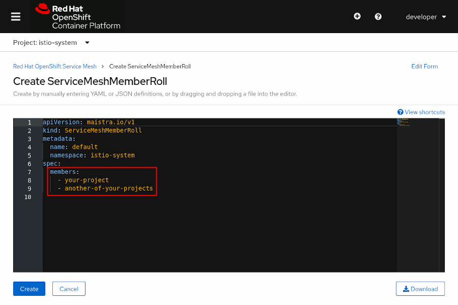

Chapter 2. Installing Red Hat OpenShift Service Mesh

# Installation
OpenShift Service Mesh is installed using the Web Console, or CLI, and a Kubernetes operator. The installation process requires first installing the required operators, then deploying the Control Plane, and finally creating a Service Mesh Member Roll.

OpenShift Service Mesh relies on the following operators:
+ Jaeger
+ Elasticsearch
+ Kiali
+ Service Mesh

> Red Hat recomends to deploy the control plan in a separate project.

### Creating a Service Mesh Member Roll

The `ServiceMeshMemberRoll` custom resource defines the projects belonging to a control plane.

Any number of projects can be added to a `ServiceMeshMemberRoll`, however a project can be added only to one control plane.

To create or edit a Service Mesh Member Roll, first navigate to the project where Red Hat OpenShift Service Mesh is installed, then navigate to the *Istio Service Mesh Member Roll* page, and finally review and configure installation parameters.

