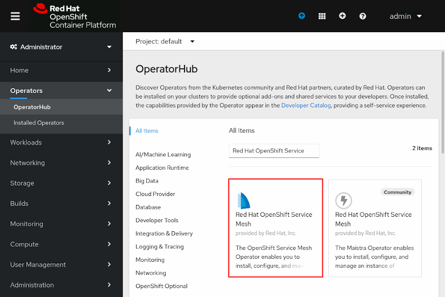

Chapter 2. Instalando Red Hat OpenShift Service Mesh

# Instalacion
OpenShift Service Mesh es instalado usando la consola web, or CLI, y un operador de Kubernetes. El proceso de instalación requiere primero instalar los operadores requeridos, luego implementar el control plane y finalmente crear un Service Mesh Member Roll.

OpenShift Service Mesh depende de los siguientes operadores:
+ Jaeger
+ Elasticsearch
+ Kiali
+ Service Mesh

> Red Hat recomienda desplegar el control plane en un projecto separado.

### Creando a Service Mesh Member Roll

El `ServiceMeshMemberRoll` es un custom resource que define los proyectos que pertenecen a un control plane.

Pueden agregarse cualquier numero de projectos al `ServiceMeshMemberRoll`, sin embargo un proyecto puede ser unicamente agregardo a un control plane.

To create or edit a Service Mesh Member Roll, first navigate to the project where Red Hat OpenShift Service Mesh is installed, then navigate to the *Istio Service Mesh Member Roll* page, and finally review and configure installation parameters.

