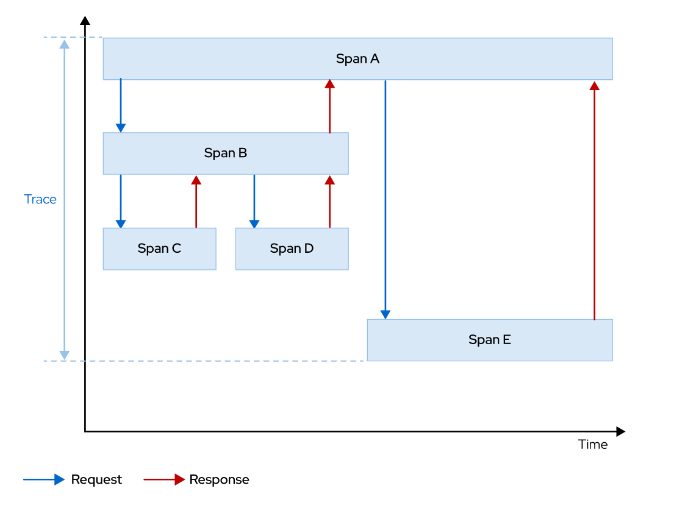

Chapter 3. Observing a Service Mesh

# Tracing Services with Jaeger
### Describing Distributed Tracing
*Distributed Tracing* is the process of tracking the performance of individual services in an application by tracing the path of the service calls in the application. Allows developers to visualize call flows in a microservices application. Understanding the sequence of calls (how many calls occur in a serial fashion versus how many occur in parallel), and sources of latency is useful when maintaining a distributed system.
Also is useful for monitoring, network profiling, and troubleshooting the interaction between services in modern, cloud-native, microservices-based applications.

### Traces and Spans in Distributed Tracing
A *Span* represents a logical unit of work, which has a unique name, a start time, and the duration of execution. To model the service call flow in a service mesh, spans are nested and executed in a particular order.
A *Trace* is an execution path of services in the service mesh. A trace is comprised of one or more spans.

In this example:
+ Service A is the request entry point for the application.
+ Because Service A is the entry point for the application, it is called the parent span. Service A makes two service calls: one to Service B and one to Service E. Thus, Service B and Service E are child spans of Service A.

+ Service B in turn calls Service C and Service D before returning the response to Service A. Service B is a parent span. Service C and Service D are child spans.

The following is a line graph representation of a single trace and its constituent spans:

**Jaeger** is a distributed tracing platform. Allows developers to configure their services to enable gathering runtime statistics about their performance and is made up of several components that work together to cllect, store, and display tracing data.

#### Trace Context Propagation
A system with a large number of microservices interact in numerous ways and cannot be planned upfront, these services typically receive and send multiple requests concurrently. Trace context propagation is a process which tracks unique requests throughout the call paths in the service mesh.

A new span is generated for each logical service call in the request. This span contains the same request id, a new span id, and the parent span id (which points to the span id of the parent span). Spans are placed on a timeline, and visualized using graphical representations, based on timestamps and durations.

Red Hat OpenShift Service Mesh uses a standard set of HTTP headers for trace context propagation. The Envoy proxy sidecar tracks these headers and forwards them to Jaeger for storage and analysis. Services in the mesh are responsible for collecting and propagating the following headers from the incoming request to any outgoing requests:

+ x-request-id
+ x-b3-traceid
+ x-b3-spanid
+ x-b3-parentspanid
+ x-b3-sampled
+ x-b3-flags
+ x-ot-span-context

# Collecting Service Metrics
In any system that has a large number of services, it is important to understand the different types of metrics to gather, and then decide on a process to measure and evaluate their performance. Each service, or a set of services with common business functionality can define their own set of metrics that should be gathered, measured and analyzed.

A common practice is to define a set of *service levels* that act as a sort of contract, or agreement between a service provider and a service consumer. Service levels can be broadly classified into three categories:

### Service Level Indicators (SLI)
An SLI is a carefully defined quantitative measure of some aspect of the level of service that is provided. For example, a common SLI is the response time, that is, the time taken by a service to provide a response. Other examples of SLI include error rate (percentage of responses that were invalid), and availablity (percentage of time that the service was in a correctly functional state).

### Service Level Agreements (SLA)
An SLA is an explicit or implicit contract with your users which includes consequences of meeting (or missing) the service level objectives (SLO) for a service. Selecting and publishing an SLA to users sets expectations about how a service will perform. For example, a credit card payment service for an e-commerce website will have an SLA that declares that "All payment requests will be processed in less than 5 seconds."

### Service Level Objectives (SLO)
An SLO is a threshold value, or range of values that is measured by an SLI. For example, an E-commerce website can have an SLO that tries to render a product catalog page in 3 to 5 seconds. Another scenario could be for handling a large number of users, for example "The payment service should be capable of handling 30,000 to 35,000 users concurrently on weekends."

**Selecting Metrics to Measure**
You should carefully select a set of metrics for a service that you want to include in your SLI. Selecting too many metrics wastes monitoring cycles and clutters up your dashboards, while choosing too few, or the wrong metrics will impede your analysis and reduce the effectiveness of your response to issues in the field.

## Service Mesh Metrics (Telemetry)
A default installation of Red Hat OpenShift Service Mesh gathers a number service metrics related to error rates, rate of traffic, HTTP status codes of the response, and more. The service mesh also gathers detailed metrics for its control plane. A default set of monitoring dashboards using these metrics is automatically created and provided to developers.

### Metrics from Envoy Proxies
The Envoy proxies provide a rich set of metrics about traffic passing through the proxy, both incoming (ingress) and outgoing (egress). The proxies also provide detailed statistics about the functioning of the proxy itself (health status and configuration).

You can customize the set of Envoy proxy metrics that will be collected for a given service mesh. By default, only a small subset of the Envoy proxy metrics are collected. This avoids overloading the system and reduces the CPU overhead associated with metrics collection.

### Metrics from Application Services
Red Hat OpenShift Service Mesh provides a set of application service metrics for observing the performance and state of incoming and outgoing service traffic. 
A default installation of Red Hat OpenShift Service Mesh gathers the following service metrics:
+ Request Count : The total number of requests sent to a service.
+ Request Duration : The time taken for the service to provide a response.
+ Request Size : The size of the body in the HTTP request.
+ Response Size : The size of the body in the HTTP response.

Each of the service mesh components (Pilot, Citadel, and Galley) also provide a set of metrics about their health, configuration, and performance.

# Observing Service Interactions with Kiali
Kiali is a web based console for viewing the topology of a service mesh. In a microservices architecture, a large number of discrete services will be interacting with each other in various complex ways to achieve business goals. Kiali helps you to understand the structure of your service mesh and how traffic flows between services in the mesh. Kiali also provides intuitive dashboards with dynamic animation to understand the end-to-end flow of requests as it traverses the service mesh.

Kiali provides an interactive graphical view of the services in your service mesh in real time. It provides visibility into features like circuit breakers, request rates, latency, and traffic flows. Kiali also provides the ability to validate your service mesh configuration. You can configure gateways, destination rules, virtual services, mesh policies and visually verify the impact of these changes using Kiali.

