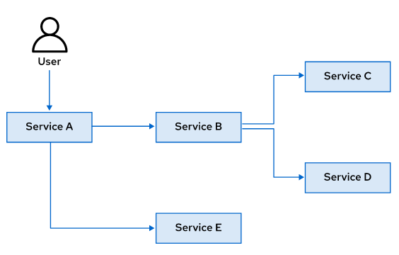
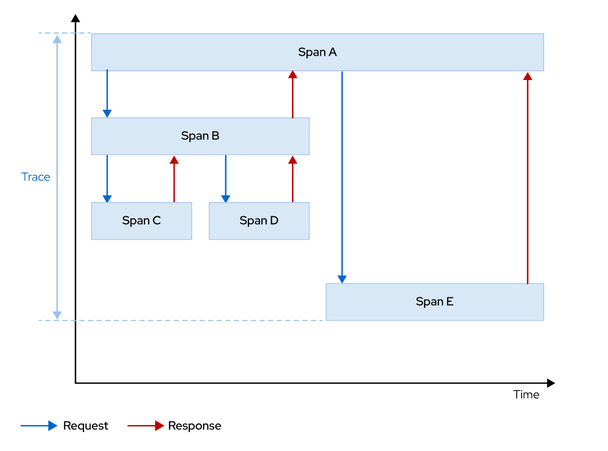

Chapter 3. Observando el Service Mesh

# Servicios de Tracing con Jaeger
### Descripción del Tracing Distribuido
*Tracing distribuido* es el proceso de seguimiento del rendimiento de servicios individuales en una aplicación mediante el seguimiento de la ruta de las llamadas de servicio en la aplicación. Permite a los desarrolladores visualizar los flujos de llamadas en una aplicación de microservicios. Comprender la secuencia de llamadas (cuántas llamadas ocurren en serie versus cuántas ocurren en paralelo) y las fuentes de latencia es útil cuando se mantiene un sistema distribuido.
También es útil para supervisar, crear perfiles de red y solucionar problemas de interacción entre servicios en aplicaciones modernas, nativas de la nube y basadas en microservicios.

### Traces y Spans en Tracing Distribuido
Un *Span* representa una unidad lógica de trabajo, que tiene un nombre único, una hora de inicio y la duración de la ejecución. Para modelar el flujo de llamadas de servicio en el mesh, los intervalos se anidan y ejecutan en un orden particular.
Un *Trace* es una ruta de ejecución de servicios en el mesh. Una traza se compone de uno o más tramos.

En el ejemplo anterior:
+ El servicio A es el punto de entrada de la solicitud para la aplicación.
+ Debido a que el Servicio A es el punto de entrada para la aplicación, se denomina parent span. El servicio A realiza dos llamadas de servicio: una al servicio B y otra al servicio E. Por lo tanto, el servicio B y el servicio E son child spans del servicio A.
+ El servicio B a su vez llama al servicio C y al servicio D antes de devolver la respuesta al servicio A. El servicio B es un parent span. El servicio C y el servicio D son child spans.

La siguiente es una representación gráfica de líneas de un solo trace y sus spans constituyentes:

**Jaeger** es una plataforma de tracing distribuida. Permite a los desarrolladores configurar sus servicios para permitir la recopilación de estadísticas de tiempo de ejecución sobre su rendimiento y se compone de varios componentes que trabajan juntos para recopilar, almacenar y mostrar datos de seguimiento.

#### Trace Context Propagacion
Un sistema con una gran cantidad de microservicios interactúa de muchas maneras y no se puede planificar por adelantado, estos servicios generalmente reciben y envían múltiples solicitudes al mismo tiempo. La propagación del contexto de rastreo es un proceso que rastrea solicitudes únicas a lo largo de las rutas de llamadas en el mesh.

Se genera un nuevo span para cada llamada de servicio lógico en la solicitud. Este span contiene el mismo ID de solicitud, un nuevo ID de span y el ID de parent span (que apunta al ID de intervalo del intervalo principal). Los span se colocan en una línea de tiempo y se visualizan mediante representaciones gráficas, basadas en marcas de tiempo y duraciones.

Red Hat OpenShift Service Mesh utiliza un conjunto estándar de headers HTTP para la propagación del contexto de seguimiento. El sidecar de Envoy proxy rastrea estos headers y los reenvía a Jaeger para su almacenamiento y análisis. Los servicios en el mesh son responsables de recopilar y propagar los siguientes encabezados de la solicitud entrante a cualquier solicitud saliente:

+ x-request-id
+ x-b3-traceid
+ x-b3-spanid
+ x-b3-parentspanid
+ x-b3-sampled
+ x-b3-flags
+ x-ot-span-context

# Recorger Service Metrics
Una práctica común es definir un conjunto de *service levels* que actúan como una especie de contrato o acuerdo entre un proveedor de servicios y un consumidor de servicios. Los niveles de servicio se pueden clasificar ampliamente en tres categorías:

### Service Level Indicators (SLI)
Un SLI es una medida cuantitativa cuidadosamente definida de algún aspecto del nivel de servicio que se proporciona. Por ejemplo, un SLI común es el tiempo de respuesta, es decir, el tiempo que tarda un servicio en proporcionar una respuesta. Otros ejemplos de SLI incluyen la tasa de error (porcentaje de respuestas que no fueron válidas) y la disponibilidad (porcentaje de tiempo que el servicio estuvo en un estado de funcionamiento correcto).

### Service Level Agreements (SLA)
Un SLA es un contrato explícito o implícito con sus usuarios que incluye las consecuencias de cumplir (o no cumplir) los objetivos de nivel de servicio (SLO) para un servicio. La selección y publicación de un SLA para los usuarios establece expectativas sobre el rendimiento de un servicio. Por ejemplo, un servicio de pago con tarjeta de crédito para un sitio web de comercio electrónico tendrá un SLA que declara que "Todas las solicitudes de pago se procesarán en menos de 5 segundos".

### Service Level Objectives (SLO)
Un SLO es un valor de umbral o rango de valores medidos por un SLI. Por ejemplo, un sitio web de comercio electrónico puede tener un SLO que intente representar una página de catálogo de productos en 3 a 5 segundos. Otro escenario podría ser para manejar una gran cantidad de usuarios, por ejemplo "El servicio de pago debería ser capaz de manejar de 30.000 a 35.000 usuarios simultáneamente los fines de semana".

**Selecionando Metricas que Medir**
Debe seleccionar cuidadosamente un conjunto de métricas para un servicio que desea incluir en su SLI. Seleccionar demasiadas métricas desperdicia ciclos de monitoreo y desordena sus tableros, mientras que elegir muy pocas o las métricas incorrectas impedirá su análisis y reducirá la efectividad de su respuesta a los problemas en el campo.

## Service Mesh Metrics (Telemetry)
Una instalación predeterminada de Red Hat OpenShift Service Mesh recopila una serie de métricas de servicio relacionadas con las tasas de error, la tasa de tráfico, los códigos de estado HTTP de la respuesta y más. El mesh también recopila métricas detalladas para su control plane. Un conjunto predeterminado de paneles de supervisión que utilizan estas métricas se crea y se proporciona automáticamente a los desarrolladores.

### Metricas del Envoy Proxies
Los Envoy proxies proporcionan un amplio conjunto de métricas sobre el tráfico que pasa a través del proxy, tanto entrante (entrada) como saliente (salida). Los proxies también proporcionan estadísticas detalladas sobre el funcionamiento del propio proxy (estado de salud y configuración).

Puede personalizar el conjunto de métricas de Envoy proxy que se recopilarán para una service mesh determinado. De forma predeterminada, solo se recopila un pequeño subconjunto de las métricas del Envoy. Esto evita la sobrecarga del sistema y reduce la sobrecarga de CPU asociada con la recopilación de métricas.

### Metricas de Servicios de Aplicaciones
Red Hat OpenShift Service Mesh proporciona un conjunto de métricas de servicios de aplicaciones para observar el rendimiento y el estado del tráfico de servicios entrante y saliente.

Una instalación predeterminada de Red Hat OpenShift Service Mesh reúne las siguientes métricas de servicio:
+ Recuento de request: el número total de solicitudes enviadas a un servicio.
+ Duración de la request: el tiempo que tarda el servicio en proporcionar una respuesta.
+ Tamaño de request: el tamaño del cuerpo en la solicitud HTTP.
+ Tamaño de respuesta: el tamaño del cuerpo en la respuesta HTTP.

Cada uno de los componentes del mesh (Pilot, Citadel and Galley) tambien proveen un conjunto de metricas acerca de su saludo, configuracion y rendimiento.

# Observando Interacciones de Servicios con Kiali
Kiali es una consola basada en web para ver la topología de un service mesh. En una arquitectura de microservicios, una gran cantidad de servicios discretos interactuarán entre sí de varias formas complejas para lograr los objetivos comerciales. Kiali le ayuda a comprender la estructura de su service mesh y cómo fluye el tráfico entre los servicios en el mesh. Kiali también proporciona paneles intuitivos con animación dinámica para comprender el flujo de solicitudes de un extremo a otro a medida que atraviesa el service mesh.

Kiali proporciona una vista gráfica interactiva de los servicios en su malla de servicios en tiempo real. Proporciona visibilidad de funciones como disyuntores, tasas de solicitud, latencia y flujos de tráfico. Kiali también brinda la capacidad de validar la configuración del service mesh. Puede configurar puertas de enlace, reglas de destino, servicios virtuales, políticas del mesh y verificar visualmente el impacto de estos cambios utilizando Kiali.

