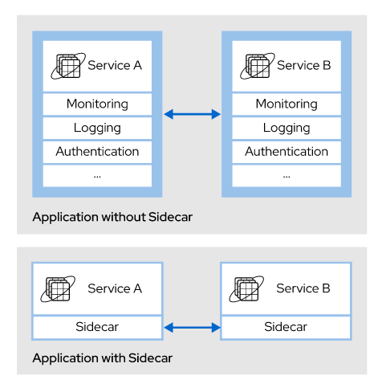
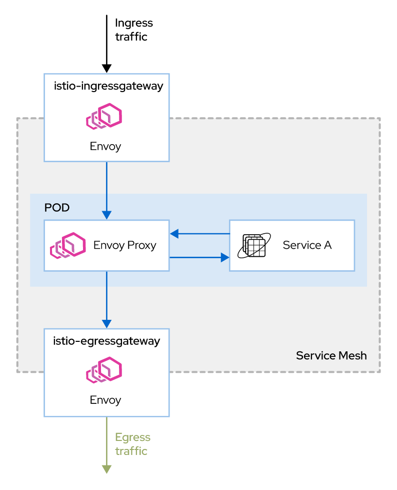
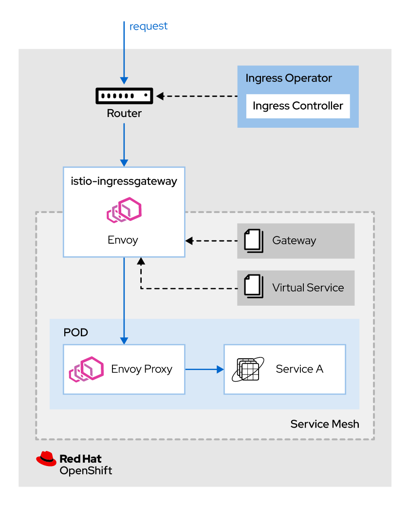
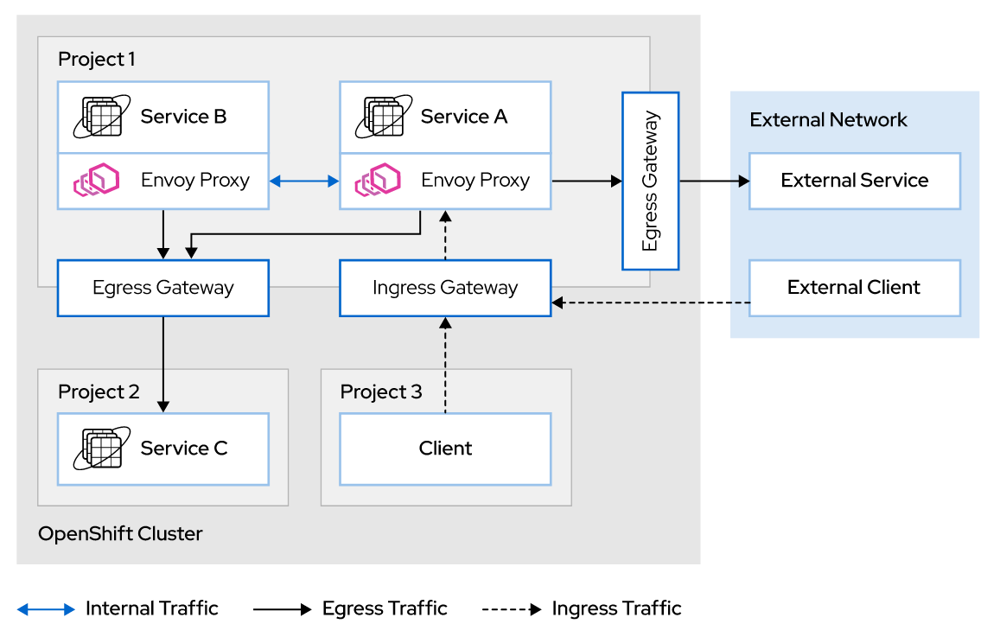

Chapter 4. Controlling Service Traffic

# Managing Service Connections with Envoy

**Traffic management**, in the context of cloud-native microservices, is the process of monitoring and controlling the external and internal network communications of an application.

OpenShift Service Mesh abstracts network communications, allowing you to manage them using Kubernetes custom resources. With OpenShift Service Mesh, you control the flow of traffic and API calls of your applications.

## Describing the Sidecar Pattern
Applications usually require functionalities outside of the application domain, such as monitoring, logging, and authentication. The *sidecar pattern* is an architectural pattern where a main process (the main application) segregates non-business related functionalities to an auxiliary process (the sidecar).



### The Sidecar Pattern and OpenShift Service Mesh
On Service Mesh enabled services, an Envoy proxy instance is injected into the application pod using the sidecar pattern. After the Envoy sidecar is injected, it takes control of all of the network communications for the pod

OpenShift Service Mesh does not automatically inject the sidecar into every pod. You must explicitly specify the pods that you want Service Mesh to manage by adding annotations to the deployment configuration. This manual approach ensures that the automatic sidecar injection does not interfere with other Red Hat OpenShift features.

To automatically inject the Envoy sidecar into a service, you must specify the sidecar.istio.io/inject annotation with the value set to "true" in the Deployment resource.

```
...
      annotations:
        sidecar.istio.io/inject: "true"
...
```

The default installation of OpenShift Service Mesh provides an instance of istio-ingressgateway and an instance of istio-egressgateway to manage the ingress and egress traffic in a Service Mesh. Both gateways can be customized to suit the needs of your applications.

## Understanding the Gateway Custom Resource
A *gateway* is a custom resource that operates as a load balancer at the edge of the Service Mesh, managing ingress or egress connections. Gateway configurations are applied to Envoy proxies running at the edge of the Service Mesh.



The Open Systems Interconnection (OSI) model is a conceptual model that splits networking systems into seven abstraction layers. It provides a standard to describe how applications communicate over the network.

A gateway follows the OSI model, letting you configure Layer 4, Layer 5, and Layer 6 load balancing properties, and also delegates application-layer traffic routing (Layer 7) to virtual services. This way of splitting the configuration between different and specialized components gives you more control and flexibility over the communications of your application.

Example of ingress gateway:
```
apiVersion: networking.istio.io/v1beta1
kind: Gateway
metadata:
  name: exchange-gw
spec:
  selector:
    istio: ingressgateway
  servers:
    - port:
      number: 80
      name: http
      protocol: HTTP
    hosts:
      - "exchange.example.com"
```

The preceding setup configures the ingressgateway to expose the combination of virtual hostname/DNS exchange.example.com protocol HTTP and port 80. This means that all HTTP traffic for that hostname/DNS is allowed to enter the mesh.

### Describing the VirtualService Custom Resource
A virtual service is a Kubernetes custom resource, which allows you to configure how the requests to services in the Service Mesh are routed. They are composed of a list of routing rules that are evaluated in order, from top to bottom. Each routing rule consists of a traffic destination and zero or more match conditions that, if met, direct traffic to the destination defined by the rule.

Istiod translates the VirtualService custom resources to Envoy configuration, thereby propagating it to the data plane. In the absence of virtual services, Envoy distributes traffic between all service instances using a round-robin algorithm.

```
apiVersion: networking.istio.io/v1beta1
kind: VirtualService
metadata:
  name: exchange-vs # 1
spec:
  hosts: # 2
  - exchange
  http: # 3
  - match: # 4
    - headers:
        end-user:
          exact: test
    route:
    - destination:
        host: reviews
        subset: v2
  - route: #5
    - destination:
        host: exchange
        subset: v1
```
1. Virtual service name.
2. List of destinations to which these routing rules apply.
3. List of routing rules to apply to HTTP/1.1, HTTP2, and gRPC traffic.
4. Rule with a match condition.
5. Default no condition rule. All traffic will be routed to the specified destination if no previous conditions are met.

The preceding example redirects all requests containing the header end-user and the value test from the exchange service to the subset v2. In any other case, the match condition is not fired so the traffic is redirected to the default destination.

### Combining Gateways and Virtual Services
To make gateways and virtual services work together, you must bind them using the gateways field for the virtual service. As a result, the traffic managed by the gateways listed in the gateways field is checked against the routing rules defined in the virtual service.

Example of virtual service bound to a gateway:
```
apiVersion: networking.istio.io/v1beta1
kind: VirtualService
metadata:
  name: exchange-vs
spec:
  hosts:
  - exchange
  # This is how you bound theexchange-gw 
  # gateway with theexchange-vs virtual service
  gateways: 
  - exchange-gw 
  http:
  - match:
    - headers:
        end-user:
          exact: test
    route:
    - destination:
        host: reviews
        subset: v2
  - route:
    - destination:
        host: exchange
        subset: v1
```

## Ingress flow with OpenShift Service Mesh
In a default OpenShift Service Mesh installation, an OpenShift route is assigned to the Istio ingress gateway (istio-ingressgateway), which is the resource in charge of managing the routing inside the mesh. All ingress traffic originating from outside the service mesh flows through this gateway into the service mesh.



The ingress requesdt flow is as follows:
1. A external request enters the cluster.
2. A router instance checks the routing rules implemented by the ingress controller. If a match is found, the request is sent to the ingress gateway service pod (`istio-ingressgateway`).
3. The ingress gateway service pod evaluates the request against the Gateway configurations to check if the request matches with any configuration. If a match is found, the request is allowed to enter the mesh.
4. The ingress gateway service pod evaluates the `VirtualService` rules to find the application service pod in charge of processing the request.
5. f a `VirtualService` rule is matched, the ingress gateway service pod sends the request to the designated pod to process the request.

> Reference
> + [Traffic managment with Istio](https://istio.io/v1.6/docs/concepts/traffic-management/)
> + [Automatic sidecar injection in Isitio](https://rol.redhat.com/rol/app/courses/do328-2.0/pages/ch04#:~:text=Automatic%20sidecar%20injection%20in%20Istio)
> + [Configuring traffic managment at OCP Service Mesh Documentation](https://rol.redhat.com/rol/app/courses/do328-2.0/pages/ch04#:~:text=https%3A//access.redhat.com/documentation/en-us/openshift_container_platform/4.7/html-single/service_mesh/index)
> + [Decyphring the OSI model of networking](https://rol.redhat.com/rol/app/courses/do328-2.0/pages/ch04#:~:text=Decyphering%20the%20OSI%20model%20of%20networking)

# Routing Traffic Based on Request Headers
## Describing Destination Rules
*Destination rules* are custom resources that define policies that apply to the traffic of a service. Using those traffic policies, you can configure the load balancing behavior to distribute traffic between the instances of a service. 

The policies defined in destination rules are applied after the routing rules in the virtual services are evaluated. With destination rules you can define load balancing, connection limits, and outlier detection policies.

### Load Balancing Traffic
With destination rules, you can specify the strategy used to distribute traffic between the instances of a service.

**Round-robin**
Requests are sent to each service instance in turn.

**Random**
Requests are sent to the service instances randomly.

**Weighted**
Request are sent to the service instances according to a specific weight (percentage).

**Least request**
Requests are sent to the least busy service instances.

> When no balancing option is specified, OpenShift Service Mesh uses the round-robin strategy.

Example of a destination rule that uses random load balancing strategy:
```
apiVersion: networking.istio.io/v1beta1
kind: DestinationRule
metadata:
  name: my-destination-rule #1
spec:
  host: my-svc #2
  trafficPolicy: #3
    loadBalancer:
      simple: RANDOM #4
```

1. Name of the destination rule.
2. Service affected by the defined rule.
3. Traffic policy defined for the my-svc service.
4. Random lad balancing strategy for the traffic sent to the my-svc service.

### Splitting Services into Subsets
A service can have variants of the application running concurrently with destination rules. You can group those variants into subsets using Kubernetes tags.
When you have subsets, destination rules allow you to define a global traffic policy for the service and override the policy on the subsets.

Example of destination rule with subsets and policy overrides:

```
apiVersion: networking.istio.io/v1beta1
kind: DestinationRule
metadata:
  name: my-destination-rule
spec:
  host: my-svc
  trafficPolicy: #1
    loadBalancer:
      simple: RANDOM
  subsets: #2
  - name: v1 #3
    labels: #4
      version: v1
  - name: v2
    labels:
      version: v2
    trafficPolicy: #5
      loadBalancer:
        simple: ROUND_ROBIN
```
1. Traffic policy defined at a service level.
2. List of subsets defined for the service.
3. Name of the subset.
4. List of label tags used to select the service instances belonging to the subset.
5. Traffic policy set at the subset level, overriding the policy set at the service level.

## Routing Traffic
OpenShift Service Mesh traffic management relies on virtual services and destination rules. After combining these custom resources, you can perform A/B testing or route traffic to a specific version of a service.

Route traffic based on request headers with the following steps:
+ Deploy different services or different versions of the same service.
+ Create destination rules to split the service into subsets.
+ Create a virtual service to check the request headers and route the request to a destination service or to a subset.

### Creating Routing Rules
A virtual service is a compilation of conditions and actions that you can use to route HTTP, TCP, and unterminated TLS traffic to a desired destination.

Virtual services in combination with destination rules allow you to route traffic based on request headers. The following conditions and actions are involved:

**HTTPRoute**
Conditions and actions defined for HTTP/1.1, HTTP2, and gRPC traffic.

**HTTPMatchRequest**
List of match conditions to meet in order to execute the action defined by the rule.

**HTTPRouteDestination**
Action that routes the traffic to a desired destination.

**StringMatch**
Rule to compare a string against a value. The available options to do the comparison are: exact, prefix, and regex.

**Destination**
Destination for traffic that matches specified conditions.

Example of a virtual service with routing based on request headers:
```
apiVersion: networking.istio.io/v1beta1
kind: VirtualService
metadata:
  name: my-virtual-service
spec:
  hosts:
    - "*"
  http: #1
    - match: #2
        - headers: #3
          end-user: #4
            exact: redhatter #5
      route: #6
        - destination: #7
            host: my-svc
            subset: v2
    - route: #8
        - destination:
            host: my-svc
            subset: v1
```

1. List of HTTPRoute conditions and actions.
2. List of HTTPMatchRequest conditions and actions.
3. Header rule.
4. Name of the HTTP header to check.
5. StringMatch rule for the HTTP header. The match condition is activated when the request has an HTTP header called end-user with the value redhatter.
6. HTTPRouteDestination. When the match condition is activated, the request is redirected to this route.
7. Destination. When the headers condition is satisfied, the traffic is redirected to the v2 subset of the my-svc service.
8. Default route. Without a previous matching, the traffic is routed to this destination.
9. 
The previous example routes all the traffic that has the HTTP header end-user, with a value of redhatter, to the subset v2 of the my-svc service. When the HTTP header does not match the defined values, the traffic goes to the subset v1 of the my-svc service.

Redirecting traffic to an endpoint based on the presence of a specific HTTP header is often used for A/B testing and for HTTP authorization.

# Accessing External Services
## Managing and Routing Egress Traffic in OpenShift Service Mesh

Traffic originating from services inside the mesh and targeting external services is called egress traffic.



There are two elements related to egress traffic in OpenShift Service Mesh. The Istio control plane includes egress gateways, configuring these gateways to allow all egress traffic, or to restrict egress traffic to registered services. ServiceEntry resources register external services that are requested by internal services.

### Configuring Egress Traffic Configuration in Istio

By default, OpenShift Service Mesh allows all egress traffic. If a service invokes another service not managed by OpenShift Service Mesh, the Envoy proxy redirects the requests to the default Istio gateway. By default, this egress gateway forwards the requests to the external network, allowing all external requests to be serviced.

This setup allows all services in the mesh to reach any external service without restrictions. In some cases, it is beneficial to restrict the external services allowed to a specific list of approved services. The `spec.proxy.networking.trafficControl.outbound.policy` configuration value in the `ServiceMeshControlPlane` resource controls this behavior.

The default value for this entry is `ALLOW_ANY`. This value instructs Istio to allow all egress traffic regardless of the destination. If this configuration holds the value `REGISTRY_ONLY`, the gateway only forwards requests to services explicitly registered.

```
apiVersion: networking.istio.io/v1beta1
kind: ServiceEntry
metadata:
  name: my-external-service #1
spec:
  hosts:
  - example.external.com #2
  ports:
  - number: 80
    name: http
    protocol: HTTP
  resolution: DNS #3
  location: MESH_EXTERNAL #4
```
1. Give each service a meaningful name for easy identification.
2. The hostname where the external service is exposed.
3. The actual IP of the service must be resolved via DNS by the proxy.
4. MESH_EXTERNAL indicates that the service is external to the mesh.

This `ServiceEntry` configures Istio to allow egress traffic to `example.external.com:80` from any service in the mesh.

### Enabling Direct Access to External Services
Sometimes, it is necessary to access external services bypassing the Envoy proxy, such as for extreme performance requirements or strict immutability of the requests. You can configure Istio to create a denylist or allowlist of IP ranges for the proxy to intercept. The Envoy proxy intercepts all IPs belonging to any range in the spec.proxy.networking.trafficControl.outbound.includedIPRanges configuration entry. Istio traffic management policies handle all requests to those IPs. The Envoy proxy does not intercept any request targeting an IP belonging to a range in the spec.proxy.networking.trafficControl.outbound.excludedIPRanges configuration entry. Those requests bypass Istio policies and monitoring.

To update the configuration, edit the ServiceMeshControlPlane resource or use an oc patch command similar to:

```
[user@host ~]$ oc patch smcp basic --type merge -n istio-system \
 -p '{"spec":{"proxy":{"networking":{"trafficControl":{"outbound":{"includedIPRanges":["10.0.0.1/24"]}}}}}}'
```

Note that this configuration is global for the whole Istio installation, and affects all traffic in all meshes managed by Istio. To apply this same behavior for specific pods, add the traffic.sidecar.istio.io/excludeOutboundPorts or traffic.sidecar.istio.io/includeOutboundIPRanges annotations in the Pod resource.

```
kind: Pod
apiVersion: v1
metadata:
  name: application_pod
  annotations:
    sidecar.istio.io/inject: 'false'
    traffic.sidecar.istio.io/includeOutboundIPRanges: '10.0.0.1/24'
    ...output omitted...
  namespace: application_project
...output omitted...
```

