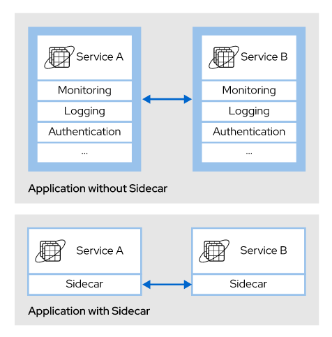
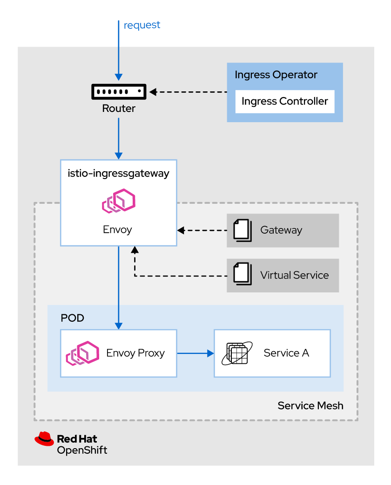

Chapter 4. Controlando Trafico de Servicios

# Gestioando Conexiones de Servicios con Envoy

**Traffic management**, en el contexto de los microservicios nativos de la nube, es el proceso de seguimiento y control de las comunicaciones de red internas y externas de una aplicación.

OpenShift Service Mesh abstrae las comunicaciones de red, lo que le permite administrarlas utilizando recursos personalizados de Kubernetes. Con OpenShift Service Mesh, usted controla el flujo de tráfico y las llamadas API de sus aplicaciones.

## Describiendo el Sidecar Pattern
Las aplicaciones generalmente requieren funcionalidades fuera del dominio de la aplicación, como monitoreo, registro y autenticación. El *sidecar patter * es un patrón arquitectónico donde un proceso principal (la aplicación principal) segrega funcionalidades no relacionadas con el negocio a un proceso auxiliar (el sidecar).



### El Sidecar Pattern y OpenShift Service Mesh
En los servicios habilitados para service mesh, se inyecta una instancia de  Envoy proxy en el pod de la aplicación mediante el sidecar pattern. Una vez que se inyecta el sidecar Envoy, toma el control de todas las comunicaciones de red del pod.

OpenShift Service Mesh no inyecta automáticamente el sidecar en cada pod. Debe especificar explícitamente los pods que desea que service esh administre agregando anotaciones a la configuración de implementación. Este enfoque manual garantiza que la inyección automática de sidecar no interfiera con otras funciones de Red Hat OpenShift.

Para inyectar automáticamente el sidecar Envoy en un servicio, debe especificar la anotación `sidecar.istio.io/inject` con el valor establecido en "`true`" en el recurso de implementación.

```
      annotations:
        sidecar.istio.io/inject: "true"
```

La instalación predeterminada de OpenShift Service Mesh proporciona una instancia de `istio-ingressgateway` y una instancia de `istio-egressgateway` para administrar el tráfico de entrada y salida en una service mesh. Ambas puertas de enlace se pueden personalizar para adaptarse a las necesidades de sus aplicaciones.

## Entendiendo el Gateway Custom Resource
Un *gateway* es un recurso personalizado que funciona como un balanceador de carga en el service mesh, administrando las conexiones de entrada o salida. Las configuraciones de puerta de enlace se aplican a los  Envoy proxies que se ejecutan en el ervice mesh.


El Open Systems Interconnection (OSI) es un modelo conceptual que divide los sistemas de redes en siete capas de abstracción. Proporciona un estándar para describir cómo se comunican las aplicaciones a través de la red.

Un gateway sigue el modelo OSI, lo que le permite configurar las propiedades de equilibrio de carga de la capa 4, la capa 5 y la capa 6, y también delega el enrutamiento del tráfico de la capa de aplicación (capa 7) a los servicios virtuales. Esta forma de dividir la configuración entre componentes diferentes y especializados le brinda más control y flexibilidad sobre las comunicaciones de su aplicación. 

Ejemplo de ingress gateway:
```
apiVersion: networking.istio.io/v1beta1
kind: Gateway
metadata:
  name: exchange-gw
spec:
  selector:
    istio: ingressgateway
  servers:
    - port:
      number: 80
      name: http
      protocol: HTTP
    hosts:
      - "exchange.example.com"
```
La configuración anterior configura el `ingressgateway` para exponer la combinación de nombre de host virtual/DNS exchange.example.com protocolo HTTP y puerto 80. Esto significa que todo el tráfico HTTP para ese nombre de host/DNS puede ingresar al mesh.

### Describing the VirtualService Custom Resource
Un `VirtualService` es un custom resrouce de Kubernetes, que le permite configurar cómo se enrutan las solicitudes a los servicios en service mesh. Están compuestos por una lista de reglas de enrutamiento que se evalúan en orden, de arriba a abajo. Cada regla de enrutamiento consta de un destino de tráfico y cero o más condiciones de coincidencia que, si se cumplen, dirigen el tráfico al destino definido por la regla.

Istiod traduce los `VritualService` a la configuración de Envoy, propagándolos así al data plane. En ausencia de `VirtualServices`, Envoy distribuye el tráfico entre todas las instancias de servicio mediante un algoritmo de operación por turnos.

```
apiVersion: networking.istio.io/v1beta1
kind: VirtualService
metadata:
  name: exchange-vs # 1
spec:
  hosts: # 2
  - exchange
  http: # 3
  - match: # 4
    - headers:
        end-user:
          exact: test
    route:
    - destination:
        host: reviews
        subset: v2
  - route: #5
    - destination:
        host: exchange
        subset: v1
```
1. Nombre del`VirtualService`.
2. Lista de destinos a los que se aplican estas reglas de enrutamiento.
3. Lista de reglas de enrutamiento para aplicar al tráfico HTTP / 1.1, HTTP2 y gRPC.
4. Regla con una condición de coincidencia.
5. Regla predeterminada sin condición. Todo el tráfico se enrutará al destino especificado si no se cumplen las condiciones previas.

246 / 5000
Resultados de traducción
El ejemplo anterior redirige todas las solicitudes que contienen el usuario final del header y la prueba de valor del servicio de intercambio al subconjunto v2. En cualquier otro caso, la condición de coincidencia no se activa, por lo que el tráfico se redirige al destino predeterminado.

### Combinar Gateways y Virtual Services
Para que los `gateway` y los `VirtualService` funcionen juntos, debe vincularlos mediante el campo de `gateway` para el `VirtualService`. Como resultado, el tráfico administrado por los gateway se compara con las reglas de enrutamiento definidas en el VirtualService.

Ejemplo de VirtualService atado a un gateway:
```
apiVersion: networking.istio.io/v1beta1
kind: VirtualService
metadata:
  name: exchange-vs
spec:
  hosts:
  - exchange
  # This is how you bound theexchange-gw 
  # gateway with theexchange-vs virtual service
  gateways: 
  - exchange-gw 
  http:
  - match:
    - headers:
        end-user:
          exact: test
    route:
    - destination:
        host: reviews
        subset: v2
  - route:
    - destination:
        host: exchange
        subset: v1
```

## Ingress flujo con OpenShift Service Mesh
En una instalación predeterminada de OpenShift Service Mesh, se asigna una ruta OpenShift al ingress gateway de Istio (istio-ingressgateway), que es el recurso a cargo de administrar el enrutamiento dentro de la malla. Todo el tráfico de entrada que se origina desde fuera del mesh fluye a través de esta gateway hacia el service mesh.



El flujo de solicitud de ingress es el siguiente:
1. Una solicitud externa ingresa al clúster.
2. Una instancia del router verifica las reglas de enrutamiento implementadas por el ingress controller. Si se encuentra una coincidencia, la solicitud se envía al ingress gateway service pod (`istio-ingressgateway`).
3. El pod del ingress gateway evalúa la solicitud en comparación con las configuraciones del gateway para comprobar si la solicitud coincide con alguna configuración. Si se encuentra una coincidencia, la solicitud puede ingresar al mesh.
4. El pod de servicio de gateway de entrada evalúa las reglas de "VirtualService" para encontrar el pod de servicio de la aplicación a cargo de procesar la solicitud.
5. Si una regla de "VirtualService" coincide, el pod del ingress gateway service envía la solicitud al pod designado para procesar la solicitud.

> Reference
> + [Traffic managment with Istio](https://istio.io/v1.6/docs/concepts/traffic-management/)
> + [Automatic sidecar injection in Isitio](https://rol.redhat.com/rol/app/courses/do328-2.0/pages/ch04#:~:text=Automatic%20sidecar%20injection%20in%20Istio)
> + [Configuring traffic managment at OCP Service Mesh Documentation](https://rol.redhat.com/rol/app/courses/do328-2.0/pages/ch04#:~:text=https%3A//access.redhat.com/documentation/en-us/openshift_container_platform/4.7/html-single/service_mesh/index)
> + [Decyphring the OSI model of networking](https://rol.redhat.com/rol/app/courses/do328-2.0/pages/ch04#:~:text=Decyphering%20the%20OSI%20model%20of%20networking)

# Routing Traffic Basado en Request Headers
## Describiendo Destination Rules
Las `DestinationRules` son custom resources que definen políticas que se aplican al tráfico de un servicio. Con esas políticas de tráfico, puede configurar el comportamiento del balanceador de carga para distribuir el tráfico entre las instancias de un servicio.

Las políticas definidas en las `DestionationRule` se aplican después de evaluar las reglas de enrutamiento en los servicios virtuales. Con las reglas de destino, puede definir el equilibrio de carga, los límites de conexión y las políticas de detección de valores atípicos.

### Load Balancing Traffic
With `DestinationRules` podes especificar estrategias para distribuir trafico entre instancias de un servicio.

**Round-robin** (default)
Request son eniados a cada instancia del servicio en turnos.

**Random**
Request son enviados a las instancias de manera aleatoria.

**Weighted**
Request son enviados a las instancias dependiendo a una cargar especifica (porcentaje).

**Least request**
Request son enviados a la instancia menos ocupada.

Ejemplo de un `DestinationRule` que usa como estrategia de balanceo random:
```
apiVersion: networking.istio.io/v1beta1
kind: DestinationRule
metadata:
  name: my-destination-rule #1
spec:
  host: my-svc #2
  trafficPolicy: #3
    loadBalancer:
      simple: RANDOM #4
```

1. Nombre del `DestinationRule`.
2. Servicio afectado por la regla definida.
3. Política de tráfico definida para el servicio my-svc.
4. Estrategia de balanceo aleatoria para el tráfico enviado al servicio my-svc.

### Dividir Servicios en Subsets
Un servicio puede tener variantes de la aplicación ejecutándose al mismo tiempo que las `DestinationRule`. Puede agrupar esas variantes en subsets utilizando etiquetas de Kubernetes.
Cuando tiene subsets, las `DestionationRules` le permiten definir una política de tráfico global para el servicio y anular la política en los subsets.

Ejemplo de `DestionationRules` con subsets y anulacion de politicas:
```
apiVersion: networking.istio.io/v1beta1
kind: DestinationRule
metadata:
  name: my-destination-rule
spec:
  host: my-svc
  trafficPolicy: #1
    loadBalancer:
      simple: RANDOM
  subsets: #2
  - name: v1 #3
    labels: #4
      version: v1
  - name: v2
    labels:
      version: v2
    trafficPolicy: #5
      loadBalancer:
        simple: ROUND_ROBIN
```
1. Política de tráfico definida a nivel de servicio.
2. Lista de subsets definidos para el servicio.
3. Nombre del subset.
4. Lista de etiquetas de etiquetas utilizadas para seleccionar las instancias de servicio que pertenecen al subset.
5. Política de tráfico establecida en el nivel de subset, anulando la política establecida en el nivel de servicio.

## Routing Traffic
La gestión del tráfico de OpenShift Service Mesh se basa en `VirtualServices` y `DestionationRule`. Después de combinar estos custom resources, puede realizar pruebas A / B o enrutar el tráfico a una versión específica de un servicio.

Enrutamiento de trafico según los headers de requests con los siguientes pasos:
+ Implementar diferentes servicios o diferentes versiones del mismo servicio.
+ Cree `DestionationRules` para dividir el servicio en subsets.
+ Cree un `VirtualService` para verificar los headers de la solicitud y enrutar la solicitud a un servicio de destino o a un subsets.

### Creando Routing Rules
Un `VirtualService` es una compilación de condiciones y acciones que puede utilizar para enrutar el tráfico HTTP, TCP y TLS no terminado a un destino deseado.

`VirtualService` en combinacion con `DestionationRule` nos permiten derivar traifco basado en request headers. Las siguientes condiciones y acciones estan involucradas:
**HTTPRoute**
Condiciones y acciones definidas para el tráfico HTTP/1.1, HTTP2, and gRPC.

**HTTPMatchRequest**
Lista de condiciones de coincidencia a cumplir para ejecutar la acción definida por la regla.

**HTTPRouteDestination**
Acción que enruta el tráfico hacia un destino deseado.

**StringMatch**
Regla para comparar una cadena con un valor. Las opciones disponibles para hacer la comparación son: exacta, prefijo y expresión regular.

**Destination**
Destino del tráfico que coincide con las condiciones especificadas.

Ejemplo de un `VirtualService` con enrutamiento basado en headers de requests:
```
apiVersion: networking.istio.io/v1beta1
kind: VirtualService
metadata:
  name: my-virtual-service
spec:
  hosts:
    - "*"
  http: #1
    - match: #2
        - headers: #3
          end-user: #4
            exact: redhatter #5
      route: #6
        - destination: #7
            host: my-svc
            subset: v2
    - route: #8
        - destination:
            host: my-svc
            subset: v1
```

1. Lista de condiciones y acciones de HTTPRoute.
2. Lista de condiciones y acciones de HTTPMatchRequest.
3. Regla de header.
4. Nombre del header HTTP a comprobar.
5. Regla StringMatch para el encabezado HTTP. La condición de coincidencia se activa cuando la solicitud tiene un header HTTP llamado usuario final con el valor redhatter.
6. HTTPRouteDestination. Cuando se activa la condición de coincidencia, la solicitud se redirige a esta ruta.
7. Destino. Cuando se cumple la condición de los encabezados, el tráfico se redirige al subconjunto v2 del servicio my-svc.
8. Ruta predeterminada. Sin una coincidencia previa, el tráfico se enruta a este destino.

El ejemplo anterior enruta todo el tráfico que tiene el usuario final del header HTTP, con un valor de redhatter, al subset v2 del servicio my-svc. Cuando el encabezado HTTP no coincide con los valores definidos, el tráfico va al subset v1 del servicio my-svc.

La redirección del tráfico a un endpoint en función de la presencia de un header HTTP específico se usa a menudo para las pruebas A/B y para la autorización HTTP.

# Accesando Servicios Externos
## Adminsitrar y Enrutamiento de Traffico de Salida en OpenShift Service Mesh

El tráfico que se origina en los servicios dentro de la mesh y que apunta a servicios externos se denomina egress traffic o trafico de salida.


Hay dos elementos relacionados con el tráfico de salida en OpenShift Service Mesh. El control plane de Istio incluye egress gateways, que configuran estas gateways para permitir todo el tráfico de salida o para restringir el tráfico de salida a los servicios registrados. Los recursos de ServiceEntry registran servicios externos que son solicitados por servicios internos.

### Configuring Egress Traffic Configuration in Istio
De forma predeterminada, OpenShift Service Mesh permite todo el tráfico de salida. Si un servicio invoca otro servicio no administrado por OpenShift Service Mesh, el Envoy proxy redirige las solicitudes al gateway predeterminoado de Istio. De forma predeterminada, este egress gateway reenvía las solicitudes a la red externa, lo que permite atender todas las solicitudes externas.

Esta configuración permite que todos los servicios del mesh lleguen a cualquier servicio externo sin restricciones. En algunos casos, es beneficioso restringir los servicios externos permitidos a una lista específica de servicios aprobados. El valor de configuración `spec.proxy.networking.trafficControl.outbound.policy` en el recurso `ServiceMeshControlPlane` controla este comportamiento.

El valor predeterminado para esta entrada es `ALLOW_ANY`. Este valor indica a Istio que permita todo el tráfico de salida independientemente del destino. Si esta configuración tiene el valor `REGISTRY_ONLY`, el gateway solo reenvía las solicitudes a los servicios registrados explícitamente.

```
apiVersion: networking.istio.io/v1beta1
kind: ServiceEntry
metadata:
  name: my-external-service #1
spec:
  hosts:
  - example.external.com #2
  ports:
  - number: 80
    name: http
    protocol: HTTP
  resolution: DNS #3
  location: MESH_EXTERNAL #4
```
1. Dé a cada servicio un nombre significativo para facilitar su identificación.
2. El nombre de host donde se expone el servicio externo.
3. El proxy debe resolver la IP real del servicio a través de DNS.
4. `MESH_EXTERNAL` indica que el servicio es externo a la malla.

EL `ServiceEntry` configura a Isitio para permitir trafico de salida a `example.external.com` desde cualquier servicio en el mesh

### Habilitando Acceso Directo a Servicios Externos
A veces, es necesario acceder a servicios externos sin pasar por el Envoy proxy, por ejemplo, para requisitos de rendimiento extremos o inmutabilidad estricta de las solicitudes. Puede configurar Istio para crear una lista denegación o una lista de permisos de rangos de IP para que el proxy los intercepte. El Envoy proxy intercepta todas las direcciones IP que pertenecen a cualquier rango en la entrada de configuración `spec.proxy.networking.trafficControl.outbound.includedIPRanges`. Las políticas de administración de tráfico de Istio manejan todas las solicitudes a esas IP. El Envoy proxy no intercepta ninguna solicitud dirigida a una IP que pertenezca a un rango en la entrada de configuración `spec.proxy.networking.trafficControl.outbound.excludedIPRanges`. Esas solicitudes omiten las políticas y la supervisión de Istio.

Para actualizar la configuración, edite el recurso `ServiceMeshControlPlane` o use un comando `oc patch` similar a:
```
[user@host ~]$ oc patch smcp basic --type merge -n istio-system \
 -p '{"spec":{"proxy":{"networking":{"trafficControl":{"outbound":{"includedIPRanges":["10.0.0.1/24"]}}}}}}'
```

Tenga en cuenta que esta configuración es global para toda la instalación de Istio y afecta a todo el tráfico en todas los mesh administrados por Istio. Para aplicar este mismo comportamiento para pods específicos, agrega las anotaciones `traffic.sidecar.istio.io/excludeOutboundPorts` o `traffic.sidecar.istio.io/includeOutboundIPRanges` en el recurso Pod.

```
kind: Pod
apiVersion: v1
metadata:
  name: application_pod
  annotations:
    sidecar.istio.io/inject: 'false'
    traffic.sidecar.istio.io/includeOutboundIPRanges: '10.0.0.1/24'
    ...output omitted...
  namespace: application_project
...output omitted...
```

