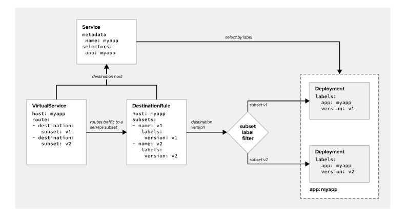

Chapter 5. Releasing Applications with OpenShift Service Mesh

# Describing Canary Releases
Canary releases uses a progressive and safe deployment approach where both versions of the application, the old and the new, run in parallel until the new version is completely validated and ready for all users. The new version, also called the canary, initially receives only a small amount of all application traffic. Therefore, if something goes wrong with this new version of the application, a minimal number of users are affected. As you gain confidence with how the canary works, you progressively route more traffic to it.

[canary_release_animation.mp4](../_resources/0916131199c247849c52be03b2b4e605.mp4)

### Use Cases
Canary deployment is a good strategy whenever you want to have more control and increase the level of confidence in your deployments. The following cases are scenarios where a canary release approach makes sense:

+ Your application handles high loads and you want to perform load or stress testing on a new version.
+ You want to validate the new version against a reduced group of users to analyze how this affects your key performance indicators. User groups can be defined according to different conditions, such as user type or location. For example, a common scenario is releasing canaries only for internal users or trusted clients.
+ You need a safe strategy to deploy a new critical version.

## Deploying a Canary Release with OpenShift Service Mesh
Istio offers various traffic routing policies, so you are not restricted to a strategy based on traffic percentage.

Virtual services, in combination with destination rules, can define traffic routes for each version. Each version is released as a Deployment and represented by a DestinationRule subset, which filters the service endpoints for that version.



The previous image shows how theses configuration resources releate in the canary scenario.

### Example
We have deployed an application called `myapp` that looks like the follwoing:

```
apiVersion: v1
kind: Service
metadata:
  labels:
    app: myapp
  name: myapp
spec:
  selector:
    app: myapp
  ...
---
apiVersion: apps/v1
kind: Deployment
metadata:
  name: myapp-v1
spec:
  ...
  template:
    metadata:
      labels:
        app: myapp
        version: v1
      annotations:
        sidecar.istio.io/inject: "true"
    spec:
        ...
```

Pay special attention to the `version` label of the `deployment`. Labels are the main property used to identify the version of the application, and to split traffic between versions. Also note that you must enable the injection of the Envoy sidecar by setting the `sidecar.istio.io/inject` annotation to "`true`". This allows the application to use Istio routing features.

**Canary Release** 
To deploy a canary release, you must create a new deployment for the new version and split traffic between versions using a virtual service and a destination rule.

```
kind: Deployment
metadata:
  name: myapp-v2
spec:
  replicas: 1
  template:
    metadata:
      labels:
        app: myapp
        version: v2
      annotations:
        sidecar.istio.io/inject: "true"
    spec:
      containers:
        ...
```
Como se muestra en el deployment previo usamos un unique name nuevo para este deployment y el label usado es el mismo que el del viejo deployment por lo que el servicio esta al tanto de que una nueva version pertenece a la misma aplicacion que la anterior version, y especificamos un nuevo valor del label version para que Service Mesh pueda distinguir entre versiones cuando routee trafico.

Creamos un `DestinationRule` para definir un subset que respente cada version.

```
apiVersion: networking.istio.io/v1beta1
kind: DestinationRule
metadata:
  name: myapp
spec:
  host: myapp #1
  subsets:
    - name: v1 #2
      labels:
        version: v1
    - name: v2 #3
      labels:
        version: v2
```

This destination rule defines the following configuration:
1. The name of the targeted service.
2. A subset for v1, filtering labels specified in the myapp-v1 deployment. In this case, version: v1.
3. A subset for v2, filtering labels specified in the myapp-v2 deployment. In this case, version: v2.

Creamos un `VirtualService` para deinfir el traifco redireccionado para cada version. Asociando cada subset con un route destino y agregamos la carga.

```
apiVersion: networking.istio.io/v1beta1
kind: VirtualService
metadata:
  name: myapp
spec:
  hosts:
    - "*"
  gateways:
    - my-gateway
  http:
    - route:
      - destination:
          host: myapp #1
          subset: v1 #2
          port:
            number: 3000
        weight: 90 #3
      - destination:
          host: myapp
          subset: v2
          port:
            number: 3000
        weight: 10
```

There are two destination configurations defined in this virtual service, one for each version. v1 receives 90% of the traffic, whereas v2 receives the remaining 10%. Each destination must contain the following information:

1. The service hostname. It must be the same as the host field defined in the destination rule.
2. The name of one of the subsets defined in the associated destination rule.
3. The percentage of traffic routed to the version.

If you need to route traffic using more advanced criteria, then you can use spec.http.match for HTTP traffic or spec.tcp.match for TCP traffic.

### Splitting Traffic Using Kiali
With Kiali, you can edit the configuration of Istio traffic management features to control canary releases. In particular, you can edit resource files in yaml format to modify the configuration of Istio resources. You can also use traffic management wizards to balance traffic between versions in a user-friendly interface.

[Kiali: Service mesh observability and configuration](https://kiali.io/documentation/v1.24/features/#_istio_wizards)

# Deploying an Application with a Mirror Launch

## Testing in Production
When releasing new versions of services, it is often necessary to test the new versions of the services in a production environment. Testing in production is important because it is difficult to simulate production workloads or realistic production data in testing or staging environments.

Testing in production consitit of:
+ Deploying the new version of the service in a production environment alongside the existing version of the service.
+ Sending a copy of production traffic to both the new service and the existing service. This is known as traffic mirroring.
+ Verifying the correct behavior of the new service.

Traffic mirroring allows testing the new service in production, with production requests, without service disruption, and keeping the state of both versions of stateful services synchronized.

## Mirroring in OpenShift Service Mesh
OpenShift Service Mesh uses the `DestinationRule` resources to define subsets (usually service versions) and the `destination` entry in `VirtualService` resources to route the requests between subsets. OpenShift Service Mesh provides traffic mirroring by using the same `DestinationRule` resources and introducing a `mirror` entry in the `VirtualService` route:

```
apiVersion: networking.istio.io/v1beta1
kind: VirtualService
metadata:
  name: my_virtual_service
spec:
  hosts:
    - target_host
  http:
  - route:
    - destination:
        host: old_service_name
        subset: old_subset
    mirror: #1
      host: new_service_name #2
      subset: new_subset #3
```

1. The mirror entry defines the serivce wo which Istio is sending request copies.
2. The name of the service thata recives the mirrored traffic
3. The subset of hosts that recive the mirrored traffic, as the define in the `DestinationRule`

Istio does not distinguish whether the mirror host is an external or an internal service. Istio can mirror traffic to any service with a related VirtualService resource.

### Mirroring a Percentage of the Traffic
There are situations where it is not needed or desirable to mirror all the traffic to the new service. For example, when maintaining the latest state of the service is not required, or when reducing traffic between services is more important than testing all requests. In those situations, Istio and OpenShift Service Mesh allow defining a percentage of the mirrored traffic:
```
apiVersion: networking.istio.io/v1beta1
kind: VirtualService
metadata:
  name: my_virtual_service
spec:
  hosts:
    - target_host
  http:
  - route:
    - destination:
        host: old_service_name
        subset: old_subset
    mirror:
      host: new_service_name
      subset: new_subset
    mirror_percent: 10
```
In the preceding example, only 10% of the requests sent to `old_service_name` are mirrored to `new_service_name`.

## Selecting the Appropriate Deployment Strategy
Canary releases and traffic mirroring are both deployment strategies that help you validate the release of new service versions. Depending on your deployment and testing plan, you may want to use one or the other. To pick the right strategy, follow these guidelines:

+ Use canary releases when you want to deploy a new version directly in production while minimizing the risk. Also, choose this strategy if you need to introduce real users in the validation process of the new version. By picking canary releases, you accept that a small portion of your users might experience problems derived from the new version.
+ Use traffic mirroring when you want to test the new version with production load without making the version available to the public. For example, traffic mirroring can be suitable if you want to test how the application responds to 100% of the production load. This approach is less risky than canary releases. If something goes wrong, it does not affect users. However, traffic mirroring is also more limited, because you can not include real users in the validation process.

Combining both strategies is also an interesting option. First, you use traffic mirroring to validate that the new version works correctly with production traffic. Next, you deploy the new version as a canary to start validating it against real users.

