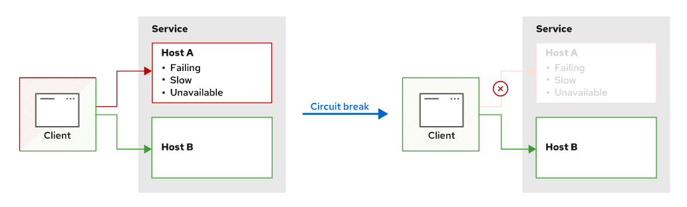

Chapter 7. Creando Servicios Resilientes

# Descripción de Estrategias para Servicios Resilientes con OpenShift Service Mesh
Prepararse para la resiliencia es una forma de hacer que las aplicaciones sean más confiables y estén listas para superar algunos de estos desafíos. Istio tiene en cuenta la confiabilidad e incluye características de resiliencia como parte de su modelo de gestión del tráfico. En particular, los `VirtualServices` y las `DestinationRule` le permiten configurar estrategias de resiliencia flexibles en diferentes niveles, como el nivel de servicio o el nivel de subset.

Las estrategias de resiliencia incluyen:
+ Utilice **load balancing** para evitar sobrecargas de servicio distribuyendo la carga entre varias réplicas de servicio suficientes para manejar la carga. Para lograr la resistencia con el load balancer, debe tener al menos una réplica redundante. Por lo tanto, si una réplica falla, el load balancer puede redistribuir todo el tráfico entre el resto de las réplicas en buen estado sin abrumarlas.
+ En lugar de esperar indefinidamente cuando ocurren estos errores, establezca un **time-outs** después del cual se rechaza la solicitud
+ **Retiries**: Es posible que los servicios no estén disponibles temporalmente debido a problemas transitorios, como cortes de red o sobrecargas momentáneas. Para abordar esta situación, configure Istio para que vuelva a intentar la solicitud antes de caerida una determinada cantidad de veces.
+ Cuando un servicio se acerca a su capacidad de rendimiento, las solicitudes adicionales pueden comenzar a fallar. Puede configurar un **Circuit Breaker** para dejar de enviar tráfico a dicho servicio. La solicitud falla rápidamente y protege el servicio para que no se sobrecargue, lo que puede causar inestabilidad.

## Implementando Resilencia con Load Balancing
Para configurar el load balancing para la resiliencia a nivel de servicio, debes usar el recurso de configuración `DestinationRule`. Específicamente, debes establecer el valor del campo `spec.trafficPolicy.loadBalancer.simple` en uno de los siguientes algoritmos:
+ **ROUND_ROBIN**: Las solicitudes se envían a cada host a su vez para distribuir la carga de manera uniforme. Este es el algoritmo predeterminado.
+ **RANDOM**: Las solicitudes se envían a los hosts al azar. Bajo cargas elevadas, las solicitudes se distribuyen aleatoriamente entre instancias.
+ **LEAST_CONN**: las solicitudes se envían a un host con pocas conexiones. Este algoritmo elige dos hosts aleatorios y elige el host con la menor cantidad de conexiones activas.

### Example
Puede definir políticas de load balacing a nivel de subset, aplicando load balancers específicos a diferentes versiones del mismo servicio.
```
apiVersion: networking.istio.io/v1beta1
kind: DestinationRule
metadata:
  name: my-destination-rule
spec:
  host: my-svc
  trafficPolicy: #1
    loadBalancer:
      simple: LEAST_CONN
  subsets:
  - name: v1
    labels:
      version: v1
  - name: v2
    labels:
      version: v2
    trafficPolicy: #2
      loadBalancer:
        simple: RANDOM
```
1. Política de tráfico que aplica el balanceador de carga LEAST_CONN al servicio.
2. Política de tráfico que aplica el balanceador de carga RANDOM al subset v2, anulando la política en el nivel de servicio.

# Configurar Time-outs
OpenShift Service Mesh le permite configurar el time-out fuera del código de su aplicación, en el Envoy proxy, mediante `VirtualServices` o HTTP headers.

## Configurar Time-outs en OpenShift Service Mesh
El uso de OpenShift Service Mesh para gestionar los time-outs le permite mantener una separación entre la lógica empresarial de las aplicaciones y la gestión de la red.
En OpenShift Service Mesh, puede configurar los time-outs utilizando servicios virtuales o encabezados HTTP sin modificar el código de su aplicación.

> El tiempo de espera predeterminado para las conexiones HTTP en OpenShift Service Mesh es de 15 segundos.

### Configurar Time-outs Usando `VirtualServices`
Los `VirtualServices` le permiten configurar time-outs para todo el tráfico enrutado a un servicio. Puede aplicar una configuración de time-outs utilizando el campo de tiempo de espera en las reglas de ruta y asignando un valor medido en segundos.
```
apiVersion: networking.istio.io/v1beta1
kind: VirtualService
metadata:
  name: a-service-vs
spec:
  hosts:
    - example-svc
  http:
    - route:
        - destination:
          host: preference
      timeout: 1s
```
En el ejemplo anterior, Envoy espera hasta 1 segundo en cualquier llamada al servicio example-svc antes de devolver un error de time-out.

### Configurar Time-outs Usando HTTP Headers
En OpenShift Service Mesh, puede utilizar HTTP headers para modificar el comportamiento de Envoy. El Envoy proxy puede agregar, eliminar o modificar HTTP headers para solicitudes entrantes. Cuando las solicitudes con HTTP headers que modifican el comportamiento del Envoy proxy se realizan desde fuera del mesh, el Envoy proxy las ignora.

En OpenShift Service Mesh, puede usar la marca `PILOT_SIDECAR_USE_REMOTE_ADDRESS` para modificar la forma en que Envoy determina el origen de una conexión. Establecer el valor de `PILOT_SIDECAR_USE_REMOTE_ADDRESS` en `true`, le permite configurar time-outs usando encabezados.

> ADVERTENCIA: Cambiar la configuración de Pilot puede tener consecuencias inesperadas en la estabilidad y el comportamiento de su malla de servicio.

Puede configurar time-outs agregando el HTTP header de solicitud x-envoy-upstream-rq-timeout-ms con un valor asignado en milisegundos.

```
HTTP/1.1 200 OK
date: Wed, 13 May 2020 13:56:01 GMT
...output omitted...
x-envoy-upstream-rq-timeout-ms: 500
...output omitted...
```
The preceding example defines a time-out of 500 milliseconds that is only valid until the service responds to that request.

## Selecionando Time-outs para la Resiliencia
No existe una forma estándar de calcular un valor preciso para el time-outs, pero hay varias cosas a considerar al definir un valor de tiempo de espera:
+ El valor permite que lleguen respuestas lentas.
+ El valor deja de esperar una respuesta que no se devuelve.
+ Un valor alto aumenta la latencia, especialmente en sistemas distribuidos.
+ Un valor alto aumenta potencialmente los recursos informáticos a la espera de que responda un servicio inactivo.

Los time-outs no son la única solución para aumentar la confiabilidad de sus aplicaciones. Puede combinar tiempos de espera con estrategias más avanzadas, como retries o circuit breakers.

# Configurando Retry
## Descripcion de Retry Patterns
El retry pattern es un patrón de diseño de comportamiento que se centra en reducir las fallas de comunicación transitorias y de corta duración. Debido a que las redes pueden no ser confiables, un microservicio puede encontrar una serie de problemas durante una solicitud de comunicación, como:
+ Un request se pierde, se maneja mal o se descarta debido a una red sobrecargada.
+ Un servicio de destino experimenta una falla temporal, por ejemplo,s debido a que el almacenamiento se desconecta temporalmente.
+ Un subconjunto de grupos de servicios de destino experimenta una falla.
+ La respuesta de una solicitud tarda más de lo esperado, lo que hace que el servicio de origen experimente un tiempo de espera.

Cuando una solicitud falla debido a cualquiera de los errores descritos anteriormente, una solicitud repetida con parámetros idénticos aún puede tener éxito. El retry pattern evita la propagación de dichos errores transitorios en la aplicación.

## Configurar Retries em OpenShift Service Mesh
### Configurar Retry Usando `VirtualService`
```
apiVersion: networking.istio.io/v1beta1
kind: VirtualService
metadata:
  name: example-vs
spec:
  hosts:
  - example-svc
  http:
  - route:
    - destination:
        host: example-svc
        subset: v1
    retries: #1
      attempts: 3 #2
      perTryTimeout: 2s #3
      retryOn: 5xx,retriable-4xx #4
```

1. El objeto HTTPRetry responsable de configurar los reintentos.
2. El número de veces que se reenviará una solicitud.
3. Un valor de tiempo de espera para cada solicitud de reintento. Los valores válidos están en milisegundos ms, segundos s, minutos m u horas h.
4. Una política que especifica las condiciones que hacen que los request fallidas vuelvan a intentar. El valor es una lista de valores separados por comas.

Los servicios virtuales vuelven a intentar solicitudes fallidas dos veces de forma predeterminada. Para deshabilitar la configuración de reintento, establezca el parámetro de intentos de la configuración de reintento en 0. Por ejemplo:

```
apiVersion: networking.istio.io/v1beta1
kind: VirtualService
metadata:
  name: vs-with-no-retry
spec:
  hosts:
  - example-svc
  http:
  - retries:
      attempts: 0
    route:
    - destination:
        host: example-svc
```

### Selecting Retry Policies
Los `VirtualServices` permiten sleecionar una o mas politicas de reintento. El Envoy proxy evalua cada request fallado usando las politicas de reintento y si encuentra alguna match realiza un reintento.

Openshift Service Mesh contiene, entre otros, las siguientes politicas de reintento:
+ **5xx**: Esta politica matchea con cualquie respuesta que contenga el 5xx response code. Adicionalmente, esta politica tambien matchea con cualquier request que del cual no se obtiene una respuesta ya sea por una desconeccion, un restart o un timeout.
> Tenga en cuenta que configurar el  x-envoy-upstream-rq-timeout-ms header anuala la configuracion de time-outs. Si un request tiene un valor equivocado en este header, la respuesta tendra el codigo de 504 pero matcheara con la politica de 5xx.
+ **gateway-error**: Esta politica matchea con respuestas que contienen 502, 503 o 504 como codigo de respuesta.
+ **reset**: Esta politica matchea con request sin ninguna respuesta debido a una desconeccion, reset o timeout.
+ **retriable-4xx**: Esta politica machea con respuestas que tengan como respuesta el codigo 409

Notese que la lista de arriba no es exhaustiva. Cuando elija una politica de reintento, es buena practica perimero analizar todos los request fallado en la apolicacion y elegir la politica mas adecuada para cada caso. Por ejemplo, el pod de una aplicacion puede tomar mucho tiempo en iniciar por lo que el primer request devuelva un timeout. Usted puede mitigar este problema usando la politica de reset.

### Selecting Retry Parameters for Resiliency
No hay valores estándar para la configuración de reintento que sean adecuados para todos los entornos. La siguiente lista no exhaustiva contiene algunas de las consideraciones para seleccionar parámetros de reintento:
+ Una política de reintento incorrecta puede afectar sustancialmente el rendimiento de la aplicación. Por ejemplo, si la aplicación de back-end está configurada incorrectamente y cualquier solicitud da como resultado una respuesta de desconexión, los reintentos solo aumentan el número total de reintentos sin beneficios para el usuario final.
+ Aumentar el número de reintentos aumenta la probabilidad potencial de éxito a costa del rendimiento. Un mayor número de reintentos da como resultado una mayor saturación de la red y puede causar problemas en entornos ocupados.
+ Aumentar el valor de timeouts ayuda a reducir la carga de los servicios de procesamiento intensivo que pueden tardar más en responder. Sin embargo, aumentar los valores de timeout también aumenta la latencia general de su sistema.

Una configuración de reintento incorrecta hace que su entorno sea menos resistente y puede acelerar los problemas de rendimiento en su entorno. Otros patrones de resiliencia, como el circuit breaker, pueden mitigar los peores escenarios de reintento. Además, Red Hat recomienda implementar el monitoreo para alertarlo sobre posibles problemas tan pronto como ocurran.


# Configurar un Circuit Breaker
## Descripcion del Circuit Breaker
Cuando un servicio experimenta errores transitorios, esos errores tienden a ocurrir continuamente. Circuit Breaker utiliza este conocimiento para evitar temporalmente dirigir solicitudes a un host que falla. Cuando una solicitud está a punto de llegar a un host que falla, el circuito se interrumpe y envía una falla al cliente sin la necesidad de esperar a que el host responda. Esta prohibición es temporal, por lo que el anfitrión recibe nuevas solicitudes cuando se restablece la función normal.



Circuit Breaker clasifica fallas de host de en dos clases:
+ **Local origin**: Fallos del servicio (usualmente HTTP 500) generados por el mismo.
+ **Gateway origin**: Cuando el servicio es inalcanzable o no responde, y por ende no puede ser utilizado.

Un Circuit Breaker identifica ambos tipos de fallas y deja de enviar solicitudes al host que falla, reenviando solicitudes solo a hosts en buen estado. La detección y el tageo para el desalojo se denomina Outlier Detection.

### Selección de Circuit Breakers para la resiliencia
Los Circuit Breakers son útiles para proteger servicios propensos a fallas transitorias. Los servicios de computación intensiva, por ejemplo, reciben más solicitudes de las que pueden responder y pueden experimentar fallas transitorias con mayor frecuencia. Los Circuit Breakers redirigen las solicitudes del host cuando comienza a fallar o se agota el tiempo, por lo que el servicio tiene tiempo de recuperarse del aumento de carga.

Otros ejemplos comunes de selección de Circuit Breakers para la resiliencia son los servicios que necesitan procesar las solicitudes de forma secuencial. Estos servicios suelen almacenar las solicitudes pendientes en una cola que procesan en orden. Si esta cola se vuelve demasiado grande, el servicio tarda demasiado en responder, lo que degrada el servicio. Los Circuit Breakers detectan esos tiempos de espera y dan tiempo al host para vaciar la cola.

## Configuración de Circuit Breakers en OpenShift Service Mesh
OpenShift Service Mesh implementa Circuit Breakers a nivel de host (red), no a nivel de servicio. Eso significa que OpenShift Service Mesh desaloja los hosts que fallan, no los servicios ni los subsets que fallan. Este comportamiento permite que los servicios sigan funcionando incluso si algún subset o algunos hosts fallan.
Por ejemplo, si tiene un servicio que apunta a tres pods y uno de ellos comienza a fallar, el desalojo se aplica solo al pod que falla. El servicio aún es accesible y cargará las solicitudes de balanceo entre los dos pods que no fallan.

> La terminología de Istio y, en consecuencia, la terminología de OpenShift Service Mesh puede resultar confusa cuando se hace referencia a un host. En muchas situaciones, como en el recurso `DestinationRule`, host se refiere a un servicio como una entrada en el registro de servicios de Kubernetes. Sin embargo, en el contexto de los Circuit Breakers, host se refiere a una carga de trabajo física o virtual, generalmente un contenedor.

### Managing Unhealthy Hosts
To enable a Circuit Breaker, include an `outlierDetection` entry in the DestinationRule resource related to the service:
```
apiVersion: networking.istio.io/v1beta1
kind: DestinationRule
metadata:
  name: myDestinationRule
spec:
  host: myService 1
  trafficPolicy: 2
    outlierDetection:
      consecutive5xxErrors: 1 3
      interval: 1s 4
      baseEjectionTime: 3m 5
      maxEjectionPercent: 100 6
```

1. `host` no se refiere al host físico, sino al nombre del servicio.
2. La entrada `outlierDetection` pertenece a un objeto `trafficPolicy`.
3. Define cuántos errores `5xx` se permiten antes de desalojar el host.
4. El intervalo de tiempo entre los recuentos de errores de verificación.
5. El *minimum* de tiempo de expulsión del host.
6. El porcentaje *maximum* de hosts desalojados que pertenecen a un servicio en cualquier momento.

El valor de `baseEjectionTime` indica el tiempo mínimo de desalojo para el host, no el tiempo real. La primera vez que OpenShift Service Mesh desaloja al host, el desalojo dura aproximadamente el tiempo mínimo. Los desalojos posteriores multiplican el `baseEjectionTime` por el número de veces que se desaloja al host. Por ejemplo, si `baseEjectionTime` es de cinco segundos, la primera vez que se desaloja al host, el desalojo dura cinco segundos. La segunda vez que se desaloja a ese mismo anfitrión, el desalojo dura diez segundos. La tercera vez, el desalojo dura quince segundos, etcétera.

El valor `maxEjectionPercent` limita el porcentaje de hosts que pueden estar simultáneamente en el estado desalojado. Si el porcentaje actual de hosts desalojados es superior a este límite, OpenShift Service Mesh no desaloja a ningún otro host, incluso si fallan o no están disponibles. Este límite es útil para evitar el desalojo de todos los hosts de un servicio, lo que hace que el servicio no esté disponible incluso si algunos hosts pueden responder. El valor predeterminado de `maxEjectionPercent` es 10%.

### Configuracion Limite de Conexiones
Otra técnica para proteger a los hosts de fallas es limitar el número de conexiones simultáneas al host. Si los hosts tienden a agotarse el tiempo de espera o fallar cuando reciben demasiadas solicitudes, limitar el número de conexiones ayuda a evitar que el host falle.

OpenShift Service Mesh permite aplicar esos límites mediante una entrada `connectionPool` en `DestinationRule`:
```
apiVersion: networking.istio.io/v1beta1
kind: DestinationRule
metadata:
  name: myDestinationRule
spec:
  host: myService
  trafficPolicy:
    connectionPool:
      tcp: #1
        maxConnections: 1 #2
        connectTimeout: 30ms #3
      http: #4
        http1MaxPendingRequests: 1 #5
        maxRequestsPerConnection: 1 #6
```
1. El connection pool se divide en configuraciones `HTTP` y` TCP` para mayor claridad.
2. Número máximo de conexiones simultáneas establecidas con el host.
3. Tiempo máximo para establecer la conexión.
4. Número máximo de solicitudes pendientes de servicio por parte del host.
5. Número máximo de solicitudes permitidas en una sola conexión. OpenShift Service Mesh reutiliza las conexiones hasta alcanzar este límite, o se consume el tiempo de `tcp.tcpKeepalive`.

Al limitar las conexiones a un host, si se excede el umbral, se generarán fallas en el servicio, específicamente, fallas en la puerta de enlace. Esos límites se pueden aplicar simultáneamente con un disyuntor. El Circuit Breaker utiliza las fallas generadas por el límite de conexión para interrumpir el circuito e iniciar las políticas de desalojo. Sin embargo, los límites de conexión y el disyuntor son políticas de tráfico independientes y los desarrolladores pueden usar uno de ellos sin el otro.

Los grupos de conexiones se aplican a todos los hosts del servicio. Eso significa que cada host tiene un grupo de conexiones independiente de otros grupos de hosts. Si el host agota su grupo de conexiones, OpenShift Service Mesh no establece más conexiones con ese host, pero continúa usando el resto de los hosts.

[Istio reference documentation for DestinationRule resources](https://istio.io/v1.6/docs/reference/config/networking/destination-rule/#DestinationRule)
