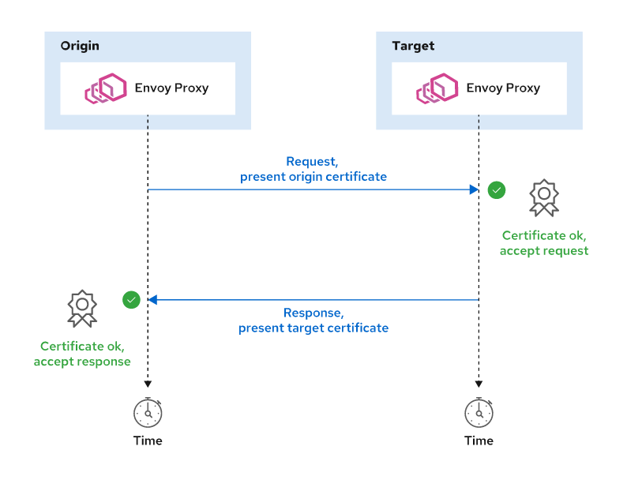

Chapter 8. Securing an OpenShift Service Mesh

# Describing Security in OpenShift Service Mesh
### Secirty and Red Hat Openshift Service Mesh
OpenShift Service Mesh enables developers and system administrators to abstract security from application code into infrastructure configuration, enabling zero-trust perimeters and deny-by-default behavior.

OpenShift Service Mesh provides, among others, the following security features:

**Cryptographically Verifiable Service Identities**
Red Hat OpenShift assigns to each deployed service a service account. OpenShift uses the service account as an identity for each deployed microservice. However, the service account identity is not cryptographically verifiable. OpenShift Service Mesh assigns microservices X.509-based identities that enable you to cryptographically verify each microservice request.
Security features, such as internal traffic encryption, verify services with the X.509-based identities.

Enabling traffic encryption means only the origin and target services can decrypt the traffic. Consequently, traffic encryption mitigates the impact of possible security breaches, and reduces avenues for attack, or attack vectors.

**Service Authorization**
A service inside of Red Hat OpenShift cluster can communicate with any other service by using the resolvable DNS name, such as svc-name.project-name.dns-domain.

OpenShift Service Mesh enables you to explicitly permit or deny service-to-service communication. This is useful for reducing potential attack vectors and providing clarity into the communication patterns in your cluster.

## Describing PKI in OpenShift Service Mesh
Public Key Infrastructure (PKI) is necessary for providing X.509-based identities. OpenShift Service Mesh contains a self-signed certificate authority (CA). The `istiod` component uses the certificate authority to issue new identities. Service Mesh uses the cryptographic identities for further security features, such as authentication and authorization settings, or mutual TLS.

OpenShift Service Mesh simplifies identity management by providing the following features:
+ *Self-rotating PKI* ensures that Envoy proxies automatically rotate certificates that are about to expire. Administrators do not manually manage certificates.

The self-rotating PKI aims to reduce the maintenance costs connected with manual PKI management, and to avoid possible outages related to certificate expiry and misconfiguration.

+ *Certificate-key pair injection* ensures that Envoy proxies mount necessary certificates into any pod that OpenShift Service Mesh manages. For any new pod joining OpenShift Service Mesh, its Envoy proxy uses the OpenShift Service Mesh CA to get a certificate-key pair identity. The Envoy proxy automatically mounts the certificate, and stores the identity information for further security settings.

The Envoy proxy requests a certificate-key pair by using the Secret Discovery Service (SDS) API. The SDS API enables certificates to be stored directly in the Envoy configuration.

Without the SDS API, OpenShift Service Mesh stores certificates in Kubernetes Secrets and mounts the secrets into pods. Mounting certificates from secrets means rotating a certificate requires restarting the pod. SDS enables Service Mesh to rotate certificates at runtime without restarting the pods.

Envoy uses the service account associated with the microservice deployment to generate the cryptographic identity. All services in a project use the same service account by default. Therefore, all services within one project encrypt their communication with the identical private key.


1. A developer deploys two new pods with separate backend and frontend service accounts.
2. OpenShift Service Mesh injects the Envoy proxy sidecar container into each pod.
3. The Envoy proxy requests a new certificate-key pair by using SDS.
4. Istiod uses the internal certificate authority to sign and return the identity.
5. Envoy proxy uses the certificates for security features, such as mutual TLS.

### Verifying Certificate-based Identities
Each certificate-key pair uses Secure Production Identity Framework for Everyone (SPIFFE) to provide security checks. SPIFFE is a specification maintained by the Cloud Native Computing Foundation (CNCF). SPIFFE is designed to cryptographically verify that the certificate identity presented by a microservice matches with the microservice service account.

Each certificate is encoded with a SPIFFE Verifiable Identity Document (SVID). The SVID takes the form of `cluster_domain/ns/project_name/sa/service_account_name`, and is encoded into the certificate as the `X509v3` `Subject Alternative Name` parameter.

The role of SPIFFE is to mitigate the attack surface for identity theft. For example, if a malicious user gains access to the certificate-key pair of the frontend microservice, and finds an exploit to execute arbitrary code in the *gateway* microservice, then SPIFFE checks might stop the attack. Because the service account name is encoded in each certificate, setting a unique service account for both the microservices ensures that the SPIFFE check fails and the Envoy proxy fails to complete the TLS handshake.

OpenShift Service Mesh provides additional security checks, referred to as secure naming. At run time, the Pilot component checks whether a service uses the correct service account before SPIFFE is checked. Consequently, the Pilot expects a response from one service but receives a response from a different service. If you set a different service account for each service, then the Envoy proxy rejects the request because it originated from a service other than the expected (mapped) one.

Secure naming is useful when an attacker compromises network routing in your OpenShift cluster and can reroute traffic from one service to another service

# Configuring Mutual TLS
Mutual TLS (mTLS) is a security feature provided by OpenShift Service Mesh. Enabling mTLS results in encrypted traffic between Envoy proxy containers. This means that traffic between services is encrypted.

Every service injected with an Envoy proxy can perform plain text as well as TLS-encrypted requests.


1. The application sends plain text traffic.
2. The Envoy proxy intercepts the traffic.
3. The origin Envoy proxy encrypts the traffic.
4. The destination Envoy proxy intercepts TLS traffic.
5. The destination Envoy proxy decrypts TLS traffic into plain text traffic.
6. The destination service receives and responds via plain text traffic.

If an attacker injects a malicious container into your service mesh, for example due to a compromised external container registry, this container cannot decrypt the encrypted network packets.

OpenShift Service Mesh enables you to utilize a managed PKI infrastructure. The deployed microservice application uses plain text protocol to communicate with other services. The Envoy proxy performs TLS encryption at the request origin and decryption at the request destination. Which Red Hat OpenShift for itself doesn't do.

### Describing Mutual Authentication Workflow
In mTLS, both the origin and target Envoy proxies authenticate each request.



The origin Envoy proxy attaches a certificate-backed identity to its request. The target Envoy proxy verifies the certificate attached to the request. In the response, the target Envoy proxy attaches its certificate-backed identity to the response. Finally, the origin Envoy proxy accepts only responses with a valid and trusted identity.


## Mutual TLS Modes
You can enable mTLS in one of two modes:
1. Permissive mode allows Envoy proxies to accept either plain text or mTLS-encrypted traffic. The permissive mode is the default mTLS mode because it enables communication with services that are not injected with Envoy proxies.
2. Strict mode enables you to configure services that must use mTLS. If you specify that a service must use mTLS, then the Envoy proxy rejects plain text requests from such service. Consequently, services that use plain text requests are unable to communicate with services in OpenShift Service Mesh.

Use the strict mode when you want to enforce a zero-trust perimeter, and when your services have no dependencies on services that do not have the Envoy proxy sidecar container.

Permissive mode is especially useful when you are migrating some of your services to OpenShift Service Mesh, or for testing. Even when OpenShift Service Mesh uses the permissive mode, you can set services with the Envoy proxy container to communicate by using mTLS.

### Configuring Mutual TLS Globally
You can configure global strict enforcement of mTLS by modifying the servicemeshcontrolplane resource:

```
[student@demo ~]$ oc edit servicemeshcontrolplane basic-install -n istio-system
apiVersion: maistra.io/v2
kind: ServiceMeshControlPlane
metadata:
  creationTimestamp: "2021-05-31T10:34:24Z"
  finalizers:
  - maistra.io/istio-operator
  generation: 2
  name: basic
  namespace: istio-system
spec:
  security:
    dataPlane:
      mtls: true #1
    controlPlane:
      mtls: true #2
    grafana:
      enabled: true
  version: v2.0
...
```

1. The .spec.security.dataPlane.mtls property configures strict mTLS for Envoy proxies in the data plane.
2. The .spec.security.controlPlane.mtls property configures strict mTLS for Envoy proxies in the control plane.

### Configuring Mutual TLS per Project
At the project level, OpenShift Service Mesh uses two custom resources to configure mTLS:
+ The `DestinationRule` (DR) resource configures how an Envoy proxy sends origin requests.
+ The `PeerAuthentication` (PA) resource configures the policies for receiving requests.


### Configuring Origin Request Policies with DestinationRule
The following destination rule explicitly configures the Envoy proxy to use mutual TLS:
```
apiVersion: networking.istio.io/v1beta1
kind: DestinationRule
metadata:
  name: dr-mtls
  namespace: mtls #1
spec:
  host: * #2
  trafficPolicy:
    tls:
      mode: ISTIO_MUTUAL #3
```
1. The destination rule configures Envoy proxies in the mtls project.
2. This destination rule applies to requests for all hosts.
3. Originating requests use strictly mutual TLS.

The preceding destination rule configures Envoy proxies such that:
+ Pods in the mtls project use only mTLS to originate requests. Consequently, any Envoy proxy in the mtls project cannot originate request with microservices that are not managed by OpenShift Service Mesh.
If you specify the host, for example *.mtls.svc.local, the Envoy proxies use strict mTLS only for the configured host. Consequently, the Envoy proxies can fall back to plain text traffic when originating requests to other hosts.

+ The destination rule does not configure incoming requests. Consequently, microservices that are not managed by OpenShift Service Mesh can send plain text requests to services in the mtls project. The Envoy proxies in the mtls project successfully fall back to plain text traffic for outgoing requests.

### Configuring Target Request Policies with PeerAuthentication
The `PeerAuthentication` resource enables you to configure what types of incoming traffic you want to allow in a project.
The following `PeerAuthentication` resource is the simplest way to refuse any incoming plain text requests:
```
apiVersion: security.istio.io/v1beta1
kind: PeerAuthentication
metadata:
  name: default
  namespace: foo
spec:
  mtls:
    mode: STRICT
```

If you want to enforce mTLS-only traffic in a project, configure Envoy proxies with both the destination rule as well as PeerAuthentication resources.

The preceding peer authentication does not specify the .spec.selector field. Consequently, it configures all Envoy proxies in the project.

You can specify selectors to target specific workloads in a project, for example:
```
apiVersion: security.istio.io/v1beta1
kind: PeerAuthentication
metadata:
  name: default
  namespace: foo
spec:
  selector:
    matchLabels:
      app: backend #1
  mtls:
    mode: STRICT
```
1. This peer authentication policy matches only pods with the app=backend label.

### Classifying mTLS Traffic Types
Services deployed on OpenShift Service Mesh can use a number of different protocols to expose their APIs and communicate with other services. OpenShift Service Mesh supports a number of such protocols, for example: http, http2, grpc, mongo, mysql, TCP

When a service uses an unknown protocol, the Envoy proxy treats the traffic as an opaque TCP connection and wraps the connection for mTLS.

You can use peer authentication to configure mTLS on a port level, for example:
```
apiVersion: security.istio.io/v1beta1
kind: PeerAuthentication
metadata:
  name: default
  namespace: foo
spec:
  mtls:
    mode: STRICT #1
  portLevelMtls:
    3333:
      mode: DISABLE #2
```
1. Configure strict mTLS.
2. Envoy proxies can accept plain text traffic on port 3333.

Also you can configure the Envoy proxy to not redirect and wrap traffic by using annotations, for example:

+ `traffic.sidecar.istio.io/excludeInboundPorts`: a list of inbound ports excluded from redirection
+ `traffic.sidecar.istio.io/excludeOutboundPorts`: a list of outbound ports excluded from redirection
+ `traffic.sidecar.istio.io/excludeOutboundIPRanges`: a list of IP address ranges in the CIDR form excluded from redirection

The preceding annotations apply to pods and configure Envoy proxy not to intercept traffic on the configured ports or IP ranges.

### Verifying State of Mutual TLS
You can both verify the mTLS configuration by using the istioctl command-line utility. You can use the istioctl experimental authz check POD_NAME command to verify Envoy proxy mTLS settings.

```
[student@demo ~]$ istioctl proxy-config listener customer-5fc9f6d46f-mq4f7 \
  | jq '.[25].name'
"virtualInbound"
```

### Verifying Service Identity
Services that use mTLS use a set of X.509 certificates to establish request identity. The certificate is commonly stored in the Envoy proxy configuration.

```
[student@demo ~]$ oc exec POD_NAME -c istio-proxy -- \
 curl -s  http://127.0.0.1:15000/config_dump  | \
 jq -r .configs[5].dynamic_active_secrets[0].secret | \
 jq -r .tls_certificate.certificate_chain.inline_bytes | \
 base64 --decode > certificate-chain.pem
```
Examine the parsed certificate by using the `openssl` utility:
```
[student@demo ~]$ cat certificate-chain.pem | openssl x509 -text -noout
Certificate:
    Data:
        Version: 3 (0x2)
        Serial Number:
            8e:e5:1b:99:76:cc:47:7e:0c:3b:5e:8a:50:08:a2:03
        Signature Algorithm: sha256WithRSAEncryption
        Issuer: O = cluster.local
        Validity
            Not Before: Jun  1 11:17:13 2021 GMT
            Not After : Jun  2 11:17:13 2021 GMT
        Subject:
        Subject Public Key Info:
...output omitted...
```

Verifying the service identity is useful, for example, when you change the OpenShift Service Mesh certificate authority to your organization's certificate authority, or when troubleshooting lower-level network issues, such as failure to perform TLS handshake between two services. You can also verify the SPIFFE identity encoded in the certificate.

### End-to-end TLS
Configuring end-to-end TLS means the communication between an external client and a service is fully encrypted. However, to get routed to applications managed by OpenShift Service Mesh, you must use the ingressgateway pods.

Configuring one route to expose multiple different services is difficult because a single route can have only one set of certificates.

You can solve the issue by deploying a separate ingress gateway for each service that you want to expose to external clients. Alternatively, you can create a passthrough-terminated TLS route for each exposed service and mount the certificates for each route into the default ingressgateway pod.

To secure your application by using a passthrough-terminated TLS route:
1. Create a tls secret with the contents of your certificate-key pair.
```
[student@demo ~]$ oc -n istio-system create secret tls istio-ingressgateway-customer-certs --key customer.key --cert customer.crt
secret/istio-ingressgateway-customer-certs created
```

2. Mount the certificates into the istio-ingressgateway pod.
a. Prepare a patch that mounts the istio-ingressgateway-customer-certs secret into the istio-ingressgateway pod.

	```
	[student@demo ~]$ cat > gateway-patch.json << EOF
	[{
	  "op": "add",
	  "path": "/spec/template/spec/containers/0/volumeMounts/0",
	  "value": {
		"mountPath": "/etc/istio/customer-certs",
		"name": "customer-certs",
		"readOnly": true
	  }
	},
	{
	  "op": "add",
	  "path": "/spec/template/spec/volumes/0",
	  "value": {
	  "name": "customer-certs",
		"secret": {
		  "secretName": "istio-ingressgateway-customer-certs",
		  "optional": true
		}
	  }
	}]
	EOF
	```

	b. Apply the patch 
	```
	[student@demo ~]$ oc -n istio-system patch --type=json deploy istio-ingressgateway -p "$(cat gateway-patch.json)"
	deployment.apps/istio-ingressgateway patched
	```

3. Verify certificates are mounted in the ingressgateway container.

```
[student@demo ~]$ INGRESS_POD=$(oc -n istio-system get pods -l istio=ingressgateway -o jsonpath='{.items..metadata.name}')
[student@demo ~]$ oc -n istio-system exec $INGRESS_POD -- ls /etc/istio/customer-certs
tls.crt
tls.key
```

4. Create a gateway that accepts connections by using the host of your exposed application, that is, the resolvable host name used for ingress on the HTTPS port

```
[student@demo ~]$ cat > gateway.yml <<EOF
apiVersion: networking.istio.io/v1beta1
kind: Gateway
metadata:
  name: customer-gateway
spec:
  selector:
	istio: ingressgateway #1
  servers:
  - port: #2
	  number: 443
	  name: https-customer
	  protocol: HTTPS
	tls:
	  mode: SIMPLE  #3
	  serverCertificate: /etc/istio/customer-certs/tls.crt #4
	  privateKey: /etc/istio/customer-certs/tls.key
	hosts:
	- "customer.com" # 5
EOF
```
1. The gateway targets the `istio-ingressgateway` pod by the label istio=ingressgateway. The `istio-ingressgateway` pod contains the mounted certificate-key pair.
2. The gateway accepts connections on the HTTPS port 443 with the HTTPS protocol.
3. The `SIMPLE` TLS mode means the server does not verify client certificates. Only the client verifies the server authority.
4. Provide path to the mounted certificate-key pair. The route presents this certificate to clients.
5. The host of the path. This path responds to `https://customer.com`. Ensure clients can correctly resolve this domain.


5. Create a virtual service that responds to the customer-gateway gateway.
```
[student@demo ~]$ cat > vservice.yml << EOF
apiVersion: networking.istio.io/v1beta1
kind: VirtualService
metadata:
  name: customer-virtualservice
spec:
  hosts:
  - "customer.com"
  gateways:
  - customer-gateway
  http:
  - match:
	- uri:
		prefix: /
	route:
	- destination:
		host: customer
		port:
		  number: 8080
EOF
```
6. Create a passthrough-terminated TLS route in the istio-system project that listens to the domain that you selected earlier. The route redirects requests to the istio-ingressgateway service.

```
[student@demo ~]$ cat > route.yml << EOF
apiVersion: route.openshift.io/v1
kind: Route
metadata:
  labels:
    app: istio-ingressgateway
  name: customer-https-route
  namespace: istio-system
spec:
  host: customer.com
  port:
    targetPort: https
  tls:
    insecureEdgeTerminationPolicy: None
    termination: passthrough
  to:
    kind: Service
    name: istio-ingressgateway
    weight: 100
  wildcardPolicy: None
EOF
```

8. Verify secure ingress:
```
[student@demo ~]$ curl  https://customer.com/
customer => preference => recommendation v1 from 'f11b097f1dd0': 2
```

# Defining Service to Service Authorization
OpenShift Service Mesh provides an authorization mechanism, which uses the service identity and provides developers fine-grained control over services communication. You can configure a deny-by-default communication pattern with targeted exceptions.

Without OpenShift Service Mesh, you can choose not to configure ingress for services that should not be exposed. However, if an attacker injects a malicious container into your cluster, for example due to a compromised container registry, the database is directly accessible from within the cluster. In the worst case scenario, the malicious container is deployed into the cluster with its own Envoy proxy and a valid cryptographic identity.

OpenShift Service Mesh enables you to mitigate such a breach by using the deny-by-default communication pattern. It can be configured to allow connections to the database service only from pods with a specified identity. Any other communication is forbidden and the malicious container cannot communicate with the database pod.

Enabling authorization in OpenShift Service Mesh requires no modifications to the application code. Envoy proxies ensure that authorization configuration is enforced.

Also enables you to control egress calls. If you configure OpenShift Service Mesh to deny unknown egress requests, a potential malicious container is unable to make any calls outside of OpenShift Service Mesh.

## Describing Authorization Workflow
Use the `AuthorizationPolicy` custom resource definition to configure authorization. When you create a new authorization policy, `istiod` generates an Envoy RBAC policy configuration. This policy configuration is propagated into Envoy proxy containers. Envoy proxies apply the authorization policies at run time, when another service sends a request.


Mutual TLS is required for authorization policies that use identity, such as principals, namespaces, or server name indication (SNI). If you disable mutual TLS, then the request contains no identity and identity-based policies deny the request.

## Configuring Service Authorization
To configure OpenShift Service Mesh authorization policies, use the `AuthorizationPolicy` custom resource definition (CRD). The `AuthorizationPolicy` CRD specifies the following attributes:

+ Subject, matched by the .spec.selector field. This is the target Envoy proxy that enforces the policy.

+ Action, matched by the .spec.action field, specifies an allowlist (ALLOW) or a denylist (DENY) action. The default value is ALLOW.

+ Rule set, matched by the spec.rules field, specifies the trigger for this policy, for example communication on a specified port. Each rule set has the following attributes:

	+ source field, specifies the origin of the request, for example, a service identity.

	+ to field, specifies the HTTP method, port, path, or other properties of the request.

	+ when field, specifies additional conditions, such as the presence of an HTTP header.

### Example
```
apiVersion: "security.istio.io/v1beta1"
kind: "AuthorizationPolicy"
metadata:
  name: "test-policy"
spec:
  selector: 1
    matchLabels:
      app: test
  action: ALLOW 2
  rules: 3
  - from:
    - source:
        namespaces: ["test"]
    to:
    - operation:
        methods: ["GET"]
        ports: ["8080"]
        paths: ["/"]
```

1. This authorization policy targets all pods that match the app=test label. The Envoy proxy in matching pods will enforce this authorization policy.
2. Action is explicitly set to ALLOW. Requests that trigger this policy are permitted. Any other requests to the matching pods will be denied, unless you specify another authorization policy.
3. This policy matches requests from the test namespace with the GET HTTP method to the 8080 port matching the / endpoint.

Note the following: 
+ If you create no authorization policy, then all requests are permitted. However, when you specify at least one authorization policy, you enable deny-by-default behavior for the Envoy proxy of the matching workload.
+ If you create a single `DENY` policy, all requests are permitted except for the requests that match the policy.
+ You can create multiple authorization policies for one workload. It is useful for designing atomic, easy-to-maintain policies. Also enables other patterns, such as temporary permit requests used for testing or development. 
Each Envoy proxy contains a list of authorization policies. When an Envoy proxy receives a request, each policy is evaluated separately. The first policy that matches is applied. This results in a logical OR behavior.

### Configuring Traffic Type

You can specify authorization policies to match parameters that are not available in all protocols. For example, consider the following matching parameters:
+ Match requests to host `example`.
+ Match request for path `/example`
+ Match requests for the `GET` method.

> The preceding matching is specific to the HTTP protocol, and does not work for protocols like TCP.

If you create authorization policies with HTTP-based matching, then you must specify your traffic type in the Service object.

```
kind: Service
apiVersion: v1
metadata:
  labels:
    app: exchange
  name: exchange
spec:
  ports:
  - port: 8080
    protocol: TCP
    targetPort: 8080
  selector:
    app: exchange
```

The service does not name the port it uses. Service Mesh treats the traffic as opaque TCP traffic. Consequently, Envoy proxies do not match HTTP-based authorization policies as expected.

To set the traffic type, provide the port name, for example:
```
kind: Service
apiVersion: v1
metadata:
  labels:
    app: exchange
  name: exchange
spec:
  ports:
  - port: 8080
    protocol: TCP
    targetPort: 8080
    name: http
  selector:
    app: exchange
```

### Using Authorization Policies with Rewriting Rules
The virtual service object enables you to rewrite paths. For example, consider the following virtual service:

```
kind: VirtualService
apiVersion: networking.istio.io/v1beta1
metadata:
  name: example
spec:
...spec omitted...
  http:
  - match:
    - uri:
        prefix: /path
    rewrite:
      uri: /
    route:
    - destination:
        host: exchange
        port:
          number: 8080
```

The `example` virtual service rewrites the request path from `/path` to `/` and then redirects the request to the `exchange:8080` host. However, when the request targets other paths, such as `/path/example`, the rewriting rule rewrites the path to `//example`. If you create an authorization policy that targets the `/example` path, then it does not match the `//example` path.

You can solve the issue in one of the following ways:
+ Change the authorization policy to match the `//example` path.
+ Use the built-in path normalization to remove double slashes from rewritten paths.
+ Change the rewriting rules from `/path` to `/path/`. This change provides an additional security benefit of not matching paths such as `/pathABC` by the virtual service.

You can set the path normalization setting on your control plane file:
```
spec:
  techPreview:
    global:
      pathNormalization: MERGE_SLASHES
```

[Learn more about normalization options in the Service Mesh Documentation.](https://rol.redhat.com/rol/app/courses/do328-2.0/pages/ch08s05#:~:text=Service%20Mesh%20Documentation)

Rewriting traffic can lead to unexpected authorization policy matches. If you rewrite your traffic and use authorization policies, then carefully test your authorization policy matching before relying on the authorization policies in production environments.

## Combining Authorization Policy Rule Parameters
You can specify multiple rule parameters, such as the `.spec.rules.from.source` or `.spec.rules.to.operation` parameters. Specifying multiple matching parameters results in the logical OR behavior.

This is useful for specifying multiple trigger conditions for the policy. However, large authorization policies with multiple rule parameters are difficult to understand and maintain. It is a best practice to keep your authorization policies as small and atomic as possible in the context of your environment.

The following policy example combines multiple `.spec.rules.from.source` fields:
```
apiVersion: "security.istio.io/v1beta1"
kind: "AuthorizationPolicy"
metadata:
  name: "test-policy-multiple-sources"
spec:
  selector:
    matchLabels:
      app: test
  rules:
  - from:
    - source:
        namespaces: ["test"]
    - source:
        principals: ["cluster.local/ns/test2/sa/test2-service-account"]
    - source:
        ipBlocks: ["10.128.0.0/14"]
```
The example `test-policy-multiple-sources` authorization policy specifies no `.spec.action` field value. Consequently, the default `ALLOW` value is applied. The policy permits any requests that match at least one of the following conditions:
+ Requests originate from the test namespace.
+ Requests identified by the test2-service-account service account in project test2.
+ Requests originating from an IP in the 10.128.0.0/14 range.

Because the preceding policy did not specify any to field, all requests from the allowed sources are allowed.

The following policy example combines multiple .spec.rules.to.operation fields:

```
apiVersion: "security.istio.io/v1beta1"
kind: "AuthorizationPolicy"
metadata:
  name: "test-policy-multiple-operation"
spec:
  selector:
    matchLabels:
      app: test
  rules:
  - to:
    - operation:
        methods: ["GET"]
        ports: ["8080"]
    - operation:
        methods: ["POST"]
        ports: ["8080"]
        paths: ["/api/v2/createEmployee/*"]
    - operation:
        methods: ["PUT"]
        ports: ["8080"]
        paths: ["/api/v2/updateEmployee"]
```

The `test-policy-multiple-operation` authorization policy permits any requests that match at least one of the following conditions:

+ Any `GET` requests on the `8080` port.
+ `POST` requests on the `8080` port to the `/api/v2/createEmployee/*` endpoints.
+ `PUT` requests on the `8080` port to the `/api/v2/updateEmployee` endpoint.